# Activity Diagrams

## BuildTrace - Construction Drawing Comparison Platform

**Document Version:** 1.0  
**Date:** December 2025

---

## Table of Contents

1. [User Authentication Activity](#1-user-authentication-activity)
2. [Drawing Upload Activity](#2-drawing-upload-activity)
3. [Comparison Processing Activity](#3-comparison-processing-activity)
4. [OCR Processing Activity](#4-ocr-processing-activity)
5. [Diff Generation Activity](#5-diff-generation-activity)
6. [Summary Generation Activity](#6-summary-generation-activity)
7. [Results Viewing Activity](#7-results-viewing-activity)
8. [Error Handling Activity](#8-error-handling-activity)

---

## 1. User Authentication Activity

### 1.1 Login Activity

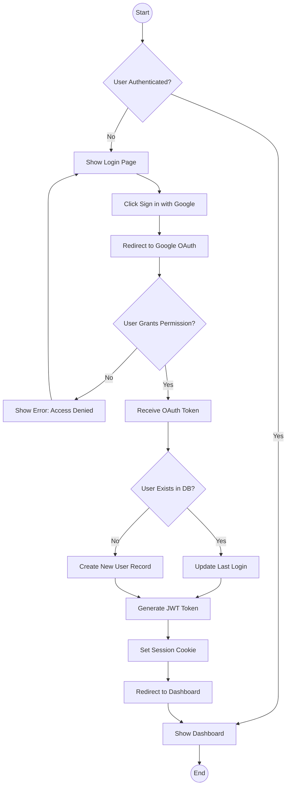

### 1.2 Logout Activity

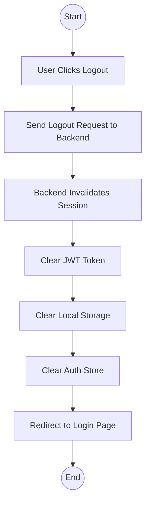

---

## 2. Drawing Upload Activity

### 2.1 Single File Upload

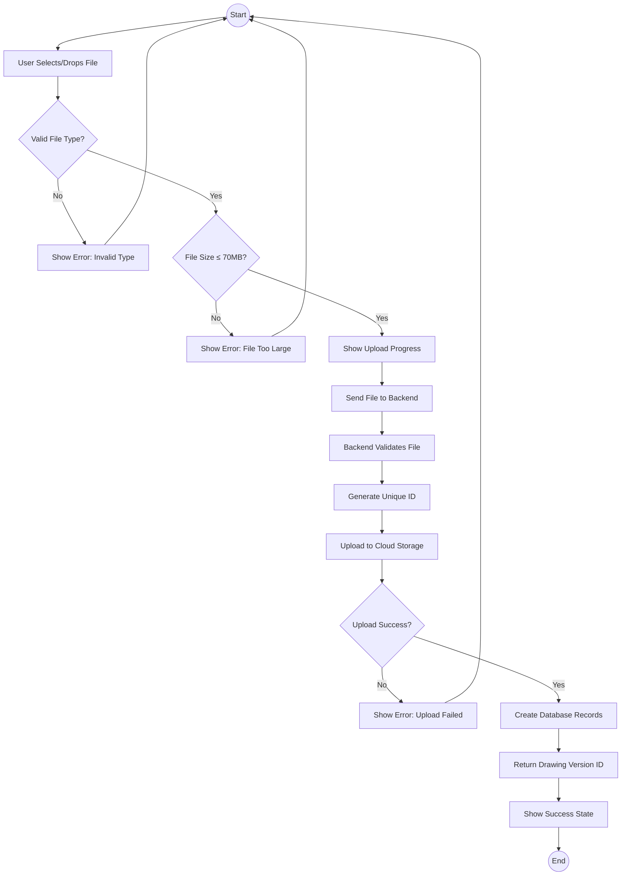

### 2.2 Comparison Upload (Both Files)

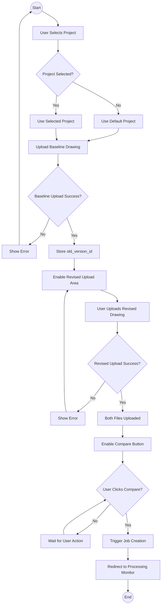

---

## 3. Comparison Processing Activity

### 3.1 Job Orchestration (High-Level)

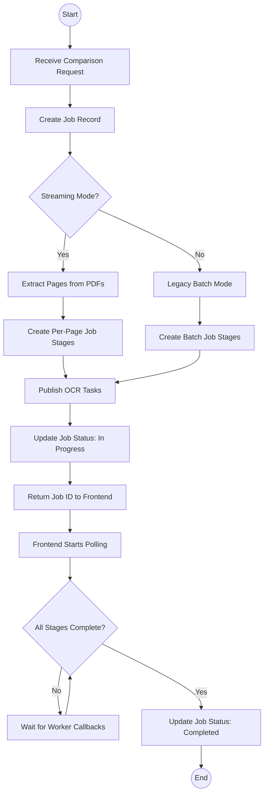

### 3.2 Streaming Pipeline Flow

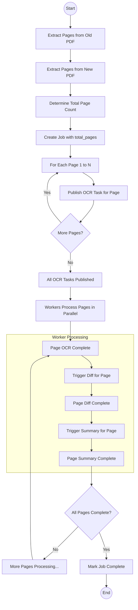

---

## 4. OCR Processing Activity

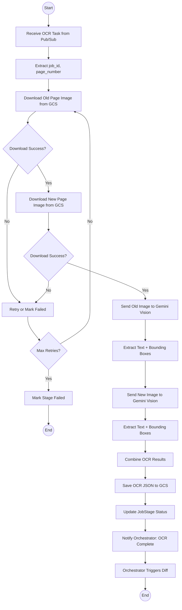

### OCR AI Processing Detail

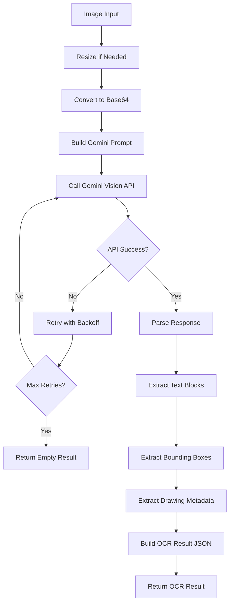

---

## 5. Diff Generation Activity

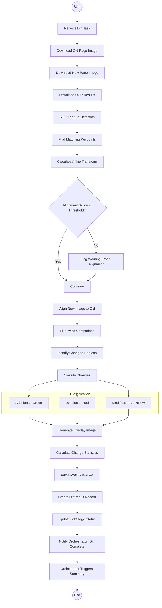

---

## 6. Summary Generation Activity

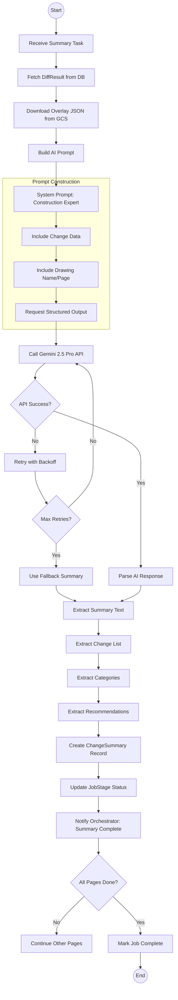

---

## 7. Results Viewing Activity

### 7.1 Load Results Page

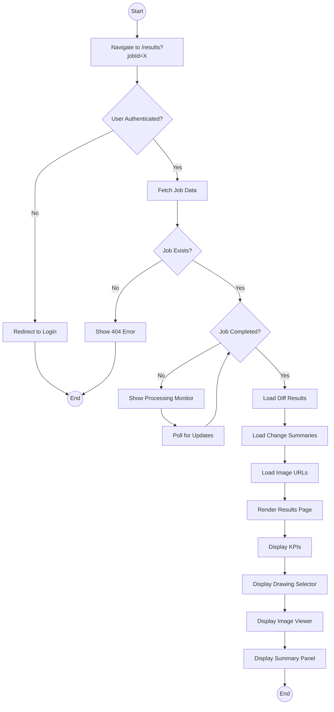

### 7.2 Image Viewer Interaction

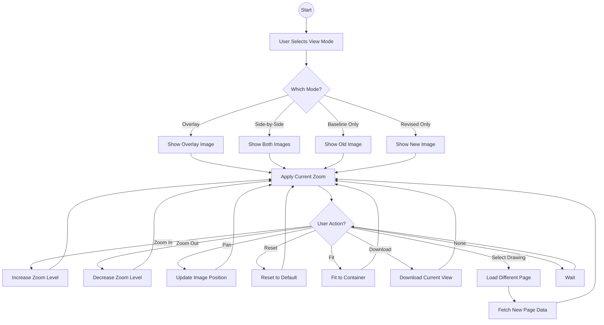

---

## 8. Error Handling Activity

### 8.1 Worker Error Handling

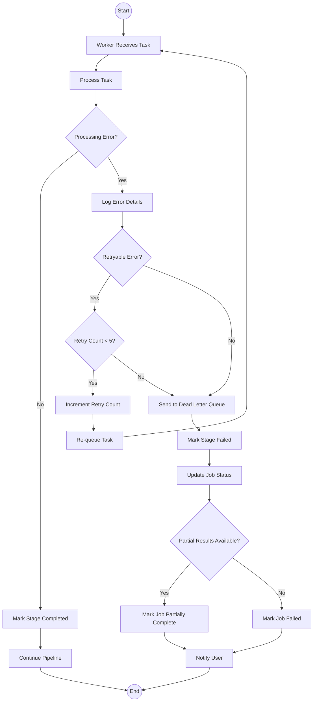

### 8.2 API Error Handling

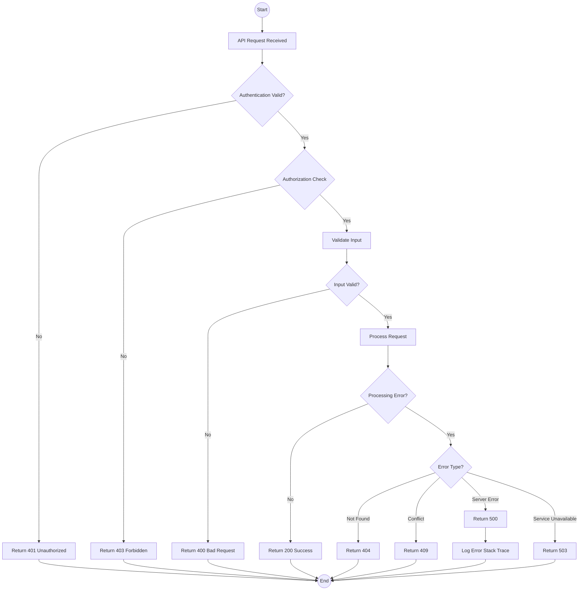

---

## Activity Diagram Summary

| Activity | Description | Key Decision Points |
|----------|-------------|---------------------|
| **Authentication** | OAuth login flow | User exists?, Permission granted? |
| **Upload** | File upload with validation | Valid type?, Size limit?, Upload success? |
| **Job Orchestration** | High-level comparison flow | Streaming mode?, All stages complete? |
| **Streaming Pipeline** | Per-page processing | All pages complete? |
| **OCR Processing** | AI text extraction | Download success?, API success? |
| **Diff Generation** | Change detection | Alignment score threshold? |
| **Summary Generation** | AI summarization | API success?, All pages done? |
| **Results Viewing** | User interaction with results | View mode?, User action? |
| **Error Handling** | Retry and DLQ logic | Retryable?, Max retries? |

---

*End of Activity Diagrams Document*

