# Architecture Diagrams

## BuildTrace - Construction Drawing Comparison Platform

**Document Version:** 1.0  
**Date:** December 2025

---

## Table of Contents

1. [System Architecture Overview](#1-system-architecture-overview)
2. [Deployment Architecture](#2-deployment-architecture)
3. [Component Architecture](#3-component-architecture)
4. [Backend Architecture](#4-backend-architecture)
5. [Frontend Architecture](#5-frontend-architecture)
6. [Database Architecture](#6-database-architecture)
7. [Message Queue Architecture](#7-message-queue-architecture)
8. [Security Architecture](#8-security-architecture)

---

## 1. System Architecture Overview

### 1.1 High-Level System Architecture

```mermaid
graph TB
    subgraph "Client Layer"
        Browser[🌐 Web Browser]
    end

    subgraph "Edge Layer"
        CDN[☁️ Cloud CDN]
        LB[⚖️ Load Balancer]
    end

    subgraph "Application Layer"
        Frontend[📱 Next.js Frontend<br/>Cloud Run]
        Backend[🔧 Flask Backend<br/>Cloud Run]
    end

    subgraph "Worker Layer"
        OCRWorker[🔍 OCR Worker]
        DiffWorker[⚖️ Diff Worker]
        SummaryWorker[📝 Summary Worker]
    end

    subgraph "Service Layer"
        PubSub[📨 Pub/Sub]
        Secrets[🔐 Secret Manager]
        Logging[📊 Cloud Logging]
    end

    subgraph "Data Layer"
        CloudSQL[(🗄️ Cloud SQL<br/>PostgreSQL)]
        GCS[(📦 Cloud Storage<br/>GCS)]
    end

    subgraph "AI Layer"
        Gemini[🤖 Google Gemini]
        OpenAI[🧠 OpenAI GPT]
    end

    Browser --> CDN
    CDN --> LB
    LB --> Frontend
    Frontend --> Backend
    Backend --> CloudSQL
    Backend --> GCS
    Backend --> PubSub
    Backend --> Secrets

    PubSub --> OCRWorker
    PubSub --> DiffWorker
    PubSub --> SummaryWorker

    OCRWorker --> Gemini
    OCRWorker --> GCS
    OCRWorker --> CloudSQL

    DiffWorker --> GCS
    DiffWorker --> CloudSQL

    SummaryWorker --> Gemini
    SummaryWorker --> OpenAI
    SummaryWorker --> CloudSQL

    Backend --> Logging
    OCRWorker --> Logging
    DiffWorker --> Logging
    SummaryWorker --> Logging
```



### 1.2 System Components

| Layer | Component | Technology | Purpose |
|-------|-----------|------------|---------|
| **Client** | Web Browser | Chrome, Firefox, Safari | User interface access |
| **Edge** | Load Balancer | Cloud Run Ingress | Traffic distribution |
| **Application** | Frontend | Next.js 14 on Cloud Run | User interface |
| **Application** | Backend | Flask on Cloud Run | REST API |
| **Worker** | OCR Worker | Python on Cloud Run Jobs | Text extraction |
| **Worker** | Diff Worker | Python on Cloud Run Jobs | Change detection |
| **Worker** | Summary Worker | Python on Cloud Run Jobs | AI summarization |
| **Data** | Database | Cloud SQL PostgreSQL 17 | Structured data |
| **Data** | File Storage | Cloud Storage | Binary files |
| **Service** | Message Queue | Cloud Pub/Sub | Async processing |
| **AI** | Vision AI | Google Gemini 2.5 Pro | OCR and analysis |

---

## 2. Deployment Architecture

### 2.1 Google Cloud Platform Layout


### 2.2 Container Architecture


---

## 3. Component Architecture

### 3.1 Backend Component Diagram


### 3.2 Frontend Component Diagram

```mermaid
graph TB
    subgraph "Next.js Application"
        subgraph "Pages (App Router)"
            HomePage[page.tsx<br/>/ (Upload)]
            LoginPage[login/page.tsx<br/>/login]
            ResultsPage[results/page.tsx<br/>/results]
            ProjectsPage[projects/page.tsx<br/>/projects]
            ProjectDetail[projects/[id]/page.tsx<br/>/projects/:id]
        end

        subgraph "Components"
            subgraph "Auth"
                LoginBtn[LoginButton.tsx]
                ProtectedRoute[ProtectedRoute.tsx]
            end

            subgraph "Layout"
                Header[Header.tsx]
            end

            subgraph "Upload"
                FileUploader[FileUploader.tsx]
                ProcessingMonitor[ProcessingMonitor.tsx]
                ProgressSteps[ProgressSteps.tsx]
                RecentSessions[RecentSessions.tsx]
            end

            subgraph "Results"
                OverlayViewer[OverlayImageViewer.tsx]
                ChangesList[ChangesList.tsx]
                SummaryPanel[SummaryPanel.tsx]
                ViewModeToggle[ViewModeToggle.tsx]
            end

            subgraph "Reports"
                CostReport[CostImpactReport.tsx]
                ScheduleReport[ScheduleImpactReport.tsx]
            end
        end

        subgraph "State & API"
            AuthStore[authStore.ts<br/>Zustand]
            APIClient[api.ts<br/>Axios]
            MockAPI[mockApiClient.ts]
        end

        subgraph "Types"
            Types[types/index.ts]
        end
    end

    HomePage --> FileUploader
    HomePage --> ProcessingMonitor
    HomePage --> RecentSessions

    ResultsPage --> OverlayViewer
    ResultsPage --> ChangesList
    ResultsPage --> SummaryPanel
    ResultsPage --> CostReport
    ResultsPage --> ScheduleReport

    FileUploader --> APIClient
    OverlayViewer --> APIClient
    LoginBtn --> AuthStore
    ProtectedRoute --> AuthStore

    APIClient --> MockAPI
```

---

## 4. Backend Architecture

### 4.1 Request Flow


### 4.2 Blueprint Organization

| Blueprint | Prefix | Purpose |
|-----------|--------|---------|
| `auth` | `/api/v1/auth` | Authentication (Google OAuth) |
| `jobs` | `/api/v1/jobs` | Job management |
| `drawings` | `/api/v1/drawings` | Drawing uploads |
| `projects` | `/api/v1/projects` | Project management |
| `overlays` | `/api/v1/overlays` | Overlay images |
| `summaries` | `/api/v1/summaries` | AI summaries |
| `chat` | `/api/v1/chat` | Chatbot |
| `sessions` | `/api/v1/sessions` | Legacy sessions |

### 4.3 Service Layer Pattern


---

## 5. Frontend Architecture

### 5.1 State Management


### 5.2 API Client Pattern


---

## 6. Database Architecture

### 6.1 Entity Relationship Diagram


### 6.2 Table Groups


---

## 7. Message Queue Architecture

### 7.1 Pub/Sub Topology


### 7.2 Message Flow


---

## 8. Security Architecture

### 8.1 Authentication Flow


### 8.2 Security Layers


### 8.3 Service Account Permissions

| Service Account | Permissions |
|-----------------|-------------|
| `buildtrace-service-account` | Cloud SQL Client, Storage Object Admin, Pub/Sub Publisher/Subscriber, Secret Manager Accessor |
| `frontend-service-account` | Cloud Run Invoker |

---

*End of Architecture Diagrams Document*

