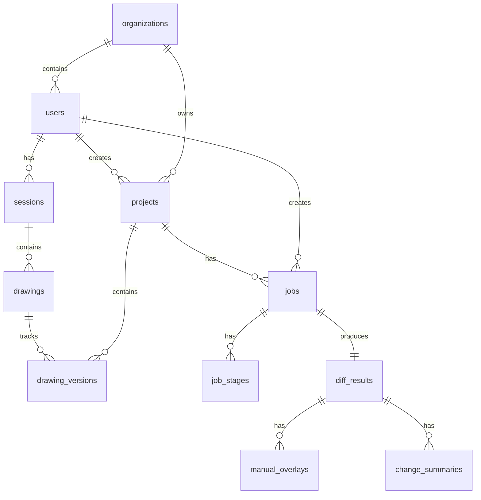

# Database Schema Documentation

## BuildTrace - Construction Drawing Comparison Platform

**Document Version:** 1.0  
**Date:** December 2025  
**Database:** PostgreSQL 17 on Cloud SQL

---

## Table of Contents

1. [Schema Overview](#1-schema-overview)
2. [Identity Tables](#2-identity-tables)
3. [Project Management Tables](#3-project-management-tables)
4. [Drawing Management Tables](#4-drawing-management-tables)
5. [Job Processing Tables](#5-job-processing-tables)
6. [Results Tables](#6-results-tables)
7. [Communication Tables](#7-communication-tables)
8. [Audit Tables](#8-audit-tables)
9. [Indexes and Constraints](#9-indexes-and-constraints)

---

## 1. Schema Overview

### 1.1 Entity Count

| Category | Tables | Description |
|----------|--------|-------------|
| Identity | 3 | Users, Organizations, OAuth |
| Project Management | 2 | Projects, Project Users |
| Drawing Management | 3 | Drawings, Drawing Versions, Sessions |
| Job Processing | 2 | Jobs, Job Stages |
| Results | 3 | Diff Results, Manual Overlays, Change Summaries |
| Communication | 2 | Chat Conversations, Chat Messages |
| Audit | 1 | Audit Logs |
| Legacy | 3 | Comparisons, Analysis Results, Processing Jobs |
| **Total** | **19** | |

### 1.2 Schema Diagram



---

## 2. Identity Tables

### 2.1 organizations

Multi-tenant organization support.

```sql
CREATE TABLE organizations (
    id VARCHAR(36) PRIMARY KEY DEFAULT uuid_generate_v4(),
    name VARCHAR(255) NOT NULL,
    domain VARCHAR(255),
    plan VARCHAR(50) DEFAULT 'free',
    created_at TIMESTAMP DEFAULT NOW(),
    updated_at TIMESTAMP DEFAULT NOW()
);

CREATE INDEX idx_organizations_domain ON organizations(domain);
```

| Column | Type | Constraints | Description |
|--------|------|-------------|-------------|
| id | VARCHAR(36) | PK | UUID identifier |
| name | VARCHAR(255) | NOT NULL | Organization name |
| domain | VARCHAR(255) | | Email domain for auto-join |
| plan | VARCHAR(50) | DEFAULT 'free' | Subscription plan |
| created_at | TIMESTAMP | DEFAULT NOW() | Creation timestamp |
| updated_at | TIMESTAMP | DEFAULT NOW() | Last update |

### 2.2 users

User accounts and profiles.

```sql
CREATE TABLE users (
    id VARCHAR(36) PRIMARY KEY DEFAULT uuid_generate_v4(),
    email VARCHAR(255) UNIQUE NOT NULL,
    name VARCHAR(255),
    company VARCHAR(255),
    role VARCHAR(100),
    password_hash VARCHAR(255),
    last_login TIMESTAMP,
    email_verified BOOLEAN DEFAULT FALSE,
    created_at TIMESTAMP DEFAULT NOW(),
    updated_at TIMESTAMP DEFAULT NOW(),
    is_active BOOLEAN DEFAULT TRUE,
    organization_id VARCHAR(36) REFERENCES organizations(id)
);

CREATE INDEX idx_users_email ON users(email);
CREATE INDEX idx_users_org ON users(organization_id);
```

| Column | Type | Constraints | Description |
|--------|------|-------------|-------------|
| id | VARCHAR(36) | PK | UUID identifier |
| email | VARCHAR(255) | UNIQUE, NOT NULL | Email address |
| name | VARCHAR(255) | | Display name |
| company | VARCHAR(255) | | Company name |
| role | VARCHAR(100) | | architect, engineer, contractor |
| password_hash | VARCHAR(255) | | Hashed password (if using email auth) |
| last_login | TIMESTAMP | | Last login time |
| email_verified | BOOLEAN | DEFAULT FALSE | Email verification status |
| is_active | BOOLEAN | DEFAULT TRUE | Account active |
| organization_id | VARCHAR(36) | FK | Link to organization |

### 2.3 oauth

OAuth token storage (Flask-Dance).

```sql
CREATE TABLE oauth (
    id VARCHAR(36) PRIMARY KEY DEFAULT uuid_generate_v4(),
    provider VARCHAR(50) NOT NULL,
    provider_user_id VARCHAR(256) UNIQUE NOT NULL,
    token JSON NOT NULL,
    user_id VARCHAR(36) REFERENCES users(id) NOT NULL,
    created_at TIMESTAMP DEFAULT NOW()
);

CREATE INDEX idx_oauth_user ON oauth(user_id);
```

---

## 3. Project Management Tables

### 3.1 projects

Project containers for organizing drawings.

```sql
CREATE TABLE projects (
    id VARCHAR(36) PRIMARY KEY DEFAULT uuid_generate_v4(),
    user_id VARCHAR(36) REFERENCES users(id) ON DELETE CASCADE NOT NULL,
    organization_id VARCHAR(36) REFERENCES organizations(id),
    name VARCHAR(255) NOT NULL,
    description TEXT,
    project_number VARCHAR(100),
    client_name VARCHAR(255),
    location VARCHAR(255),
    status VARCHAR(50) DEFAULT 'active',
    created_at TIMESTAMP DEFAULT NOW(),
    updated_at TIMESTAMP DEFAULT NOW()
);

CREATE INDEX idx_user_project ON projects(user_id, name);
CREATE INDEX idx_projects_org ON projects(organization_id);
CREATE INDEX idx_projects_status ON projects(status);
```

| Column | Type | Constraints | Description |
|--------|------|-------------|-------------|
| id | VARCHAR(36) | PK | UUID identifier |
| user_id | VARCHAR(36) | FK, NOT NULL | Project owner |
| organization_id | VARCHAR(36) | FK | Optional organization |
| name | VARCHAR(255) | NOT NULL | Project name |
| description | TEXT | | Project description |
| project_number | VARCHAR(100) | | External reference |
| client_name | VARCHAR(255) | | Client name |
| location | VARCHAR(255) | | Project location |
| status | VARCHAR(50) | DEFAULT 'active' | active/archived/completed |

### 3.2 project_users

Many-to-many relationship for project sharing.

```sql
CREATE TABLE project_users (
    id VARCHAR(36) PRIMARY KEY DEFAULT uuid_generate_v4(),
    project_id VARCHAR(36) REFERENCES projects(id) ON DELETE CASCADE NOT NULL,
    user_id VARCHAR(36) REFERENCES users(id) ON DELETE CASCADE NOT NULL,
    role VARCHAR(50) DEFAULT 'member',
    invited_at TIMESTAMP DEFAULT NOW(),
    joined_at TIMESTAMP,
    invited_by VARCHAR(36) REFERENCES users(id),
    user_name VARCHAR(255),
    user_email VARCHAR(255),
    UNIQUE(project_id, user_id)
);

CREATE INDEX idx_project_users_project ON project_users(project_id);
CREATE INDEX idx_project_users_user ON project_users(user_id);
CREATE INDEX idx_project_users_role ON project_users(role);
```

---

## 4. Drawing Management Tables

### 4.1 sessions

User comparison sessions (legacy).

```sql
CREATE TABLE sessions (
    id VARCHAR(36) PRIMARY KEY DEFAULT uuid_generate_v4(),
    user_id VARCHAR(36) REFERENCES users(id),
    project_id VARCHAR(36) REFERENCES projects(id),
    session_type VARCHAR(50) DEFAULT 'comparison',
    created_at TIMESTAMP DEFAULT NOW(),
    updated_at TIMESTAMP DEFAULT NOW(),
    status VARCHAR(50) DEFAULT 'active',
    total_time FLOAT,
    session_metadata JSONB
);

CREATE INDEX idx_sessions_user ON sessions(user_id);
CREATE INDEX idx_sessions_project ON sessions(project_id);
CREATE INDEX idx_sessions_status ON sessions(status);
```

### 4.2 drawings

Individual drawing files within a session.

```sql
CREATE TABLE drawings (
    id VARCHAR(36) PRIMARY KEY DEFAULT uuid_generate_v4(),
    session_id VARCHAR(36) REFERENCES sessions(id) ON DELETE CASCADE NOT NULL,
    drawing_type VARCHAR(20) NOT NULL,
    filename VARCHAR(255) NOT NULL,
    original_filename VARCHAR(255) NOT NULL,
    storage_path TEXT,
    drawing_name VARCHAR(100),
    page_number INTEGER,
    processed_at TIMESTAMP DEFAULT NOW(),
    drawing_metadata JSONB
);

CREATE INDEX idx_session_drawing ON drawings(session_id, drawing_name);
CREATE UNIQUE INDEX unique_session_drawing_type 
    ON drawings(session_id, drawing_name, drawing_type);
```

| Column | Type | Constraints | Description |
|--------|------|-------------|-------------|
| drawing_type | VARCHAR(20) | NOT NULL | 'old' or 'new' |
| storage_path | TEXT | | GCS path |
| drawing_name | VARCHAR(100) | | Extracted name (A-101) |
| page_number | INTEGER | | Page in multi-page PDF |
| drawing_metadata | JSONB | | Additional metadata |

### 4.3 drawing_versions

Versioned drawings within a project.

```sql
CREATE TABLE drawing_versions (
    id VARCHAR(36) PRIMARY KEY DEFAULT uuid_generate_v4(),
    project_id VARCHAR(36) REFERENCES projects(id) ON DELETE CASCADE NOT NULL,
    drawing_name VARCHAR(100) NOT NULL,
    version_number INTEGER NOT NULL,
    version_label VARCHAR(50),
    upload_date TIMESTAMP DEFAULT NOW(),
    drawing_id VARCHAR(36) REFERENCES drawings(id) NOT NULL,
    comments TEXT,
    ocr_status VARCHAR(50) DEFAULT 'pending',
    ocr_result_ref TEXT,
    ocr_completed_at TIMESTAMP,
    rasterized_image_ref TEXT,
    file_hash VARCHAR(64),
    file_size BIGINT
);

CREATE UNIQUE INDEX idx_project_drawing_version 
    ON drawing_versions(project_id, drawing_name, version_number);
CREATE INDEX idx_drawing_versions_ocr_status ON drawing_versions(ocr_status);
```

| Column | Type | Description |
|--------|------|-------------|
| ocr_status | VARCHAR(50) | pending/in_progress/completed/failed |
| ocr_result_ref | TEXT | GCS path to OCR JSON |
| rasterized_image_ref | TEXT | GCS path to PNG |
| file_hash | VARCHAR(64) | SHA-256 for deduplication |
| file_size | BIGINT | File size in bytes |

---

## 5. Job Processing Tables

### 5.1 jobs

Comparison job records.

```sql
CREATE TABLE jobs (
    id VARCHAR(36) PRIMARY KEY DEFAULT uuid_generate_v4(),
    project_id VARCHAR(36) REFERENCES projects(id) ON DELETE CASCADE NOT NULL,
    old_drawing_version_id VARCHAR(36) REFERENCES drawing_versions(id) NOT NULL,
    new_drawing_version_id VARCHAR(36) REFERENCES drawing_versions(id) NOT NULL,
    status VARCHAR(50) DEFAULT 'created',
    total_pages INTEGER DEFAULT 1,
    created_by VARCHAR(36) REFERENCES users(id) NOT NULL,
    created_at TIMESTAMP DEFAULT NOW(),
    started_at TIMESTAMP,
    completed_at TIMESTAMP,
    cancelled_at TIMESTAMP,
    cancelled_by VARCHAR(36) REFERENCES users(id),
    error_message TEXT,
    job_metadata JSONB
);

CREATE INDEX idx_jobs_project ON jobs(project_id);
CREATE INDEX idx_jobs_status ON jobs(status);
CREATE INDEX idx_jobs_created_by ON jobs(created_by);
CREATE INDEX idx_jobs_created_at ON jobs(created_at DESC);
```

**Status Values:**
- `created` - Job created, pending processing
- `in_progress` - At least one stage is processing
- `completed` - All stages completed successfully
- `failed` - One or more stages failed
- `cancelled` - User cancelled the job

### 5.2 job_stages

Individual processing stages within a job.

```sql
CREATE TABLE job_stages (
    id VARCHAR(36) PRIMARY KEY DEFAULT uuid_generate_v4(),
    job_id VARCHAR(36) REFERENCES jobs(id) ON DELETE CASCADE NOT NULL,
    stage VARCHAR(50) NOT NULL,
    page_number INTEGER,
    drawing_version_id VARCHAR(36) REFERENCES drawing_versions(id),
    status VARCHAR(50) DEFAULT 'pending',
    started_at TIMESTAMP,
    completed_at TIMESTAMP,
    error_message TEXT,
    result_ref TEXT,
    retry_count INTEGER DEFAULT 0,
    stage_metadata JSONB,
    created_at TIMESTAMP DEFAULT NOW()
);

CREATE INDEX idx_job_stages_job ON job_stages(job_id);
CREATE INDEX idx_job_stages_status ON job_stages(status);
CREATE INDEX idx_job_stages_stage ON job_stages(stage);
CREATE INDEX idx_job_stages_page ON job_stages(job_id, page_number);
CREATE UNIQUE INDEX uq_job_stage_page_drawing 
    ON job_stages(job_id, stage, page_number, drawing_version_id);
```

**Stage Values:**
- `ocr` - Text extraction
- `diff` - Change detection
- `summary` - AI summarization

**Status Values:**
- `pending` - Waiting to be processed
- `in_progress` - Currently processing
- `completed` - Successfully completed
- `failed` - Processing failed
- `skipped` - Stage was skipped

---

## 6. Results Tables

### 6.1 diff_results

Comparison output data.

```sql
CREATE TABLE diff_results (
    id VARCHAR(36) PRIMARY KEY DEFAULT uuid_generate_v4(),
    job_id VARCHAR(36) REFERENCES jobs(id) ON DELETE CASCADE NOT NULL,
    old_drawing_version_id VARCHAR(36) REFERENCES drawing_versions(id) NOT NULL,
    new_drawing_version_id VARCHAR(36) REFERENCES drawing_versions(id) NOT NULL,
    page_number INTEGER DEFAULT 1,
    drawing_name VARCHAR(255),
    machine_generated_overlay_ref TEXT NOT NULL,
    alignment_score FLOAT,
    changes_detected BOOLEAN DEFAULT FALSE,
    change_count INTEGER DEFAULT 0,
    created_at TIMESTAMP DEFAULT NOW(),
    created_by VARCHAR(36) REFERENCES users(id),
    diff_metadata JSONB
);

CREATE INDEX idx_diff_results_job ON diff_results(job_id);
CREATE INDEX idx_diff_results_job_page ON diff_results(job_id, page_number);
CREATE INDEX idx_diff_results_versions 
    ON diff_results(old_drawing_version_id, new_drawing_version_id);
```

### 6.2 manual_overlays

Human-corrected overlay data.

```sql
CREATE TABLE manual_overlays (
    id VARCHAR(36) PRIMARY KEY DEFAULT uuid_generate_v4(),
    diff_result_id VARCHAR(36) REFERENCES diff_results(id) ON DELETE CASCADE NOT NULL,
    overlay_ref TEXT NOT NULL,
    created_by VARCHAR(36) REFERENCES users(id) NOT NULL,
    is_active BOOLEAN DEFAULT TRUE,
    parent_overlay_id VARCHAR(36) REFERENCES manual_overlays(id),
    created_at TIMESTAMP DEFAULT NOW(),
    updated_at TIMESTAMP DEFAULT NOW(),
    overlay_metadata JSONB
);

CREATE INDEX idx_manual_overlays_diff ON manual_overlays(diff_result_id);
CREATE INDEX idx_manual_overlays_active ON manual_overlays(diff_result_id, is_active);
```

### 6.3 change_summaries

AI-generated and human-edited summaries.

```sql
CREATE TABLE change_summaries (
    id VARCHAR(36) PRIMARY KEY DEFAULT uuid_generate_v4(),
    diff_result_id VARCHAR(36) REFERENCES diff_results(id) ON DELETE CASCADE NOT NULL,
    overlay_id VARCHAR(36) REFERENCES manual_overlays(id),
    summary_text TEXT NOT NULL,
    summary_json JSONB,
    source VARCHAR(50) NOT NULL,
    ai_model_used VARCHAR(50),
    created_by VARCHAR(36) REFERENCES users(id),
    is_active BOOLEAN DEFAULT TRUE,
    parent_summary_id VARCHAR(36) REFERENCES change_summaries(id),
    created_at TIMESTAMP DEFAULT NOW(),
    updated_at TIMESTAMP DEFAULT NOW(),
    summary_metadata JSONB
);

CREATE INDEX idx_change_summaries_diff ON change_summaries(diff_result_id);
CREATE INDEX idx_change_summaries_active ON change_summaries(diff_result_id, is_active);
CREATE INDEX idx_change_summaries_source ON change_summaries(source);
```

**Source Values:**
- `machine` - AI-generated
- `human_corrected` - Human-edited AI summary
- `human_written` - Entirely human-written

---

## 7. Communication Tables

### 7.1 chat_conversations

Chatbot conversation sessions.

```sql
CREATE TABLE chat_conversations (
    id VARCHAR(36) PRIMARY KEY DEFAULT uuid_generate_v4(),
    session_id VARCHAR(36) REFERENCES sessions(id) ON DELETE CASCADE NOT NULL,
    created_at TIMESTAMP DEFAULT NOW(),
    updated_at TIMESTAMP DEFAULT NOW()
);

CREATE INDEX idx_chat_conversations_session ON chat_conversations(session_id);
```

### 7.2 chat_messages

Individual chat messages.

```sql
CREATE TABLE chat_messages (
    id VARCHAR(36) PRIMARY KEY DEFAULT uuid_generate_v4(),
    conversation_id VARCHAR(36) REFERENCES chat_conversations(id) ON DELETE CASCADE NOT NULL,
    role VARCHAR(20) NOT NULL,
    content TEXT NOT NULL,
    timestamp TIMESTAMP DEFAULT NOW(),
    message_metadata JSONB
);

CREATE INDEX idx_chat_messages_conversation ON chat_messages(conversation_id);
CREATE INDEX idx_chat_messages_timestamp ON chat_messages(timestamp DESC);
```

**Role Values:**
- `user` - User message
- `assistant` - AI response
- `system` - System message

---

## 8. Audit Tables

### 8.1 audit_logs

Action tracking for compliance.

```sql
CREATE TABLE audit_logs (
    id VARCHAR(36) PRIMARY KEY DEFAULT uuid_generate_v4(),
    user_id VARCHAR(36) REFERENCES users(id),
    entity_type VARCHAR(50) NOT NULL,
    entity_id VARCHAR(36) NOT NULL,
    action VARCHAR(50) NOT NULL,
    changes JSONB,
    ip_address VARCHAR(45),
    user_agent TEXT,
    created_at TIMESTAMP DEFAULT NOW()
);

CREATE INDEX idx_audit_logs_user ON audit_logs(user_id);
CREATE INDEX idx_audit_logs_entity ON audit_logs(entity_type, entity_id);
CREATE INDEX idx_audit_logs_created ON audit_logs(created_at DESC);
```

**Action Values:**
- `create` - Record created
- `update` - Record updated
- `delete` - Record deleted
- `view` - Record viewed

---

## 9. Indexes and Constraints

### 9.1 Primary Keys

All tables use UUID primary keys generated via `uuid_generate_v4()`.

### 9.2 Foreign Key Constraints

| Table | Column | References | On Delete |
|-------|--------|------------|-----------|
| users | organization_id | organizations(id) | SET NULL |
| projects | user_id | users(id) | CASCADE |
| projects | organization_id | organizations(id) | SET NULL |
| drawing_versions | project_id | projects(id) | CASCADE |
| jobs | project_id | projects(id) | CASCADE |
| jobs | created_by | users(id) | NO ACTION |
| job_stages | job_id | jobs(id) | CASCADE |
| diff_results | job_id | jobs(id) | CASCADE |

### 9.3 Unique Constraints

| Table | Columns | Name |
|-------|---------|------|
| users | email | users_email_key |
| project_users | project_id, user_id | uq_project_user |
| drawing_versions | project_id, drawing_name, version_number | idx_project_drawing_version |
| job_stages | job_id, stage, page_number, drawing_version_id | uq_job_stage_page_drawing |

### 9.4 Performance Indexes

```sql
-- High-frequency queries
CREATE INDEX idx_jobs_status ON jobs(status);
CREATE INDEX idx_jobs_created_at ON jobs(created_at DESC);
CREATE INDEX idx_job_stages_status ON job_stages(status);
CREATE INDEX idx_drawing_versions_ocr_status ON drawing_versions(ocr_status);

-- Join optimization
CREATE INDEX idx_diff_results_job ON diff_results(job_id);
CREATE INDEX idx_change_summaries_diff ON change_summaries(diff_result_id);
```

---

*End of Database Schema Documentation*

