# Data Flow Diagrams (DFD)

## BuildTrace - Construction Drawing Comparison Platform

**Document Version:** 1.0  
**Date:** December 2025

---

## Table of Contents

1. [Context Diagram (Level 0)](#1-context-diagram-level-0)
2. [Level 1 DFD](#2-level-1-dfd)
3. [Level 2 DFD - Authentication](#3-level-2-dfd---authentication)
4. [Level 2 DFD - Drawing Management](#4-level-2-dfd---drawing-management)
5. [Level 2 DFD - Comparison Processing](#5-level-2-dfd---comparison-processing)
6. [Level 2 DFD - AI Analysis](#6-level-2-dfd---ai-analysis)
7. [Data Dictionary](#7-data-dictionary)
8. [Data Store Descriptions](#8-data-store-descriptions)

---

## 1. Context Diagram (Level 0)

The context diagram shows BuildTrace as a single process interacting with external entities.

```mermaid
flowchart TB
    subgraph External Entities
        User((👤 User))
        Google((🔐 Google OAuth))
        GeminiAI((🤖 Gemini AI))
        OpenAI((🧠 OpenAI))
    end
    
    subgraph BuildTrace System
        BT[0<br/>BuildTrace<br/>Drawing Comparison<br/>System]
    end
    
    User -->|Drawing Files<br/>Comparison Requests<br/>Chat Messages| BT
    BT -->|Comparison Results<br/>AI Summaries<br/>Overlay Images| User
    
    Google -->|OAuth Tokens<br/>User Profile| BT
    BT -->|Auth Requests| Google
    
    BT -->|OCR Requests<br/>Summary Requests| GeminiAI
    GeminiAI -->|OCR Results<br/>Summaries| BT
    
    BT -->|Fallback Requests| OpenAI
    OpenAI -->|AI Responses| BT
```

### Context Diagram Data Flows

| Data Flow | Source | Destination | Description |
|-----------|--------|-------------|-------------|
| Drawing Files | User | BuildTrace | PDF, DWG, DXF, PNG, JPG uploads |
| Comparison Requests | User | BuildTrace | Request to compare two drawings |
| Chat Messages | User | BuildTrace | Questions about changes |
| Comparison Results | BuildTrace | User | Overlay images, change counts |
| AI Summaries | BuildTrace | User | Natural language change summaries |
| Auth Requests | BuildTrace | Google | OAuth authentication flow |
| OAuth Tokens | Google | BuildTrace | Access tokens for authentication |
| OCR Requests | BuildTrace | Gemini AI | Images for text extraction |
| Summary Requests | BuildTrace | Gemini AI | Change data for summarization |

---

## 2. Level 1 DFD

Level 1 decomposes the system into major processes.

```mermaid
flowchart TB
    User((👤 User))
    Google((🔐 Google))
    AI((🤖 AI Services))
    
    subgraph BuildTrace System
        P1[1.0<br/>Authentication<br/>Management]
        P2[2.0<br/>Project & Drawing<br/>Management]
        P3[3.0<br/>Comparison<br/>Processing]
        P4[4.0<br/>AI Analysis<br/>& Summary]
        P5[5.0<br/>Results<br/>Visualization]
    end
    
    subgraph Data Stores
        D1[(D1<br/>Users)]
        D2[(D2<br/>Projects)]
        D3[(D3<br/>Drawings)]
        D4[(D4<br/>Jobs)]
        D5[(D5<br/>Results)]
        D6[(D6<br/>File Storage)]
    end
    
    %% User flows
    User -->|Credentials| P1
    P1 -->|Session Token| User
    
    User -->|Project Data| P2
    P2 -->|Project List| User
    
    User -->|Drawing Files| P2
    User -->|Comparison Request| P3
    
    P5 -->|Results View| User
    
    %% Google flows
    P1 <-->|OAuth| Google
    
    %% AI flows
    P3 -->|Image Data| AI
    AI -->|OCR Data| P3
    P4 <-->|Analysis| AI
    
    %% Internal flows
    P1 -->|User Info| D1
    D1 -->|User Data| P1
    
    P2 -->|Project Info| D2
    D2 -->|Project Data| P2
    
    P2 -->|Drawing Info| D3
    D3 -->|Drawing Data| P3
    
    P2 -->|File Data| D6
    D6 -->|File Data| P3
    
    P3 -->|Job Data| D4
    D4 -->|Job Status| P3
    
    P3 -->|Diff Results| D5
    D5 -->|Results| P4
    
    P4 -->|Summary Data| D5
    D5 -->|Full Results| P5
```

### Level 1 Process Descriptions

| Process | ID | Description | Inputs | Outputs |
|---------|-----|-------------|--------|---------|
| **Authentication Management** | 1.0 | Handles user login, logout, and session management | Credentials, OAuth tokens | Session tokens, User profile |
| **Project & Drawing Management** | 2.0 | Manages projects, uploads, and drawing versions | Project data, Drawing files | Project list, Drawing metadata |
| **Comparison Processing** | 3.0 | Orchestrates OCR, diff, and summary workflows | Drawing pairs, Job requests | Job status, Diff results |
| **AI Analysis & Summary** | 4.0 | Generates AI summaries and chatbot responses | Change data, Questions | Summaries, Answers |
| **Results Visualization** | 5.0 | Provides results viewing and export | Results requests | Overlay images, Reports |

---

## 3. Level 2 DFD - Authentication

```mermaid
flowchart TB
    User((👤 User))
    Google((🔐 Google))
    
    subgraph "1.0 Authentication Management"
        P1_1[1.1<br/>Initiate<br/>OAuth Login]
        P1_2[1.2<br/>Process<br/>OAuth Callback]
        P1_3[1.3<br/>Create/Update<br/>User Profile]
        P1_4[1.4<br/>Generate<br/>JWT Token]
        P1_5[1.5<br/>Validate<br/>Session]
        P1_6[1.6<br/>Logout]
    end
    
    D1[(D1<br/>Users)]
    
    User -->|Login Request| P1_1
    P1_1 -->|OAuth URL| User
    P1_1 -->|Auth Request| Google
    Google -->|Redirect + Code| P1_2
    P1_2 -->|Token Request| Google
    Google -->|Access Token| P1_2
    P1_2 -->|User Info| P1_3
    P1_3 -->|User Data| D1
    D1 -->|Existing User| P1_3
    P1_3 -->|User Record| P1_4
    P1_4 -->|JWT Token| User
    
    User -->|API Request + JWT| P1_5
    P1_5 -->|Validate| D1
    D1 -->|User Valid| P1_5
    P1_5 -->|Authorized| User
    
    User -->|Logout Request| P1_6
    P1_6 -->|Clear Session| D1
    P1_6 -->|Success| User
```

### Level 2 Authentication Data Flows

| Flow | Description | Data Elements |
|------|-------------|---------------|
| Login Request | User initiates login | None (trigger only) |
| OAuth URL | Redirect URL for Google | state, redirect_uri, scope |
| Auth Request | Request to Google OAuth | client_id, redirect_uri |
| Redirect + Code | OAuth callback | authorization_code, state |
| Access Token | Google token response | access_token, id_token, expires_in |
| User Info | Profile from Google | email, name, picture |
| User Data | Database user record | user_id, email, organization_id |
| JWT Token | Session token | user_id, exp, iat |

---

## 4. Level 2 DFD - Drawing Management

```mermaid
flowchart TB
    User((👤 User))
    
    subgraph "2.0 Project & Drawing Management"
        P2_1[2.1<br/>Create<br/>Project]
        P2_2[2.2<br/>List<br/>Projects]
        P2_3[2.3<br/>Upload<br/>Drawing]
        P2_4[2.4<br/>Validate<br/>File]
        P2_5[2.5<br/>Store<br/>File]
        P2_6[2.6<br/>Create<br/>Version]
        P2_7[2.7<br/>List<br/>Drawings]
    end
    
    D2[(D2<br/>Projects)]
    D3[(D3<br/>Drawings)]
    D6[(D6<br/>File Storage<br/>GCS)]
    
    User -->|Project Details| P2_1
    P2_1 -->|Project Record| D2
    P2_1 -->|Project Created| User
    
    User -->|List Request| P2_2
    P2_2 -->|Query| D2
    D2 -->|Project List| P2_2
    P2_2 -->|Projects| User
    
    User -->|Drawing File| P2_3
    P2_3 -->|File Data| P2_4
    P2_4 -->|Validation Result| P2_3
    P2_3 -->|Valid File| P2_5
    P2_5 -->|File Binary| D6
    D6 -->|Storage Path| P2_5
    P2_5 -->|Path| P2_6
    P2_6 -->|Version Record| D3
    P2_6 -->|Drawing ID| User
    
    User -->|List Drawings Request| P2_7
    P2_7 -->|Query| D3
    D3 -->|Drawing List| P2_7
    P2_7 -->|Drawings| User
```

### File Validation Rules

```mermaid
flowchart TD
    A[File Input] --> B{Extension Valid?}
    B -->|No| C[Error: Invalid Type]
    B -->|Yes| D{Size ≤ 70MB?}
    D -->|No| E[Error: Too Large]
    D -->|Yes| F{Content Valid?}
    F -->|No| G[Error: Corrupted File]
    F -->|Yes| H[File Accepted]
```

---

## 5. Level 2 DFD - Comparison Processing

```mermaid
flowchart TB
    User((👤 User))
    AI((🤖 AI))
    
    subgraph "3.0 Comparison Processing"
        P3_1[3.1<br/>Create<br/>Job]
        P3_2[3.2<br/>Extract<br/>Pages]
        P3_3[3.3<br/>OCR<br/>Processing]
        P3_4[3.4<br/>Diff<br/>Calculation]
        P3_5[3.5<br/>Stage<br/>Management]
        P3_6[3.6<br/>Job Status<br/>Tracking]
    end
    
    D3[(D3<br/>Drawings)]
    D4[(D4<br/>Jobs)]
    D5[(D5<br/>Results)]
    D6[(D6<br/>File Storage)]
    MQ[(MQ<br/>Message Queue)]
    
    User -->|Compare Request| P3_1
    P3_1 -->|Fetch Drawings| D3
    D3 -->|Drawing Data| P3_1
    P3_1 -->|Job Record| D4
    P3_1 -->|Extract Request| P3_2
    
    P3_2 -->|Fetch PDF| D6
    D6 -->|PDF Data| P3_2
    P3_2 -->|Page Images| D6
    P3_2 -->|OCR Tasks| MQ
    
    MQ -->|OCR Task| P3_3
    P3_3 -->|Image Data| D6
    P3_3 -->|OCR Request| AI
    AI -->|OCR Results| P3_3
    P3_3 -->|OCR Data| D6
    P3_3 -->|Stage Update| P3_5
    P3_5 -->|Diff Task| MQ
    
    MQ -->|Diff Task| P3_4
    P3_4 -->|Page Images| D6
    P3_4 -->|OCR Data| D6
    P3_4 -->|Overlay Image| D6
    P3_4 -->|Diff Results| D5
    P3_4 -->|Stage Update| P3_5
    
    P3_5 -->|Stage Data| D4
    P3_5 -->|Job Status| P3_6
    
    User -->|Status Request| P3_6
    P3_6 -->|Query| D4
    D4 -->|Status Data| P3_6
    P3_6 -->|Progress| User
```

### Per-Page Processing Data Flow

---

## 6. Level 2 DFD - AI Analysis

```mermaid
flowchart TB
    User((👤 User))
    AI((🤖 Gemini AI))
    
    subgraph "4.0 AI Analysis & Summary"
        P4_1[4.1<br/>Generate<br/>Summary]
        P4_2[4.2<br/>Categorize<br/>Changes]
        P4_3[4.3<br/>Process<br/>Chat]
        P4_4[4.4<br/>Web<br/>Search]
        P4_5[4.5<br/>Generate<br/>Reports]
    end
    
    D5[(D5<br/>Results)]
    D7[(D7<br/>Summaries)]
    D8[(D8<br/>Chat History)]
    
    D5 -->|Diff Data| P4_1
    P4_1 -->|Analysis Request| AI
    AI -->|Summary Text| P4_1
    P4_1 -->|Summary Record| D7
    P4_1 -->|Change List| P4_2
    P4_2 -->|Categorized| D7
    
    User -->|Question| P4_3
    P4_3 -->|Context| D5
    P4_3 -->|History| D8
    P4_3 -->|Search Query| P4_4
    P4_4 -->|Search Results| P4_3
    P4_3 -->|Full Prompt| AI
    AI -->|Response| P4_3
    P4_3 -->|Message| D8
    P4_3 -->|Answer| User
    
    User -->|Report Request| P4_5
    P4_5 -->|Change Data| D5
    P4_5 -->|Summaries| D7
    P4_5 -->|Report| User
```

### Summary Generation Data Flow

---

## 7. Data Dictionary

### 7.1 User Data

| Field | Type | Description |
|-------|------|-------------|
| user_id | String(36) | UUID primary key |
| email | String(255) | User email (unique) |
| name | String(255) | Display name |
| company | String(255) | Company name |
| role | String(100) | User role (architect, engineer, etc.) |
| organization_id | String(36) | FK to organizations |
| email_verified | Boolean | Email verification status |
| is_active | Boolean | Account active status |
| created_at | DateTime | Account creation timestamp |
| last_login | DateTime | Last login timestamp |

### 7.2 Project Data

| Field | Type | Description |
|-------|------|-------------|
| project_id | String(36) | UUID primary key |
| user_id | String(36) | FK to users (owner) |
| organization_id | String(36) | FK to organizations |
| name | String(255) | Project name |
| description | Text | Project description |
| project_number | String(100) | External reference number |
| status | String(50) | active/archived/completed |
| created_at | DateTime | Creation timestamp |

### 7.3 Drawing Version Data

| Field | Type | Description |
|-------|------|-------------|
| id | String(36) | UUID primary key |
| project_id | String(36) | FK to projects |
| drawing_name | String(100) | Drawing identifier (A-101) |
| version_number | Integer | Version sequence |
| ocr_status | String(50) | pending/in_progress/completed/failed |
| ocr_result_ref | Text | GCS path to OCR JSON |
| rasterized_image_ref | Text | GCS path to PNG |
| file_hash | String(64) | SHA-256 hash |
| file_size | BigInteger | Size in bytes |

### 7.4 Job Data

| Field | Type | Description |
|-------|------|-------------|
| job_id | String(36) | UUID primary key |
| project_id | String(36) | FK to projects |
| old_drawing_version_id | String(36) | FK to drawing_versions |
| new_drawing_version_id | String(36) | FK to drawing_versions |
| status | String(50) | created/in_progress/completed/failed |
| total_pages | Integer | Number of pages in PDF |
| created_by | String(36) | FK to users |
| created_at | DateTime | Job creation time |
| started_at | DateTime | Processing start time |
| completed_at | DateTime | Processing completion time |

### 7.5 Diff Result Data

| Field | Type | Description |
|-------|------|-------------|
| diff_result_id | String(36) | UUID primary key |
| job_id | String(36) | FK to jobs |
| page_number | Integer | Page number (1-indexed) |
| drawing_name | String(255) | Extracted drawing name |
| machine_generated_overlay_ref | Text | GCS path to overlay JSON |
| alignment_score | Float | 0-1 alignment quality |
| changes_detected | Boolean | Any changes found? |
| change_count | Integer | Total change count |

### 7.6 Change Summary Data

| Field | Type | Description |
|-------|------|-------------|
| summary_id | String(36) | UUID primary key |
| diff_result_id | String(36) | FK to diff_results |
| summary_text | Text | Natural language summary |
| summary_json | JSON | Structured change data |
| source | String(50) | machine/human_corrected |
| ai_model_used | String(50) | Model identifier |
| is_active | Boolean | Current active summary |

---

## 8. Data Store Descriptions

| ID | Name | Type | Description |
|----|------|------|-------------|
| **D1** | Users | PostgreSQL | User accounts and profiles |
| **D2** | Projects | PostgreSQL | Project metadata |
| **D3** | Drawings | PostgreSQL | Drawing versions and metadata |
| **D4** | Jobs | PostgreSQL | Job status and stages |
| **D5** | Results | PostgreSQL | Diff results and summaries |
| **D6** | File Storage | GCS | Binary files (PDFs, PNGs, JSONs) |
| **D7** | Summaries | PostgreSQL | AI-generated summaries |
| **D8** | Chat History | PostgreSQL | Chatbot conversations |
| **MQ** | Message Queue | Pub/Sub | Async job messages |

### Data Store Relationships

---

*End of Data Flow Diagrams Document*

