# Sequence Diagrams

## BuildTrace - Construction Drawing Comparison Platform

**Document Version:** 1.0  
**Date:** December 2025

---

## Table of Contents

1. [Authentication Flow](#1-authentication-flow)
2. [Drawing Upload Flow](#2-drawing-upload-flow)
3. [Comparison Job Creation](#3-comparison-job-creation)
4. [Streaming Pipeline Processing](#4-streaming-pipeline-processing)
5. [Results Retrieval](#5-results-retrieval)
6. [Chatbot Interaction](#6-chatbot-interaction)
7. [Summary Regeneration](#7-summary-regeneration)

---

## 1. Authentication Flow

### 1.1 Google OAuth 2.0 Login

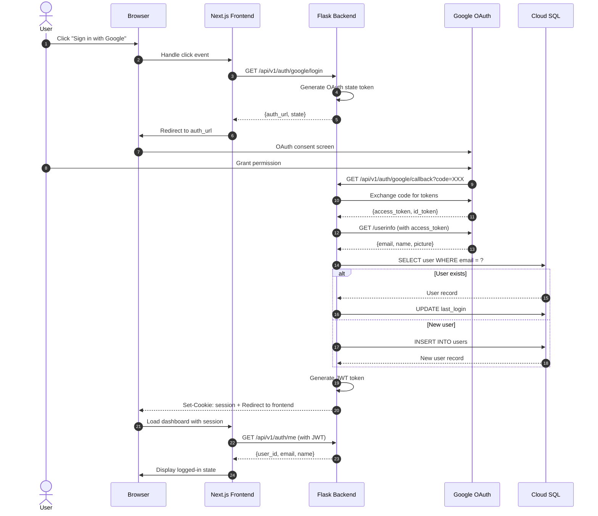

### 1.2 Logout Flow

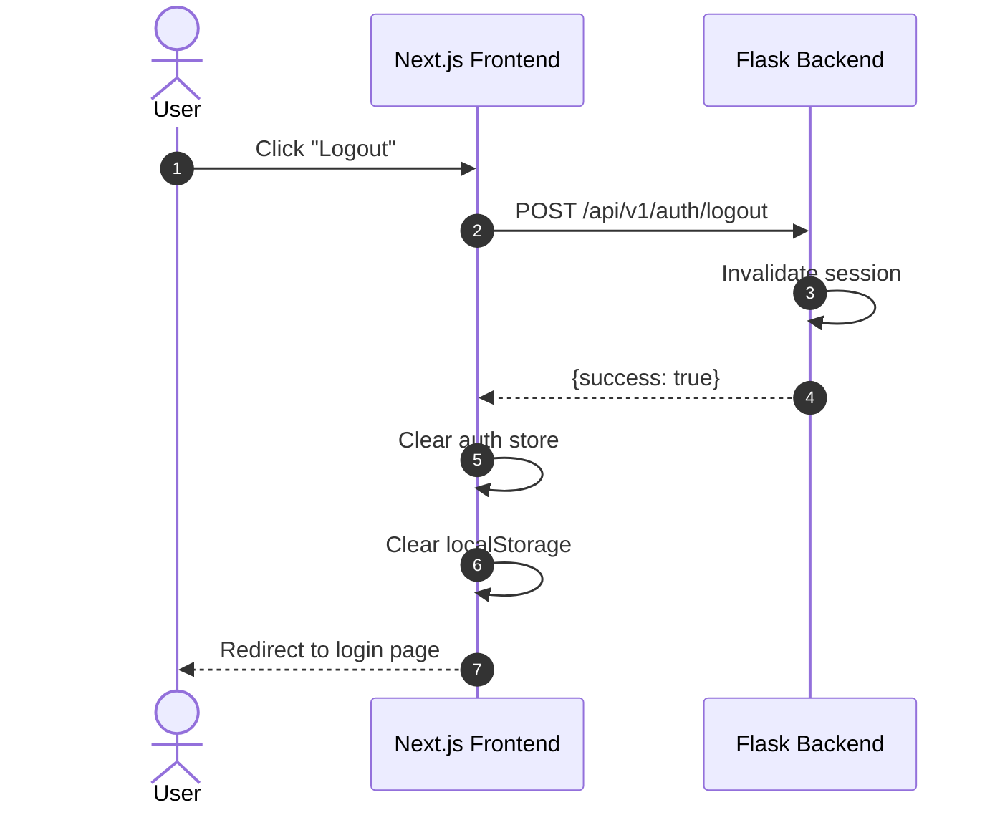

---

## 2. Drawing Upload Flow

### 2.1 Single File Upload

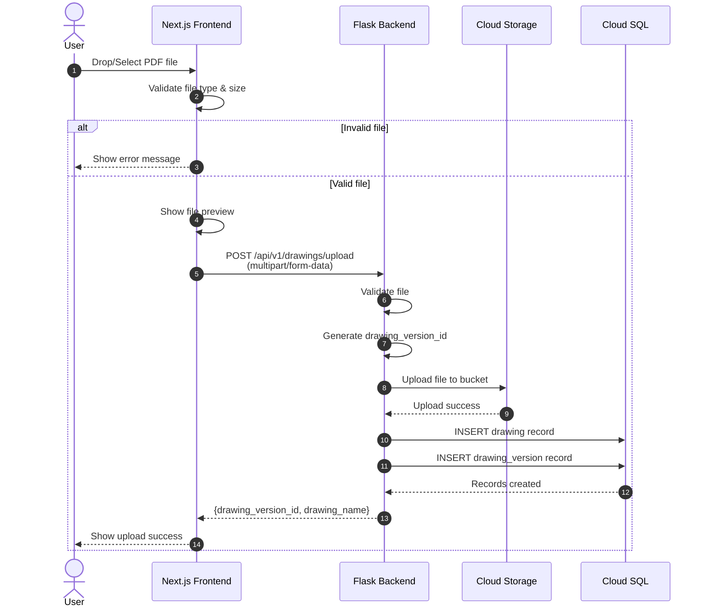

### 2.2 Comparison Upload Flow (Both Files)

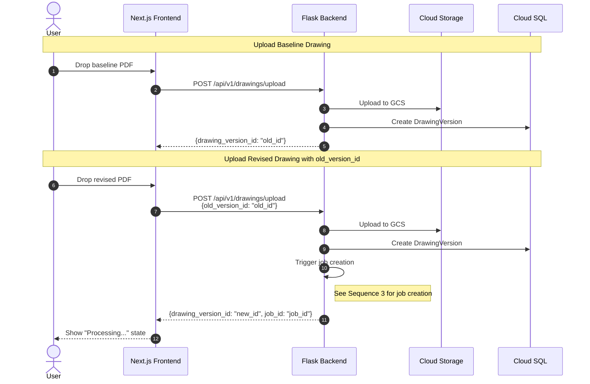

---

## 3. Comparison Job Creation

### 3.1 Legacy Batch Mode

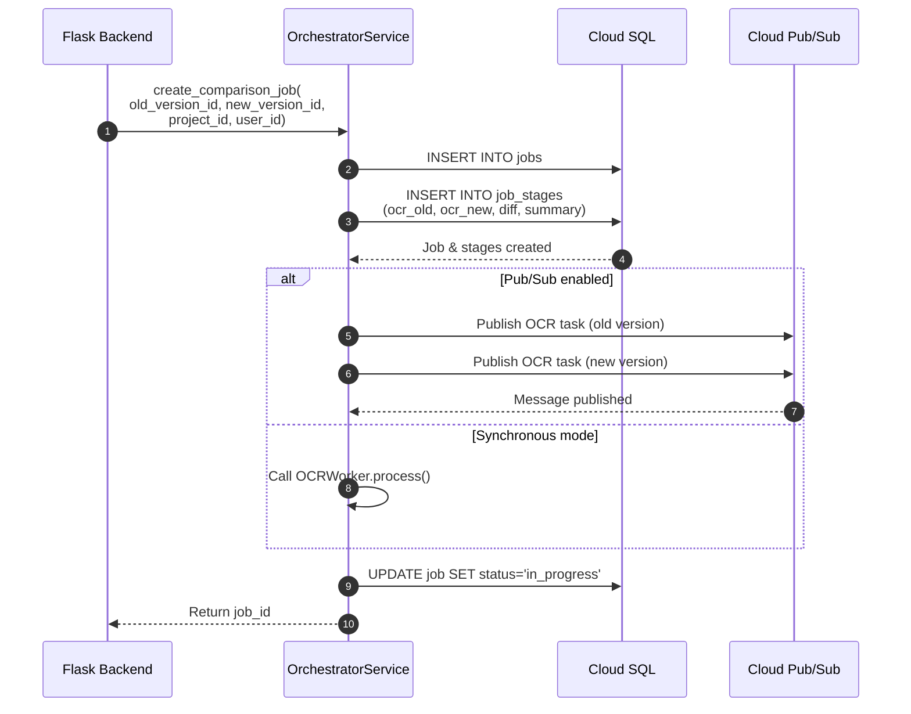

### 3.2 Streaming Mode (Per-Page)

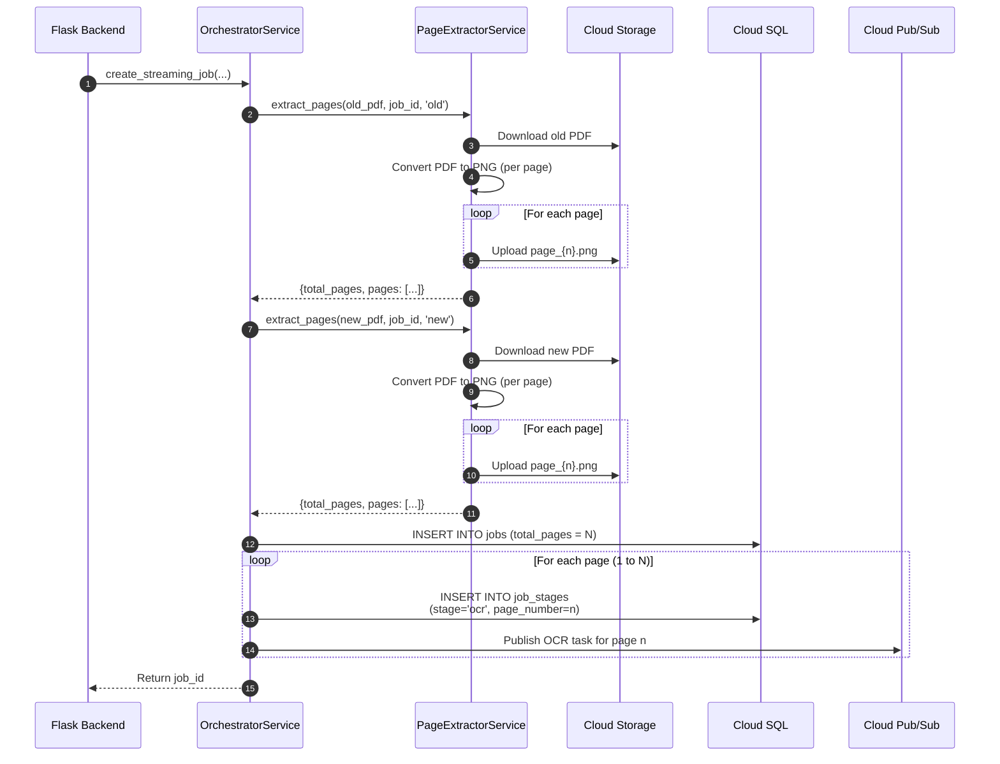

---

## 4. Streaming Pipeline Processing

### 4.1 Per-Page OCR → Diff → Summary Flow

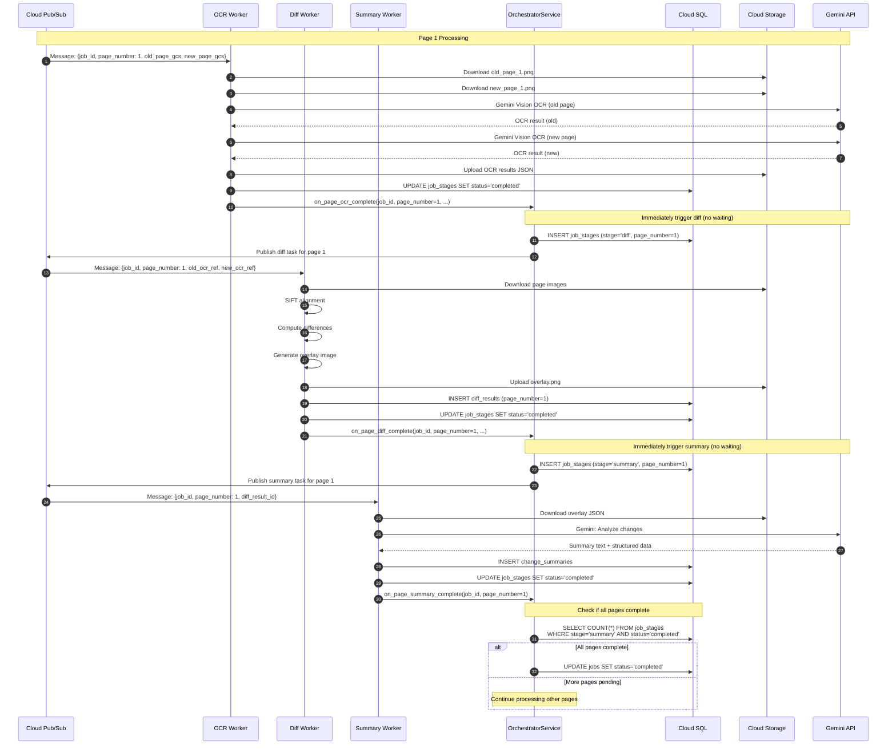

### 4.2 Parallel Page Processing

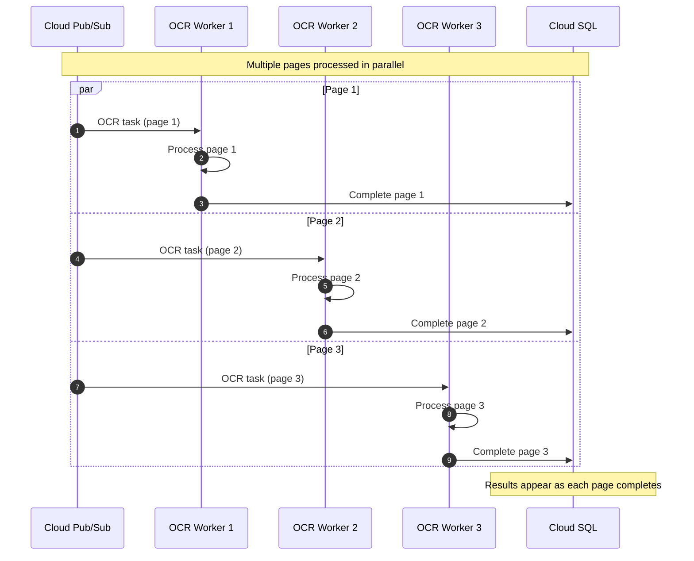

---

## 5. Results Retrieval

### 5.1 Job Status Polling

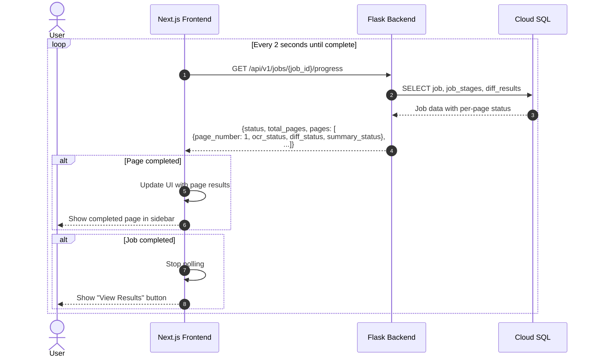

### 5.2 Load Full Results

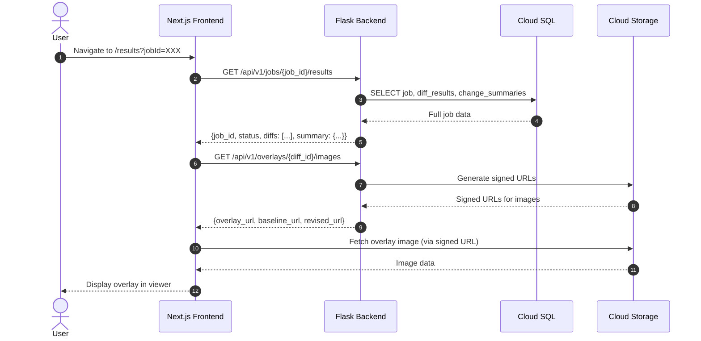

---

## 6. Chatbot Interaction

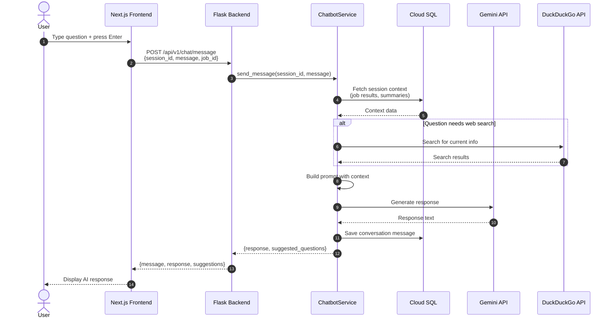

---

## 7. Summary Regeneration

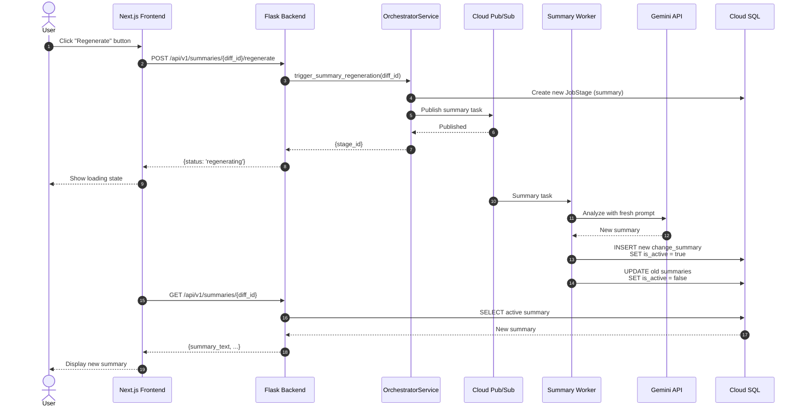

---

## Summary

This document covered the main sequence diagrams for BuildTrace:

| Flow | Description | Key Components |
|------|-------------|----------------|
| **Authentication** | Google OAuth login/logout | Frontend, Backend, Google OAuth |
| **Drawing Upload** | File upload with validation | Frontend, Backend, GCS |
| **Job Creation** | Legacy batch and streaming modes | Orchestrator, DB, Pub/Sub |
| **Streaming Pipeline** | Per-page OCR → Diff → Summary | Workers, Orchestrator |
| **Results Retrieval** | Polling and full results load | Frontend, Backend, GCS |
| **Chatbot** | AI-powered Q&A | Chatbot Service, Gemini |
| **Regeneration** | Summary regeneration | Orchestrator, Workers |

---

*End of Sequence Diagrams Document*

