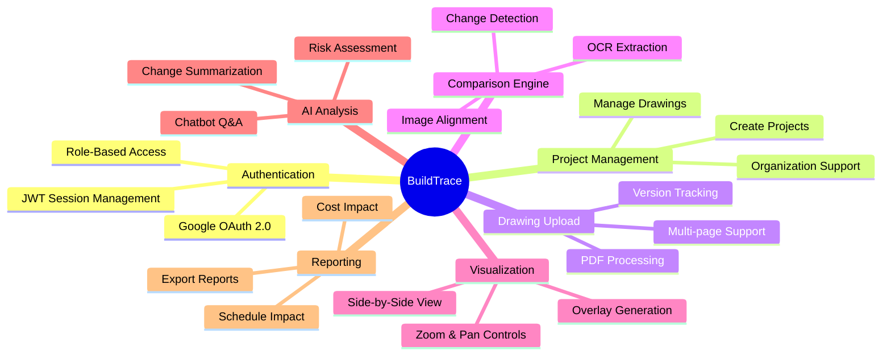
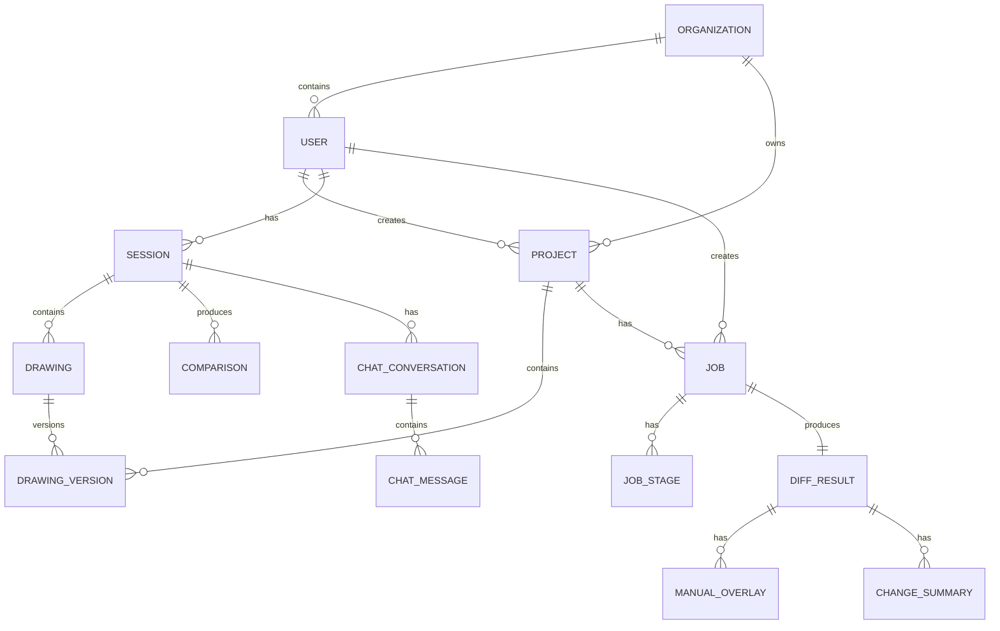

# Software Requirements Specification (SRS)

## BuildTrace - Construction Drawing Comparison Platform

**Document Version:** 1.0  
**Date:** December 2025  
**Status:** Approved ✅

---

## Table of Contents

1. [Introduction](#1-introduction)
2. [Overall Description](#2-overall-description)
3. [System Features](#3-system-features)
4. [External Interface Requirements](#4-external-interface-requirements)
5. [Non-Functional Requirements](#5-non-functional-requirements)
6. [Data Requirements](#6-data-requirements)
7. [Constraints](#7-constraints)
8. [Appendices](#8-appendices)

---

## 1. Introduction

### 1.1 Purpose

This Software Requirements Specification (SRS) document provides a comprehensive description of the BuildTrace platform—a cloud-based SaaS solution for automated construction drawing comparison and change detection. This document is intended for:

- Development team members
- Quality assurance engineers
- Project managers
- System architects
- Stakeholders and investors

### 1.2 Scope

BuildTrace is designed to:

1. Accept construction drawing uploads (PDF, DWG, DXF, PNG, JPG)
2. Extract text and layout information using AI-powered OCR
3. Compare two versions of drawings to detect changes
4. Generate visual overlays highlighting additions, deletions, and modifications
5. Produce AI-generated summaries of detected changes
6. Provide an interactive chatbot for querying changes
7. Support multi-tenant organizations with project management

### 1.3 Definitions, Acronyms, and Abbreviations

| Term | Definition |
|------|------------|
| **OCR** | Optical Character Recognition - extracting text from images |
| **DWG** | AutoCAD Drawing file format |
| **DXF** | Drawing Exchange Format (AutoCAD) |
| **GCS** | Google Cloud Storage |
| **Pub/Sub** | Google Cloud Pub/Sub messaging service |
| **SIFT** | Scale-Invariant Feature Transform (image alignment algorithm) |
| **JWT** | JSON Web Token for authentication |
| **LLM** | Large Language Model (AI text generation) |
| **Overlay** | Visual representation showing changes between drawings |
| **Diff** | Difference calculation between two versions |

### 1.4 References

- Google Cloud Platform Documentation
- Flask Framework Documentation
- Next.js 14 Documentation
- OpenCV Documentation
- Google Gemini API Documentation

### 1.5 Overview

The remainder of this document details the product functions, user characteristics, constraints, assumptions, and specific requirements for the BuildTrace system.

---

## 2. Overall Description

### 2.1 Product Perspective

BuildTrace operates as a standalone SaaS application deployed on Google Cloud Platform. It integrates with:

- **Google Cloud Run** - Serverless compute for backend and frontend
- **Cloud SQL** - Managed PostgreSQL database
- **Cloud Storage** - Object storage for drawings and results
- **Cloud Pub/Sub** - Asynchronous job processing
- **Google Identity** - OAuth 2.0 authentication
- **Google Gemini** - AI vision and text analysis
- **OpenAI GPT** - Alternative AI provider (fallback)

### 2.2 Product Functions

The system provides the following high-level functions:

### 2.3 User Classes and Characteristics

| User Class | Description | Technical Expertise |
|------------|-------------|---------------------|
| **Architect** | Reviews drawing revisions, primary user | Low to Medium |
| **Engineer** | Analyzes structural/MEP changes | Medium |
| **Contractor** | Needs quick change summaries for field work | Low |
| **Project Manager** | Oversees comparisons, tracks project history | Low |
| **Administrator** | Manages users, organizations, system settings | Medium to High |

### 2.4 Operating Environment

- **Client:** Modern web browsers (Chrome, Firefox, Safari, Edge)
- **Server:** Google Cloud Run (Linux containers)
- **Database:** PostgreSQL 17 (Cloud SQL)
- **Storage:** Google Cloud Storage

### 2.5 Design and Implementation Constraints

1. **File Size Limit:** Maximum 70 MB per upload
2. **Supported Formats:** PDF, DWG, DXF, PNG, JPG, JPEG
3. **Processing Time:** 2-5 minutes for typical 2-page comparison
4. **Concurrent Users:** Limited by Cloud Run scaling (0-100 instances)
5. **Data Retention:** Configurable lifecycle policies on GCS

### 2.6 Assumptions and Dependencies

**Assumptions:**
- Users have stable internet connections
- Uploaded drawings are valid and not corrupted
- Users have Google accounts for authentication

**Dependencies:**
- Google Cloud Platform services availability
- Google Gemini API availability and quotas
- OpenAI API availability (fallback)
- Third-party library compatibility

---

## 3. System Features

### 3.1 User Authentication (FR-AUTH)

**Priority:** High

#### 3.1.1 Description
Users authenticate via Google OAuth 2.0. The system creates user profiles and manages sessions using JWT tokens.

#### 3.1.2 Functional Requirements

| ID | Requirement | Priority |
|----|-------------|----------|
| FR-AUTH-01 | System shall support Google OAuth 2.0 authentication | High |
| FR-AUTH-02 | System shall create user profile on first login | High |
| FR-AUTH-03 | System shall issue JWT tokens for API authentication | High |
| FR-AUTH-04 | System shall support session logout | Medium |
| FR-AUTH-05 | System shall restrict access to authenticated users only | High |
| FR-AUTH-06 | System shall support organization-based multi-tenancy | Medium |

### 3.2 Project Management (FR-PROJ)

**Priority:** High

#### 3.2.1 Description
Users can create and manage projects to organize their drawing comparisons.

#### 3.2.2 Functional Requirements

| ID | Requirement | Priority |
|----|-------------|----------|
| FR-PROJ-01 | Users shall create new projects with name and description | High |
| FR-PROJ-02 | Users shall view list of their projects | High |
| FR-PROJ-03 | Users shall access project details including statistics | Medium |
| FR-PROJ-04 | Projects shall track document count, drawing count, comparison count | Medium |
| FR-PROJ-05 | Projects shall support status (active, archived, completed) | Low |
| FR-PROJ-06 | System shall create default project for new users | High |

### 3.3 Drawing Upload (FR-UPLOAD)

**Priority:** High

#### 3.3.1 Description
Users upload construction drawings for comparison. The system validates, stores, and processes uploads.

#### 3.3.2 Functional Requirements

| ID | Requirement | Priority |
|----|-------------|----------|
| FR-UPLOAD-01 | System shall accept PDF, DWG, DXF, PNG, JPG file uploads | High |
| FR-UPLOAD-02 | System shall validate file size (max 70 MB) | High |
| FR-UPLOAD-03 | System shall store uploads in cloud storage | High |
| FR-UPLOAD-04 | System shall create drawing version records | High |
| FR-UPLOAD-05 | System shall extract drawing names from PDFs | Medium |
| FR-UPLOAD-06 | System shall support multi-page PDF uploads | High |
| FR-UPLOAD-07 | System shall show upload progress | Medium |

### 3.4 Comparison Processing (FR-COMPARE)

**Priority:** High

#### 3.4.1 Description
The core comparison engine processes uploaded drawings through OCR, diff, and summary stages.

#### 3.4.2 Functional Requirements

| ID | Requirement | Priority |
|----|-------------|----------|
| FR-COMPARE-01 | System shall perform OCR on both baseline and revised drawings | High |
| FR-COMPARE-02 | System shall align drawings using SIFT algorithm | High |
| FR-COMPARE-03 | System shall detect additions (green), deletions (red), modifications (yellow) | High |
| FR-COMPARE-04 | System shall generate overlay images | High |
| FR-COMPARE-05 | System shall calculate alignment score (0-100%) | Medium |
| FR-COMPARE-06 | System shall count total changes detected | High |
| FR-COMPARE-07 | System shall process pages in parallel (streaming) | High |
| FR-COMPARE-08 | System shall show results as each page completes | High |

### 3.5 AI Summarization (FR-SUMMARY)

**Priority:** High

#### 3.5.1 Description
AI generates natural language summaries of detected changes using Google Gemini.

#### 3.5.2 Functional Requirements

| ID | Requirement | Priority |
|----|-------------|----------|
| FR-SUMMARY-01 | System shall generate AI summary for each comparison | High |
| FR-SUMMARY-02 | Summary shall include change list with descriptions | High |
| FR-SUMMARY-03 | Summary shall categorize changes (Architectural, MEP, Structural) | Medium |
| FR-SUMMARY-04 | Summary shall identify critical changes | High |
| FR-SUMMARY-05 | Users shall edit and save modified summaries | Medium |
| FR-SUMMARY-06 | System shall support summary regeneration | Medium |

### 3.6 Results Visualization (FR-VIS)

**Priority:** High

#### 3.6.1 Description
Interactive visualization of comparison results with multiple view modes.

#### 3.6.2 Functional Requirements

| ID | Requirement | Priority |
|----|-------------|----------|
| FR-VIS-01 | System shall display overlay view showing all changes | High |
| FR-VIS-02 | System shall provide side-by-side view of old and new | High |
| FR-VIS-03 | System shall provide baseline-only view | Medium |
| FR-VIS-04 | System shall provide revised-only view | Medium |
| FR-VIS-05 | Users shall zoom in/out (5% to 400%) | High |
| FR-VIS-06 | Users shall pan across drawings | High |
| FR-VIS-07 | Side-by-side view shall synchronize scroll positions | High |
| FR-VIS-08 | System shall provide download button for overlay | Medium |

### 3.7 AI Chatbot (FR-CHAT)

**Priority:** Medium

#### 3.7.1 Description
Interactive chatbot for querying changes using natural language.

#### 3.7.2 Functional Requirements

| ID | Requirement | Priority |
|----|-------------|----------|
| FR-CHAT-01 | Users shall ask questions about detected changes | Medium |
| FR-CHAT-02 | Chatbot shall provide context-aware responses | Medium |
| FR-CHAT-03 | Chatbot shall suggest relevant questions | Low |
| FR-CHAT-04 | Chatbot shall support web search for current information | Low |
| FR-CHAT-05 | System shall maintain conversation history per session | Medium |

### 3.8 Reporting (FR-REPORT)

**Priority:** Medium

#### 3.8.1 Description
Generate impact reports based on detected changes.

#### 3.8.2 Functional Requirements

| ID | Requirement | Priority |
|----|-------------|----------|
| FR-REPORT-01 | System shall generate cost impact report | Medium |
| FR-REPORT-02 | System shall generate schedule impact report | Medium |
| FR-REPORT-03 | Reports shall be exportable (PDF format) | Low |
| FR-REPORT-04 | Reports shall show itemized change costs | Medium |

---

## 4. External Interface Requirements

### 4.1 User Interfaces

#### 4.1.1 Home Page / Upload Interface
- Hero section with product branding
- Project selector dropdown
- Dual file upload areas (baseline + revised)
- Progress stepper (Upload Old → Upload New → Process → Results)
- Compare Drawings button
- Recent comparisons table

#### 4.1.2 Results Page
- Drawing selector sidebar (list of compared pages)
- View mode toggle (Overlay, Side-by-Side, Baseline Only, Revised Only)
- Zoom controls (zoom in, zoom out, reset, fit to screen)
- Image viewer with pan support
- Changes list panel
- AI summary panel with edit capability
- Quick Questions section (Cost Impact, Schedule Impact)
- Chatbot input

#### 4.1.3 Projects Page
- Project cards with statistics
- Create new project modal
- Project detail view with tabs (Documents, Drawings, Comparisons)

### 4.2 Hardware Interfaces

Not applicable - cloud-based application.

### 4.3 Software Interfaces

| Interface | Description | Protocol |
|-----------|-------------|----------|
| **Google OAuth 2.0** | User authentication | HTTPS |
| **Google Gemini API** | AI vision and text | HTTPS/REST |
| **OpenAI API** | Fallback AI provider | HTTPS/REST |
| **Cloud SQL** | Database connection | PostgreSQL (TCP) |
| **Cloud Storage** | File storage | HTTPS/gRPC |
| **Cloud Pub/Sub** | Message queue | HTTPS/gRPC |

### 4.4 Communications Interfaces

- **Protocol:** HTTPS (TLS 1.3)
- **API Format:** RESTful JSON
- **Authentication:** Bearer JWT tokens
- **CORS:** Configured for frontend origins

---

## 5. Non-Functional Requirements

### 5.1 Performance Requirements

| Metric | Requirement |
|--------|-------------|
| **API Response Time** | < 500ms for status queries |
| **Upload Speed** | Support up to 70 MB files |
| **Processing Time** | < 5 minutes for 2-page comparison |
| **Streaming Updates** | Per-page results within 30s of completion |
| **Concurrent Users** | Support 100+ simultaneous users |

### 5.2 Safety Requirements

- No physical safety hazards (software-only system)
- Data validation to prevent corruption
- Error handling with graceful degradation

### 5.3 Security Requirements

| Requirement | Implementation |
|-------------|----------------|
| **Authentication** | Google OAuth 2.0 + JWT |
| **Authorization** | User ownership checks on all resources |
| **Data Encryption (Transit)** | TLS 1.3 for all HTTPS traffic |
| **Data Encryption (Rest)** | Google-managed encryption for Cloud SQL and GCS |
| **Secrets Management** | Google Secret Manager |
| **Input Validation** | File type, size, and content validation |
| **CORS** | Restrict to known frontend origins |
| **Session Security** | HTTP-only, SameSite=Lax, Secure cookies |

### 5.4 Software Quality Attributes

| Attribute | Target | Measure |
|-----------|--------|---------|
| **Availability** | 99.5% | Monthly uptime |
| **Reliability** | < 1% job failure rate | Failed jobs / total jobs |
| **Scalability** | Auto-scale to demand | Cloud Run instances |
| **Maintainability** | Modular architecture | Separation of concerns |
| **Portability** | Containerized | Docker images |

### 5.5 Business Rules

1. Users can only access their own projects and comparisons
2. Organization members can access shared organization projects
3. Jobs cannot be cancelled after completion
4. Uploaded files are retained according to GCS lifecycle policies
5. Free tier limited to X comparisons per month (if applicable)

---

## 6. Data Requirements

### 6.1 Logical Data Model

### 6.2 Data Dictionary

| Entity | Description | Key Fields |
|--------|-------------|------------|
| **User** | Registered user account | email, name, organization_id |
| **Organization** | Multi-tenant organization | name, domain, plan |
| **Project** | Container for drawings | name, user_id, status |
| **DrawingVersion** | Specific version of a drawing | drawing_name, version_number, ocr_status |
| **Job** | Comparison job | status, total_pages, created_by |
| **JobStage** | Individual processing stage | stage, page_number, status |
| **DiffResult** | Comparison output | alignment_score, change_count |
| **ChangeSummary** | AI-generated summary | summary_text, source |

### 6.3 Data Retention

| Data Type | Retention Period | Action |
|-----------|-----------------|--------|
| Uploaded Drawings | 30 days → NEARLINE, 365 days → DELETE |
| Processed Results | 60 days → NEARLINE, 730 days → DELETE |
| Job Metadata | Indefinite (database) |
| Audit Logs | 2 years |
| Chat History | 90 days |

---

## 7. Constraints

### 7.1 Regulatory Constraints

- **GDPR Compliance:** User data deletion upon request
- **Data Residency:** Data stored in us-west2 region

### 7.2 Technical Constraints

1. Cloud Run request timeout: 60 minutes maximum
2. Cloud Run memory: 2 GiB per instance
3. Pub/Sub message size: 10 MB maximum
4. GCS single object: 5 TB maximum
5. Cloud SQL connections: Limited by instance tier

### 7.3 Business Constraints

- Dependency on Google Cloud Platform
- AI API costs per usage
- Processing capacity limited by budget

---

## 8. Appendices

### 8.1 Glossary

| Term | Definition |
|------|------------|
| **Baseline Drawing** | The older version used as reference |
| **Revised Drawing** | The newer version being compared |
| **Overlay** | Visual image showing changes with color coding |
| **Alignment Score** | Percentage indicating how well drawings align |
| **Streaming Pipeline** | Per-page processing for faster results |

### 8.2 Analysis Models

See accompanying documents:
- [Use Case Diagrams](./USE_CASE_DIAGRAMS.md)
- [Sequence Diagrams](./SEQUENCE_DIAGRAMS.md)
- [Activity Diagrams](./ACTIVITY_DIAGRAMS.md)
- [Data Flow Diagrams](./DFD.md)

### 8.3 To Be Determined (TBD)

| Item | Status |
|------|--------|
| Pricing tiers and limits | TBD |
| Custom AI model fine-tuning | Future consideration |
| DWG native support (without conversion) | Under evaluation |
| Mobile application | Not planned |

---

**Document Approval:**

| Role | Name | Date | Signature |
|------|------|------|-----------|
| Product Owner | - | - | - |
| Tech Lead | - | - | - |
| QA Lead | - | - | - |

---

*End of Software Requirements Specification*

