# Use Case Diagrams

## BuildTrace - Construction Drawing Comparison Platform

**Document Version:** 1.0  
**Date:** December 2025

---

## Table of Contents

1. [Actors](#1-actors)
2. [System Use Case Diagram](#2-system-use-case-diagram)
3. [Authentication Use Cases](#3-authentication-use-cases)
4. [Project Management Use Cases](#4-project-management-use-cases)
5. [Drawing Comparison Use Cases](#5-drawing-comparison-use-cases)
6. [Results Visualization Use Cases](#6-results-visualization-use-cases)
7. [AI Features Use Cases](#7-ai-features-use-cases)
8. [Use Case Specifications](#8-use-case-specifications)

---

## 1. Actors

### 1.1 Primary Actors

```mermaid
graph TB
    subgraph Primary Actors
        A1[👤 Architect<br/>Reviews drawing revisions]
        A2[👷 Engineer<br/>Analyzes structural changes]
        A3[🔧 Contractor<br/>Needs quick summaries]
        A4[📋 Project Manager<br/>Oversees comparisons]
    end
    
    subgraph Secondary Actors
        S1[🤖 AI Service<br/>Gemini/GPT]
        S2[🗄️ Database<br/>Cloud SQL]
        S3[📦 Storage<br/>Cloud Storage]
        S4[📨 Message Queue<br/>Pub/Sub]
    end
```

### 1.2 Actor Descriptions

| Actor | Type | Description | Goals |
|-------|------|-------------|-------|
| **Architect** | Primary | Construction professional reviewing drawing revisions | Quickly identify all changes between drawing versions |
| **Engineer** | Primary | Structural/MEP engineer analyzing technical changes | Understand scope and impact of changes |
| **Contractor** | Primary | Field personnel needing change information | Get clear summaries for construction activities |
| **Project Manager** | Primary | Oversees project documentation | Track revision history, ensure compliance |
| **Administrator** | Primary | System administrator | Manage users, organizations, system settings |
| **AI Service** | Secondary | Google Gemini / OpenAI GPT | Perform OCR, generate summaries |
| **Database** | Secondary | Cloud SQL PostgreSQL | Store metadata, job status |
| **Storage** | Secondary | Google Cloud Storage | Store drawings, results |
| **Message Queue** | Secondary | Cloud Pub/Sub | Handle async job processing |

---

## 2. System Use Case Diagram

```mermaid
graph TB
    subgraph BuildTrace System
        UC1((Login with Google))
        UC2((Logout))
        UC3((Create Project))
        UC4((View Projects))
        UC5((Upload Baseline Drawing))
        UC6((Upload Revised Drawing))
        UC7((Start Comparison))
        UC8((View Job Status))
        UC9((View Comparison Results))
        UC10((Change View Mode))
        UC11((Zoom/Pan Drawing))
        UC12((View Change Summary))
        UC13((Edit Summary))
        UC14((Ask Chatbot))
        UC15((Generate Cost Report))
        UC16((Generate Schedule Report))
        UC17((Download Overlay))
    end

    User((👤 User))
    AI((🤖 AI Service))
    
    User --> UC1
    User --> UC2
    User --> UC3
    User --> UC4
    User --> UC5
    User --> UC6
    User --> UC7
    User --> UC8
    User --> UC9
    User --> UC10
    User --> UC11
    User --> UC12
    User --> UC13
    User --> UC14
    User --> UC15
    User --> UC16
    User --> UC17
    
    UC7 -.-> |includes| AI
    UC12 -.-> |includes| AI
    UC14 -.-> |includes| AI
    UC15 -.-> |includes| AI
```

---

## 3. Authentication Use Cases

```mermaid
graph LR
    subgraph Authentication
        UC_LOGIN((UC-01<br/>Login with Google))
        UC_LOGOUT((UC-02<br/>Logout))
        UC_PROFILE((UC-03<br/>View Profile))
    end
    
    User((👤 User))
    Google((🔐 Google OAuth))
    
    User --> UC_LOGIN
    User --> UC_LOGOUT
    User --> UC_PROFILE
    
    UC_LOGIN -.-> |authenticates via| Google
```

### UC-01: Login with Google

| Field | Description |
|-------|-------------|
| **Use Case ID** | UC-01 |
| **Name** | Login with Google |
| **Actor** | User |
| **Preconditions** | User has a Google account |
| **Main Flow** | 1. User clicks "Sign in with Google" 2. System redirects to Google OAuth 3. User grants permission 4. System receives OAuth token 5. System creates/updates user profile 6. System issues JWT token 7. User is redirected to dashboard |
| **Postconditions** | User is authenticated and can access protected resources |
| **Alternative Flows** | A1: User denies permission → Show error message |

### UC-02: Logout

| Field | Description |
|-------|-------------|
| **Use Case ID** | UC-02 |
| **Name** | Logout |
| **Actor** | Authenticated User |
| **Preconditions** | User is logged in |
| **Main Flow** | 1. User clicks "Logout" 2. System invalidates JWT token 3. System clears session cookies 4. User is redirected to login page |
| **Postconditions** | User session is terminated |

---

## 4. Project Management Use Cases

```mermaid
graph TB
    subgraph Project Management
        UC_CREATE_PROJ((UC-10<br/>Create Project))
        UC_VIEW_PROJS((UC-11<br/>View Projects))
        UC_VIEW_PROJ((UC-12<br/>View Project Details))
        UC_EDIT_PROJ((UC-13<br/>Edit Project))
        UC_DELETE_PROJ((UC-14<br/>Archive Project))
    end
    
    User((👤 User))
    
    User --> UC_CREATE_PROJ
    User --> UC_VIEW_PROJS
    User --> UC_VIEW_PROJ
    User --> UC_EDIT_PROJ
    User --> UC_DELETE_PROJ
    
    UC_VIEW_PROJ -.-> |extends| UC_VIEW_PROJS
```

### UC-10: Create Project

| Field | Description |
|-------|-------------|
| **Use Case ID** | UC-10 |
| **Name** | Create Project |
| **Actor** | Authenticated User |
| **Preconditions** | User is logged in |
| **Main Flow** | 1. User clicks "New Project" 2. System displays project form 3. User enters name and description 4. User clicks "Create" 5. System validates input 6. System creates project record 7. System displays project in list |
| **Postconditions** | New project is created and visible |
| **Business Rules** | Project name must be unique within user's projects |

### UC-11: View Projects

| Field | Description |
|-------|-------------|
| **Use Case ID** | UC-11 |
| **Name** | View Projects |
| **Actor** | Authenticated User |
| **Preconditions** | User is logged in |
| **Main Flow** | 1. User navigates to Projects page 2. System retrieves user's projects 3. System displays project cards with statistics 4. User can filter/search projects |
| **Postconditions** | User sees list of their projects |

---

## 5. Drawing Comparison Use Cases

```mermaid
graph TB
    subgraph Drawing Comparison
        UC_UPLOAD_BASE((UC-20<br/>Upload Baseline))
        UC_UPLOAD_REV((UC-21<br/>Upload Revised))
        UC_START_COMP((UC-22<br/>Start Comparison))
        UC_VIEW_STATUS((UC-23<br/>View Job Status))
        UC_CANCEL_JOB((UC-24<br/>Cancel Job))
    end
    
    User((👤 User))
    OCR((🔍 OCR Worker))
    Diff((⚖️ Diff Worker))
    Summary((📝 Summary Worker))
    
    User --> UC_UPLOAD_BASE
    User --> UC_UPLOAD_REV
    User --> UC_START_COMP
    User --> UC_VIEW_STATUS
    User --> UC_CANCEL_JOB
    
    UC_START_COMP -.-> |triggers| OCR
    OCR -.-> |triggers| Diff
    Diff -.-> |triggers| Summary
```

### UC-20: Upload Baseline Drawing

| Field | Description |
|-------|-------------|
| **Use Case ID** | UC-20 |
| **Name** | Upload Baseline Drawing |
| **Actor** | Authenticated User |
| **Preconditions** | User is logged in, project selected |
| **Main Flow** | 1. User drags file to drop zone OR clicks to browse 2. System validates file type (PDF, PNG, etc.) 3. System validates file size (≤70 MB) 4. System uploads file to GCS 5. System creates DrawingVersion record 6. System displays uploaded file name |
| **Postconditions** | Baseline drawing is stored and ready for comparison |
| **Alternative Flows** | A1: Invalid file type → Show error A2: File too large → Show error |

### UC-21: Upload Revised Drawing

| Field | Description |
|-------|-------------|
| **Use Case ID** | UC-21 |
| **Name** | Upload Revised Drawing |
| **Actor** | Authenticated User |
| **Preconditions** | Baseline drawing uploaded |
| **Main Flow** | Same as UC-20 |
| **Postconditions** | Revised drawing is stored and ready for comparison |

### UC-22: Start Comparison

| Field | Description |
|-------|-------------|
| **Use Case ID** | UC-22 |
| **Name** | Start Comparison |
| **Actor** | Authenticated User |
| **Preconditions** | Both baseline and revised drawings uploaded |
| **Main Flow** | 1. User clicks "Compare Drawings" 2. System creates Job record 3. System extracts pages from PDFs 4. System creates JobStage records for each page 5. System publishes OCR tasks to Pub/Sub 6. System returns job_id 7. Frontend starts polling job status |
| **Postconditions** | Comparison job is running |
| **Trigger** | Both files uploaded, Compare button clicked |

### UC-23: View Job Status

| Field | Description |
|-------|-------------|
| **Use Case ID** | UC-23 |
| **Name** | View Job Status |
| **Actor** | Authenticated User |
| **Preconditions** | Job has been created |
| **Main Flow** | 1. Frontend polls GET /api/v1/jobs/{job_id}/progress 2. System returns per-page status (OCR, Diff, Summary) 3. Frontend updates progress UI 4. When job completes, redirect to results page |
| **Postconditions** | User sees real-time progress |
| **Notes** | Streaming pipeline shows results as each page completes |

---

## 6. Results Visualization Use Cases

```mermaid
graph TB
    subgraph Results Visualization
        UC_VIEW_RESULTS((UC-30<br/>View Results))
        UC_SELECT_DRAWING((UC-31<br/>Select Drawing))
        UC_CHANGE_VIEW((UC-32<br/>Change View Mode))
        UC_ZOOM_PAN((UC-33<br/>Zoom/Pan))
        UC_DOWNLOAD((UC-34<br/>Download Overlay))
    end
    
    User((👤 User))
    
    User --> UC_VIEW_RESULTS
    User --> UC_SELECT_DRAWING
    User --> UC_CHANGE_VIEW
    User --> UC_ZOOM_PAN
    User --> UC_DOWNLOAD
    
    UC_SELECT_DRAWING -.-> |part of| UC_VIEW_RESULTS
    UC_CHANGE_VIEW -.-> |part of| UC_VIEW_RESULTS
    UC_ZOOM_PAN -.-> |part of| UC_VIEW_RESULTS
```

### UC-30: View Results

| Field | Description |
|-------|-------------|
| **Use Case ID** | UC-30 |
| **Name** | View Comparison Results |
| **Actor** | Authenticated User |
| **Preconditions** | Comparison job completed |
| **Main Flow** | 1. User navigates to results page with job_id 2. System loads job results 3. System displays KPIs (Added, Modified, Removed counts) 4. System displays drawing selector 5. System displays overlay image viewer 6. System displays change summary |
| **Postconditions** | User can view and interact with comparison results |

### UC-32: Change View Mode

| Field | Description |
|-------|-------------|
| **Use Case ID** | UC-32 |
| **Name** | Change View Mode |
| **Actor** | Authenticated User |
| **Preconditions** | Viewing results page |
| **Main Flow** | 1. User clicks view mode button (Overlay, Side-by-Side, etc.) 2. System updates image viewer 3. For Side-by-Side: both images scroll together |
| **View Modes** | Overlay, Side-by-Side, Baseline Only, Revised Only |

### UC-33: Zoom/Pan

| Field | Description |
|-------|-------------|
| **Use Case ID** | UC-33 |
| **Name** | Zoom and Pan Drawing |
| **Actor** | Authenticated User |
| **Preconditions** | Viewing results page |
| **Main Flow** | 1. User clicks Zoom In/Out buttons OR uses mouse wheel 2. System adjusts zoom level (5% to 400%) 3. User drags to pan across drawing 4. User clicks Reset to return to default view |
| **Controls** | Zoom In, Zoom Out, Reset, Fit to Screen |

---

## 7. AI Features Use Cases

```mermaid
graph TB
    subgraph AI Features
        UC_VIEW_SUMMARY((UC-40<br/>View Summary))
        UC_EDIT_SUMMARY((UC-41<br/>Edit Summary))
        UC_REGEN_SUMMARY((UC-42<br/>Regenerate Summary))
        UC_ASK_CHATBOT((UC-43<br/>Ask Chatbot))
        UC_COST_REPORT((UC-44<br/>Generate Cost Report))
        UC_SCHEDULE_REPORT((UC-45<br/>Generate Schedule Report))
    end
    
    User((👤 User))
    AI((🤖 AI Service))
    
    User --> UC_VIEW_SUMMARY
    User --> UC_EDIT_SUMMARY
    User --> UC_REGEN_SUMMARY
    User --> UC_ASK_CHATBOT
    User --> UC_COST_REPORT
    User --> UC_SCHEDULE_REPORT
    
    UC_REGEN_SUMMARY -.-> |calls| AI
    UC_ASK_CHATBOT -.-> |calls| AI
    UC_COST_REPORT -.-> |calls| AI
```

### UC-40: View Summary

| Field | Description |
|-------|-------------|
| **Use Case ID** | UC-40 |
| **Name** | View AI Summary |
| **Actor** | Authenticated User |
| **Preconditions** | Comparison job completed |
| **Main Flow** | 1. User views results page 2. System displays AI-generated summary 3. Summary shows change list, categories, recommendations |
| **Postconditions** | User understands changes at a glance |

### UC-41: Edit Summary

| Field | Description |
|-------|-------------|
| **Use Case ID** | UC-41 |
| **Name** | Edit Summary |
| **Actor** | Authenticated User |
| **Preconditions** | Viewing summary |
| **Main Flow** | 1. User modifies summary text in textarea 2. User clicks "Save Summary" 3. System saves updated summary as "human_corrected" 4. System displays success message |
| **Postconditions** | Modified summary is saved |

### UC-43: Ask Chatbot

| Field | Description |
|-------|-------------|
| **Use Case ID** | UC-43 |
| **Name** | Ask Chatbot |
| **Actor** | Authenticated User |
| **Preconditions** | Viewing results page |
| **Main Flow** | 1. User types question in chatbot input 2. User presses Enter or clicks Send 3. System sends question to AI with context 4. AI generates response 5. System displays response |
| **Example Questions** | "Which walls were added?", "Summarize structural changes" |

### UC-44: Generate Cost Report

| Field | Description |
|-------|-------------|
| **Use Case ID** | UC-44 |
| **Name** | Generate Cost Impact Report |
| **Actor** | Authenticated User |
| **Preconditions** | Comparison completed |
| **Main Flow** | 1. User clicks "Cost Impact" button 2. System analyzes changes 3. System generates itemized cost estimates 4. System displays cost impact report panel |
| **Output** | Itemized cost breakdown, total estimated impact |

---

## 8. Use Case Specifications

### Use Case Summary Table

| UC ID | Name | Priority | Complexity | Status |
|-------|------|----------|------------|--------|
| UC-01 | Login with Google | High | Low | ✅ Implemented |
| UC-02 | Logout | High | Low | ✅ Implemented |
| UC-10 | Create Project | High | Low | ✅ Implemented |
| UC-11 | View Projects | High | Low | ✅ Implemented |
| UC-20 | Upload Baseline | High | Medium | ✅ Implemented |
| UC-21 | Upload Revised | High | Medium | ✅ Implemented |
| UC-22 | Start Comparison | High | High | ✅ Implemented |
| UC-23 | View Job Status | High | Medium | ✅ Implemented |
| UC-30 | View Results | High | High | ✅ Implemented |
| UC-32 | Change View Mode | High | Medium | ✅ Implemented |
| UC-33 | Zoom/Pan | High | Medium | ✅ Implemented |
| UC-40 | View Summary | High | Low | ✅ Implemented |
| UC-41 | Edit Summary | Medium | Low | ✅ Implemented |
| UC-42 | Regenerate Summary | Medium | Medium | ✅ Implemented |
| UC-43 | Ask Chatbot | Medium | High | ✅ Implemented |
| UC-44 | Cost Report | Medium | Medium | ⚠️ Mock Data |
| UC-45 | Schedule Report | Medium | Medium | ⚠️ Mock Data |

---

### Use Case Traceability Matrix

| Use Case | Functional Requirement | Test Case |
|----------|------------------------|-----------|
| UC-01 | FR-AUTH-01 | TC-AUTH-01 |
| UC-02 | FR-AUTH-04 | TC-AUTH-02 |
| UC-10 | FR-PROJ-01 | TC-PROJ-01 |
| UC-20 | FR-UPLOAD-01, FR-UPLOAD-02 | TC-UPLOAD-01 |
| UC-22 | FR-COMPARE-01 to FR-COMPARE-08 | TC-COMP-01 |
| UC-30 | FR-VIS-01 to FR-VIS-08 | TC-VIS-01 |
| UC-40 | FR-SUMMARY-01 | TC-SUM-01 |
| UC-43 | FR-CHAT-01 to FR-CHAT-05 | TC-CHAT-01 |

---

*End of Use Case Diagrams Document*

