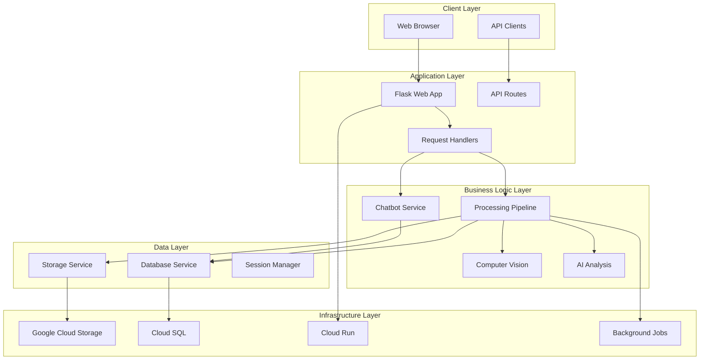
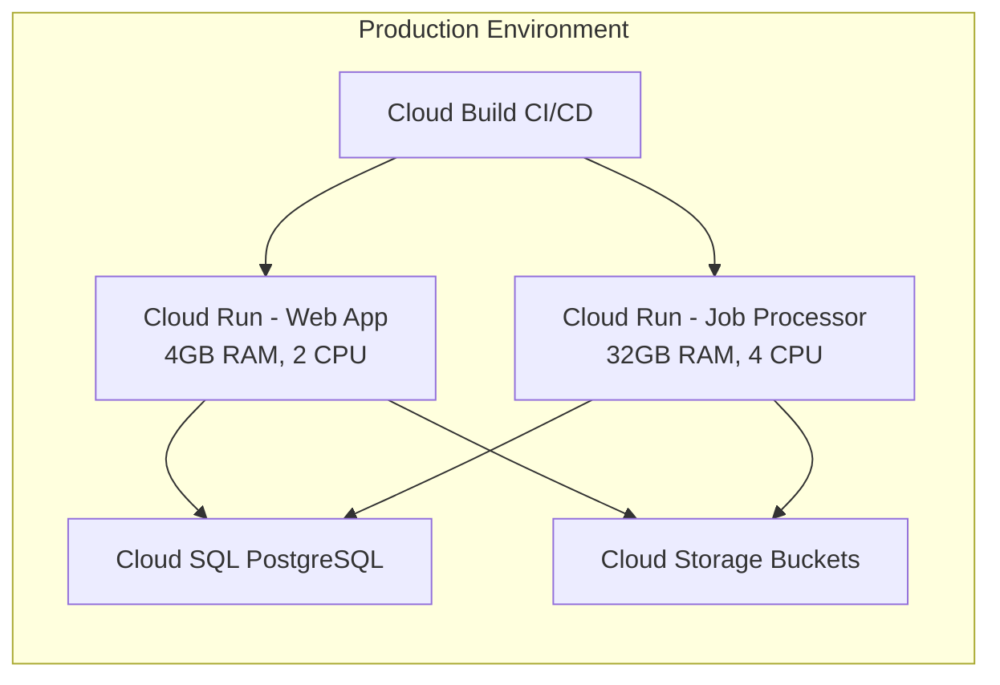
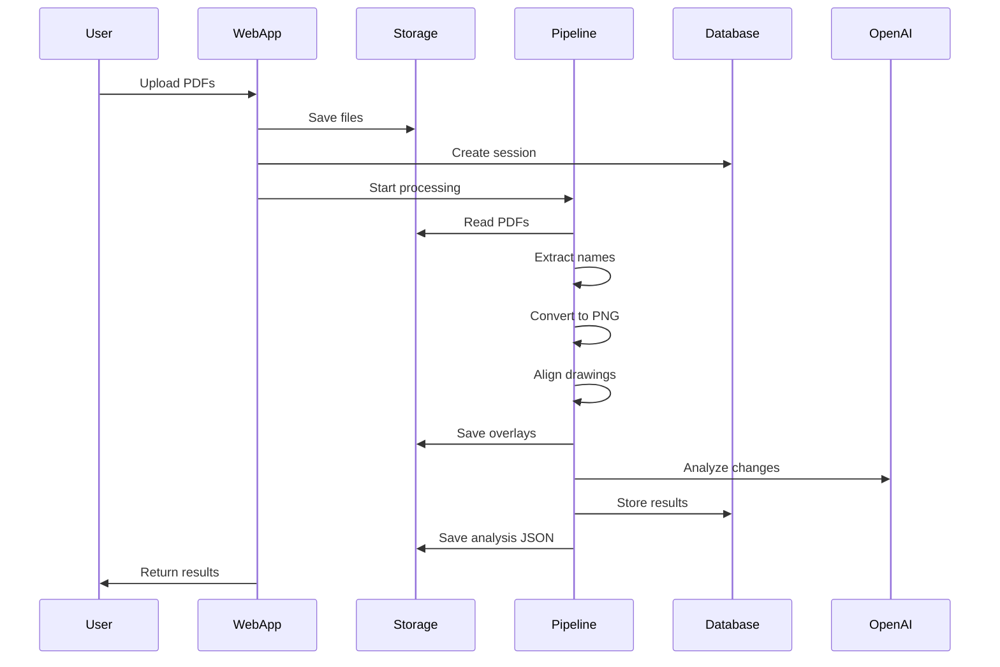
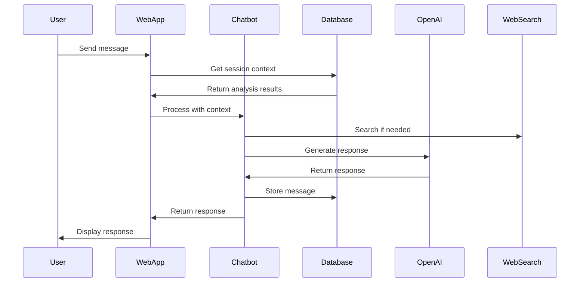

# BuildTrace Architecture

This document provides a comprehensive overview of the BuildTrace system architecture, design patterns, component interactions, and technical decisions.

## Table of Contents

1. [System Architecture](#system-architecture)
2. [Component Architecture](#component-architecture)
3. [Data Flow](#data-flow)
4. [Design Patterns](#design-patterns)
5. [Technology Choices](#technology-choices)
6. [Scalability Considerations](#scalability-considerations)
7. [Security Architecture](#security-architecture)

## System Architecture

### High-Level Overview

BuildTrace follows a **layered architecture** with clear separation of concerns:



### Deployment Architecture



## Component Architecture

### 1. Web Application (`app.py`)

**Responsibilities:**
- HTTP request handling
- Session management
- File upload processing
- API endpoint routing
- Response formatting

**Key Design Decisions:**
- **Unified Codebase**: Single codebase supports both local and cloud deployments via configuration
- **Feature Flags**: Environment-based feature toggles (database, GCS, async processing)
- **Stateless Design**: Sessions stored externally, enabling horizontal scaling

**Request Flow:**
```
HTTP Request → Flask Router → Request Handler → Service Layer → Storage/Database → Response
```

### 2. Configuration Management (`config.py`)

**Pattern**: **Configuration as Code**

**Features:**
- Environment-based configuration loading
- Feature flags for gradual rollout
- Validation on startup
- Sensible defaults with override capability

**Configuration Hierarchy:**
1. Environment variables (highest priority)
2. `.env.{environment}` file
3. `.env` file (fallback)
4. Default values (lowest priority)

### 3. Storage Service (`gcp/storage/storage_service.py`)

**Pattern**: **Strategy Pattern** with automatic fallback

**Abstractions:**
- Unified interface for local and cloud storage
- Automatic fallback to local storage in development
- Transparent file operations (upload, download, delete, list)

**Storage Paths:**
```
Production:
  gs://buildtrace-storage/
    ├── sessions/{session_id}/
    │   ├── uploads/
    │   └── results/
    └── drawings/

Development:
  ./uploads/
    ├── sessions/{session_id}/
    └── ...
```

### 4. Database Service (`gcp/database/`)

**Pattern**: **Repository Pattern** with SQLAlchemy ORM

**Components:**
- `database.py`: Connection management and session factory
- `models.py`: SQLAlchemy model definitions
- `migrations/`: Schema versioning

**Connection Management:**
- Production: Unix socket connection to Cloud SQL
- Development: TCP connection to local PostgreSQL or Cloud SQL Proxy
- Connection pooling for performance

**Model Relationships:**
```
User
  └── Projects
      └── Sessions
          ├── Drawings (old/new)
          ├── Comparisons
          │   └── AnalysisResults
          └── ChatConversations
              └── ChatMessages
```

### 5. Processing Pipeline

**Pattern**: **Pipeline Pattern** with modular stages

**Pipeline Stages:**


**Stage Details:**

1. **PDF Parsing** (`pdf_parser.py`)
   - Extracts pages from PDF
   - Determines page count
   - Handles multi-page documents

2. **Drawing Name Extraction** (`extract_drawing.py`)
   - Text extraction using PyMuPDF
   - OCR fallback with Tesseract
   - Pattern matching for drawing identifiers (A-101, S-12A, etc.)

3. **PDF to PNG Conversion** (`pdf_to_png.py`)
   - High-resolution conversion (300-600 DPI)
   - Maintains image quality
   - Handles large files

4. **Drawing Matching** (`drawing_comparison.py`)
   - Name-based matching
   - Handles missing drawings
   - Reports unmatched drawings

5. **Feature Detection & Alignment** (`align_drawings.py`)
   - SIFT feature detection
   - Feature matching with RANSAC
   - Affine transformation estimation
   - Constrained transformation (preserves scale)

6. **Overlay Generation** (`layer_overlay_2d.py`)
   - Color-coded overlays (red for old, green for new)
   - Transparency blending
   - Visual change highlighting

7. **AI Analysis** (`openai_change_analyzer.py`)
   - GPT-4 vision API integration
   - Structured change detection
   - Recommendation generation
   - JSON output formatting

### 6. Computer Vision (`align_drawings.py`)

**Algorithm**: **SIFT (Scale-Invariant Feature Transform)**

**Why SIFT?**
- Robust to scale, rotation, and translation
- Handles architectural drawings well
- Good feature density for technical drawings

**Process:**
1. Detect keypoints and descriptors in both images
2. Match features using FLANN matcher
3. Filter matches using Lowe's ratio test
4. Estimate affine transformation with RANSAC
5. Apply constrained transformation (scale preservation)
6. Validate alignment quality

**Constraints:**
- Preserves scale (no arbitrary scaling)
- Allows translation and rotation
- Handles slight perspective changes

### 7. AI Analysis Service (`openai_change_analyzer.py`)

**Model**: GPT-4 with Vision

**Prompt Engineering:**
- Structured prompts for consistent output
- Context about construction industry
- Specific output format requirements
- Error handling and retries

**Analysis Output Structure:**
```json
{
  "drawing_name": "A-101",
  "success": true,
  "changes_found": [...],
  "critical_change": "...",
  "analysis_summary": "...",
  "recommendations": [...]
}
```

### 8. Chatbot Service (`chatbot_service.py`)

**Architecture**: **Context-Aware Conversational AI**

**Features:**
- Session context integration
- Web search for current information
- Construction domain expertise
- Conversation history management

**Context Sources:**
1. Session drawing analysis results
2. Conversation history (last 10 messages)
3. Web search results (when needed)
4. System prompts with domain knowledge

## Data Flow

### Upload and Processing Flow



### Chat Flow



## Design Patterns

### 1. Strategy Pattern
**Used in**: Storage service (local vs cloud)
```python
class StorageService:
    def upload_file(self, ...):
        if self.use_gcs:
            return self._upload_to_gcs(...)
        else:
            return self._upload_local(...)
```

### 2. Factory Pattern
**Used in**: Database connection management
```python
class DatabaseManager:
    def initialize(self):
        if self.env == 'production':
            self.engine = create_engine(..., pool_size=5)
        else:
            self.engine = create_engine(...)
```

### 3. Repository Pattern
**Used in**: Database access layer
```python
with get_db_session() as db:
    session = db.query(Session).filter_by(id=session_id).first()
```

### 4. Pipeline Pattern
**Used in**: Processing workflow
```python
results = complete_drawing_pipeline(
    old_pdf_path, new_pdf_path,
    dpi=300, debug=False
)
```

### 5. Dependency Injection
**Used in**: Service initialization
```python
from config import config
from gcp.storage import storage_service
storage_service = CloudStorageService(bucket_name=config.GCS_BUCKET_NAME)
```

## Technology Choices

### Why Flask?
- **Lightweight**: Minimal overhead for API-focused application
- **Flexibility**: Easy to customize and extend
- **Ecosystem**: Rich extension library
- **Simplicity**: Easy to understand and maintain

### Why SQLAlchemy 2.0?
- **Modern API**: Type hints and async support
- **ORM Benefits**: Database abstraction
- **Migration Support**: Alembic integration
- **Cross-Database**: Easy to switch databases

### Why Cloud Run?
- **Serverless**: No infrastructure management
- **Auto-scaling**: Handles traffic spikes
- **Cost-Effective**: Pay per use
- **Container-Based**: Docker compatibility

### Why SIFT?
- **Robust**: Handles architectural drawings well
- **Mature**: Well-tested algorithm
- **OpenCV**: Excellent implementation available
- **Accuracy**: Good results for technical drawings

### Why GPT-4?
- **Vision Capability**: Can analyze images
- **High Quality**: Best available model
- **Structured Output**: Can follow format requirements
- **Context**: Large context window for detailed analysis

## Scalability Considerations

### Horizontal Scaling
- **Stateless Design**: Sessions in database/storage
- **Load Balancing**: Cloud Run handles distribution
- **Database Connection Pooling**: Efficient connection reuse

### Vertical Scaling
- **Job Processor**: 32GB RAM for large file processing
- **Web App**: 4GB RAM for typical workloads
- **CPU Allocation**: 2-4 cores based on workload

### Performance Optimizations
- **Caching**: In-memory cache for recent sessions (30s TTL)
- **Async Processing**: Background jobs for large files
- **Chunked Processing**: Large PDFs split into chunks
- **Connection Pooling**: Database connection reuse

### Bottlenecks
1. **OpenAI API**: Rate limits and latency
   - **Solution**: Retry logic, async processing
2. **Image Processing**: CPU-intensive operations
   - **Solution**: Background job processor with high CPU
3. **Database Queries**: Complex joins
   - **Solution**: Indexes, query optimization
4. **File Uploads**: Large file handling
   - **Solution**: Streaming uploads, chunked processing

## Security Architecture

### Authentication & Authorization
- **Current**: No authentication (public access)
- **Future**: Firebase Auth integration (feature flag ready)

### Data Protection
- **Encryption at Rest**: GCS and Cloud SQL encryption
- **Encryption in Transit**: HTTPS/TLS for all connections
- **API Keys**: Stored in environment variables, encrypted in Cloud Run

### Input Validation
- **File Types**: Whitelist validation
- **File Sizes**: Configurable limits (default 70MB)
- **SQL Injection**: SQLAlchemy parameterized queries
- **XSS Protection**: Flask auto-escaping

### Access Control
- **Storage**: Signed URLs for temporary access
- **Database**: Role-based access (read/write separation possible)
- **API**: Rate limiting (to be implemented)

### Secrets Management
- **Environment Variables**: Cloud Run secrets
- **Database Credentials**: Encrypted storage
- **API Keys**: Never logged or exposed

## Error Handling

### Strategy
- **Graceful Degradation**: Fallback to local storage if GCS fails
- **User-Friendly Messages**: Clear error messages
- **Logging**: Comprehensive error logging
- **Retry Logic**: Automatic retries for transient failures

### Error Types
1. **User Errors**: Validation failures, invalid inputs
2. **System Errors**: Database failures, storage errors
3. **External Errors**: OpenAI API failures, network issues
4. **Processing Errors**: Alignment failures, analysis errors

## Monitoring & Observability

### Logging
- **Structured Logging**: JSON format in production
- **Log Levels**: DEBUG, INFO, WARNING, ERROR
- **Cloud Logging**: Integrated with GCP Cloud Logging

### Metrics (To Be Implemented)
- Request latency
- Processing time
- Error rates
- API usage
- Storage usage

### Alerting (To Be Implemented)
- High error rates
- Slow processing times
- Storage quota warnings
- Database connection issues

---

**Next Steps**: See [SETUP.md](./SETUP.md) for installation instructions or [API.md](./API.md) for API documentation.

