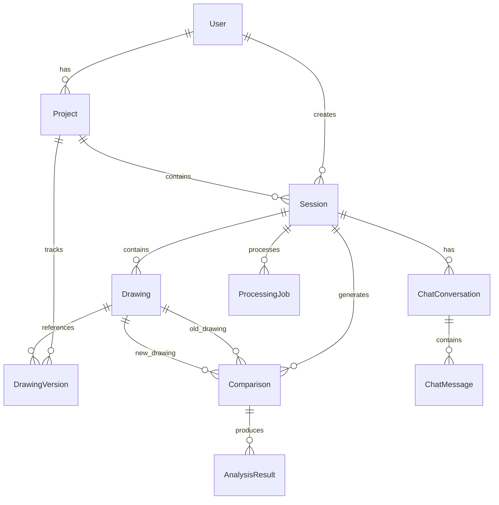

# BuildTrace Database Documentation

Complete database schema, models, relationships, and migration guide.

## Table of Contents

1. [Overview](#overview)
2. [Database Schema](#database-schema)
3. [Models](#models)
4. [Relationships](#relationships)
5. [Migrations](#migrations)
6. [Queries](#queries)
7. [Performance](#performance)

## Overview

BuildTrace uses **PostgreSQL** as the primary database (with file-based fallback for development). The database is managed through **SQLAlchemy 2.0** ORM.

### Database Modes

- **Production**: Cloud SQL PostgreSQL
- **Development**: Local PostgreSQL or file-based storage
- **Fallback**: JSON files (when `USE_DATABASE=false`)

### Connection Management

- **Production**: Unix socket connection to Cloud SQL
- **Development**: TCP connection to local PostgreSQL
- **Cloud SQL Proxy**: For local development with Cloud SQL

## Database Schema

### Entity Relationship Diagram



### Tables Overview

| Table | Purpose | Key Fields |
|-------|---------|------------|
| `users` | User accounts | id, email, name, role |
| `projects` | Project organization | id, user_id, name, status |
| `sessions` | Processing sessions | id, user_id, project_id, status |
| `drawings` | Drawing files | id, session_id, drawing_type, filename |
| `drawing_versions` | Version tracking | id, project_id, drawing_id, version_number |
| `comparisons` | Drawing comparisons | id, session_id, old_drawing_id, new_drawing_id |
| `analysis_results` | AI analysis results | id, comparison_id, changes_found |
| `chat_conversations` | Chat sessions | id, session_id |
| `chat_messages` | Chat messages | id, conversation_id, role, content |
| `processing_jobs` | Background jobs | id, session_id, job_type, status |

## Models

### User Model

```python
class User(Base):
    __tablename__ = 'users'
    
    id = Column(String(36), primary_key=True)
    email = Column(String(255), unique=True, nullable=False)
    name = Column(String(255))
    company = Column(String(255))
    role = Column(String(100))  # architect, engineer, contractor, owner
    created_at = Column(DateTime, default=datetime.utcnow)
    updated_at = Column(DateTime, default=datetime.utcnow, onupdate=datetime.utcnow)
    is_active = Column(Boolean, default=True)
```

**Relationships:**
- `projects`: One-to-many with Project
- `sessions`: One-to-many with Session

### Project Model

```python
class Project(Base):
    __tablename__ = 'projects'
    
    id = Column(String(36), primary_key=True)
    user_id = Column(String(36), ForeignKey('users.id', ondelete='CASCADE'))
    name = Column(String(255), nullable=False)
    description = Column(Text)
    project_number = Column(String(100))
    client_name = Column(String(255))
    location = Column(String(255))
    status = Column(String(50), default='active')  # active, archived, completed
    created_at = Column(DateTime, default=datetime.utcnow)
    updated_at = Column(DateTime, default=datetime.utcnow, onupdate=datetime.utcnow)
```

**Relationships:**
- `user`: Many-to-one with User
- `sessions`: One-to-many with Session
- `drawing_versions`: One-to-many with DrawingVersion

**Indexes:**
- `idx_user_project`: (user_id, name)

### Session Model

```python
class Session(Base):
    __tablename__ = 'sessions'
    
    id = Column(String(36), primary_key=True)
    user_id = Column(String(36), ForeignKey('users.id'), nullable=True)
    project_id = Column(String(36), ForeignKey('projects.id'), nullable=True)
    session_type = Column(String(50), default='comparison')
    created_at = Column(DateTime, default=datetime.utcnow)
    updated_at = Column(DateTime, default=datetime.utcnow, onupdate=datetime.utcnow)
    status = Column(String(50), default='active')  # active, processing, completed, error
    total_time = Column(Float)  # Processing time in seconds
    session_metadata = Column(JSON)  # Additional metadata
```

**Relationships:**
- `user`: Many-to-one with User (nullable)
- `project`: Many-to-one with Project (nullable)
- `drawings`: One-to-many with Drawing
- `comparisons`: One-to-many with Comparison
- `chat_conversations`: One-to-many with ChatConversation
- `processing_jobs`: One-to-many with ProcessingJob

**Status Values:**
- `active`: Session created, ready for processing
- `processing`: Currently processing
- `completed`: Processing finished successfully
- `error`: Processing failed

### Drawing Model

```python
class Drawing(Base):
    __tablename__ = 'drawings'
    
    id = Column(String(36), primary_key=True)
    session_id = Column(String(36), ForeignKey('sessions.id', ondelete='CASCADE'))
    drawing_type = Column(String(20), nullable=False)  # 'old' or 'new'
    filename = Column(String(255), nullable=False)
    original_filename = Column(String(255), nullable=False)
    storage_path = Column(Text)  # GCS path or local path
    drawing_name = Column(String(100))  # Extracted identifier (e.g., A-101)
    page_number = Column(Integer)
    processed_at = Column(DateTime, default=datetime.utcnow)
    drawing_metadata = Column(JSON)  # Dimensions, scale, etc.
```

**Relationships:**
- `session`: Many-to-one with Session

**Indexes:**
- `idx_session_drawing`: (session_id, drawing_name)
- `unique_session_drawing_type`: (session_id, drawing_name, drawing_type) - Unique constraint

### Comparison Model

```python
class Comparison(Base):
    __tablename__ = 'comparisons'
    
    id = Column(String(36), primary_key=True)
    session_id = Column(String(36), ForeignKey('sessions.id', ondelete='CASCADE'))
    old_drawing_id = Column(String(36), ForeignKey('drawings.id'))
    new_drawing_id = Column(String(36), ForeignKey('drawings.id'))
    drawing_name = Column(String(100), nullable=False)
    overlay_path = Column(Text)  # GCS path to overlay image
    old_image_path = Column(Text)  # GCS path to processed old image
    new_image_path = Column(Text)  # GCS path to processed new image
    alignment_score = Column(Float)  # Quality of alignment (0-1)
    changes_detected = Column(Boolean, default=False)
    created_at = Column(DateTime, default=datetime.utcnow)
```

**Relationships:**
- `session`: Many-to-one with Session
- `old_drawing`: Many-to-one with Drawing
- `new_drawing`: Many-to-one with Drawing
- `analysis_results`: One-to-many with AnalysisResult

**Constraints:**
- `unique_session_comparison`: (session_id, drawing_name) - Unique constraint

### AnalysisResult Model

```python
class AnalysisResult(Base):
    __tablename__ = 'analysis_results'
    
    id = Column(String(36), primary_key=True)
    comparison_id = Column(String(36), ForeignKey('comparisons.id', ondelete='CASCADE'))
    session_id = Column(String(36), ForeignKey('sessions.id', ondelete='CASCADE'))
    drawing_name = Column(String(100), nullable=False)
    changes_found = Column(JSON)  # List of changes
    critical_change = Column(Text)
    analysis_summary = Column(Text)
    recommendations = Column(JSON)  # List of recommendations
    success = Column(Boolean, default=True)
    error_message = Column(Text, nullable=True)
    ai_model_used = Column(String(50), default='gpt-4-vision-preview')
    created_at = Column(DateTime, default=datetime.utcnow)
```

**Relationships:**
- `comparison`: Many-to-one with Comparison

**Constraints:**
- `unique_session_analysis`: (session_id, drawing_name) - Unique constraint

**JSON Fields:**
- `changes_found`: Array of change descriptions
- `recommendations`: Array of recommendation strings

### ChatConversation Model

```python
class ChatConversation(Base):
    __tablename__ = 'chat_conversations'
    
    id = Column(String(36), primary_key=True)
    session_id = Column(String(36), ForeignKey('sessions.id', ondelete='CASCADE'))
    created_at = Column(DateTime, default=datetime.utcnow)
    updated_at = Column(DateTime, default=datetime.utcnow, onupdate=datetime.utcnow)
```

**Relationships:**
- `session`: Many-to-one with Session
- `messages`: One-to-many with ChatMessage

### ChatMessage Model

```python
class ChatMessage(Base):
    __tablename__ = 'chat_messages'
    
    id = Column(String(36), primary_key=True)
    conversation_id = Column(String(36), ForeignKey('chat_conversations.id', ondelete='CASCADE'))
    role = Column(String(20), nullable=False)  # 'user', 'assistant', 'system'
    content = Column(Text, nullable=False)
    timestamp = Column(DateTime, default=datetime.utcnow)
    message_metadata = Column(JSON)  # Token usage, model version, etc.
```

**Relationships:**
- `conversation`: Many-to-one with ChatConversation

### ProcessingJob Model

```python
class ProcessingJob(Base):
    __tablename__ = 'processing_jobs'
    
    id = Column(String(36), primary_key=True)
    session_id = Column(String(36), ForeignKey('sessions.id', ondelete='CASCADE'))
    job_type = Column(String(50), nullable=False)  # 'pdf_extraction', 'comparison', 'ai_analysis'
    status = Column(String(20), default='pending')  # pending, running, completed, failed
    started_at = Column(DateTime)
    completed_at = Column(DateTime)
    error_message = Column(Text)
    job_metadata = Column(JSON)
    created_at = Column(DateTime, default=datetime.utcnow)
```

**Relationships:**
- `session`: Many-to-one with Session

**Status Values:**
- `pending`: Job queued, not started
- `running`: Job currently executing
- `completed`: Job finished successfully
- `failed`: Job failed with error

## Relationships

### Cascade Deletes

- **User → Projects**: CASCADE (deleting user deletes projects)
- **Project → Sessions**: CASCADE
- **Session → Drawings**: CASCADE
- **Session → Comparisons**: CASCADE
- **Session → ChatConversations**: CASCADE
- **Session → ProcessingJobs**: CASCADE
- **Comparison → AnalysisResults**: CASCADE
- **ChatConversation → ChatMessages**: CASCADE

### Foreign Key Constraints

All foreign keys use `ondelete='CASCADE'` to ensure data consistency when parent records are deleted.

## Migrations

### Initialization

```bash
# Initialize database tables
python -c "from gcp.database import init_db; init_db()"
```

### Using Alembic (Recommended)

```bash
# Initialize Alembic (first time)
alembic init alembic

# Create migration
alembic revision --autogenerate -m "Description of changes"

# Apply migration
alembic upgrade head

# Rollback migration
alembic downgrade -1
```

### Manual Migrations

Migration scripts are located in `gcp/database/migrations/`:

- `init_database.py`: Initial schema creation
- `add_total_time_migration.py`: Add total_time to sessions
- `add_session_id_migration.sql`: SQL migration example

### Migration Best Practices

1. **Always backup** before running migrations in production
2. **Test migrations** in development first
3. **Use transactions** for multi-step migrations
4. **Document breaking changes** in migration comments
5. **Version control** all migration files

## Queries

### Common Query Patterns

#### Get Session with All Data

```python
from gcp.database import get_db_session
from gcp.database.models import Session, Drawing, Comparison, AnalysisResult

with get_db_session() as db:
    session = db.query(Session).filter_by(id=session_id).first()
    
    # Eager load relationships
    drawings = db.query(Drawing).filter_by(session_id=session_id).all()
    comparisons = db.query(Comparison).filter_by(session_id=session_id).all()
    analyses = db.query(AnalysisResult).filter_by(session_id=session_id).all()
```

#### Get Recent Sessions

```python
from sqlalchemy import desc

recent_sessions = db.query(Session)\
    .order_by(desc(Session.created_at))\
    .limit(10)\
    .all()
```

#### Get Analysis Results for Drawing

```python
analysis = db.query(AnalysisResult)\
    .filter_by(session_id=session_id, drawing_name="A-101")\
    .first()
```

#### Count Comparisons by Status

```python
from sqlalchemy import func

status_counts = db.query(
    Comparison.changes_detected,
    func.count(Comparison.id)
).filter_by(session_id=session_id)\
 .group_by(Comparison.changes_detected)\
 .all()
```

#### Get Chat History

```python
conversation = db.query(ChatConversation)\
    .filter_by(session_id=session_id)\
    .first()

if conversation:
    messages = db.query(ChatMessage)\
        .filter_by(conversation_id=conversation.id)\
        .order_by(ChatMessage.timestamp)\
        .all()
```

### Complex Queries

#### Get Session Summary

```python
from sqlalchemy import func, case

summary = db.query(
    Session.id,
    func.count(Comparison.id).label('total_comparisons'),
    func.count(case((AnalysisResult.success == True, 1))).label('successful_analyses'),
    func.avg(Comparison.alignment_score).label('avg_alignment_score')
).join(Comparison, Session.id == Comparison.session_id)\
 .outerjoin(AnalysisResult, Comparison.id == AnalysisResult.comparison_id)\
 .filter_by(id=session_id)\
 .group_by(Session.id)\
 .first()
```

## Performance

### Indexes

**Existing Indexes:**
- `idx_user_project`: (user_id, name) on projects
- `idx_project_drawing_version`: (project_id, drawing_name, version_number) on drawing_versions
- `idx_session_drawing`: (session_id, drawing_name) on drawings
- `unique_session_drawing_type`: (session_id, drawing_name, drawing_type) on drawings
- `unique_session_comparison`: (session_id, drawing_name) on comparisons
- `unique_session_analysis`: (session_id, drawing_name) on analysis_results

### Recommended Additional Indexes

```sql
-- For session queries
CREATE INDEX idx_session_status ON sessions(status);
CREATE INDEX idx_session_created_at ON sessions(created_at DESC);

-- For drawing queries
CREATE INDEX idx_drawing_type ON drawings(drawing_type);
CREATE INDEX idx_drawing_name ON drawings(drawing_name);

-- For comparison queries
CREATE INDEX idx_comparison_changes ON comparisons(changes_detected);

-- For analysis queries
CREATE INDEX idx_analysis_success ON analysis_results(success);
CREATE INDEX idx_analysis_created_at ON analysis_results(created_at DESC);
```

### Query Optimization

1. **Use Eager Loading**: Load relationships in single query
   ```python
   from sqlalchemy.orm import joinedload
   session = db.query(Session)\
       .options(joinedload(Session.drawings))\
       .filter_by(id=session_id)\
       .first()
   ```

2. **Limit Results**: Always use `.limit()` for list queries
   ```python
   sessions = db.query(Session)\
       .order_by(desc(Session.created_at))\
       .limit(50)\
       .all()
   ```

3. **Use Select Specific Columns**: Don't load unnecessary data
   ```python
   session_ids = db.query(Session.id)\
       .filter_by(status='completed')\
       .all()
   ```

4. **Connection Pooling**: Configured in `database.py`
   - Production: pool_size=5, max_overflow=10
   - Development: Default pool settings

### Monitoring

**Query Performance:**
```python
# Enable query logging
import logging
logging.getLogger('sqlalchemy.engine').setLevel(logging.INFO)
```

**Slow Query Detection:**
- Monitor query execution time
- Use EXPLAIN ANALYZE for complex queries
- Set up database performance monitoring

---

**Next Steps**: See [PIPELINE.md](./PIPELINE.md) for processing pipeline or [TROUBLESHOOTING.md](./TROUBLESHOOTING.md) for database issues.

