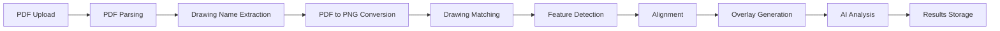
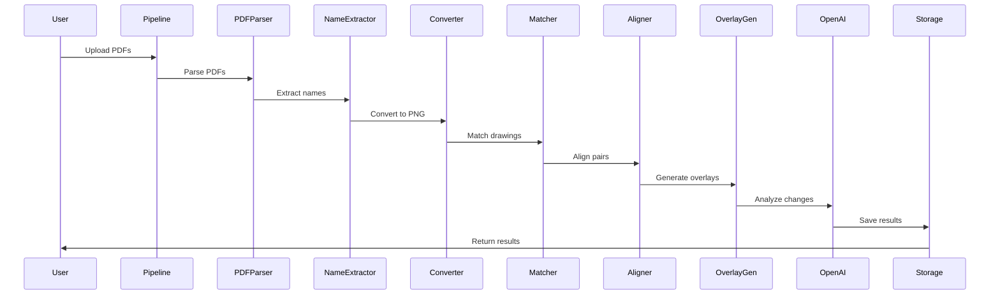

# BuildTrace Processing Pipeline

Complete documentation of the drawing comparison and analysis pipeline, including algorithms, data flow, and processing stages.

## Table of Contents

1. [Overview](#overview)
2. [Pipeline Stages](#pipeline-stages)
3. [Algorithms](#algorithms)
4. [Data Flow](#data-flow)
5. [Error Handling](#error-handling)
6. [Performance Optimization](#performance-optimization)

## Overview

The BuildTrace processing pipeline transforms uploaded drawing files into comprehensive change analysis reports through multiple stages:



**Total Processing Time**: 30-120 seconds per drawing pair (depending on complexity)

## Pipeline Stages

### Stage 1: PDF Parsing

**Module**: `pdf_parser.py`

**Purpose**: Extract pages and metadata from PDF files

**Process:**
1. Open PDF using PyMuPDF (fitz)
2. Count total pages
3. Extract page dimensions
4. Create output directory structure

**Output:**
- Page count
- Page dimensions
- Directory structure for output

**Code Example:**
```python
import fitz  # PyMuPDF

doc = fitz.open(pdf_path)
page_count = len(doc)
for page_num in range(page_count):
    page = doc[page_num]
    dimensions = page.rect
```

### Stage 2: Drawing Name Extraction

**Module**: `extract_drawing.py`

**Purpose**: Extract drawing identifiers (e.g., A-101, S-12A) from each page

**Process:**
1. **Text Extraction** (Primary Method)
   - Use PyMuPDF to extract text with positions
   - Filter text in bottom-right region (typical location for drawing names)
   - Pattern matching for drawing name formats

2. **OCR Fallback** (If no text found)
   - Extract bottom-right region as image
   - Use Tesseract OCR to read text
   - Pattern matching for drawing names

**Pattern Matching:**
- Supports formats: `A-101`, `A-102`, `A-344-MB`, `S-12A`, `E-201`, etc.
- Regex pattern: `[A-Z]-\d+[A-Z]?(-[A-Z]+)?`

**Code Example:**
```python
def extract_drawing_name(page):
    # Try text extraction first
    text_blocks = page.get_text("blocks")
    for block in text_blocks:
        if is_bottom_right(block):
            name = match_drawing_pattern(block[4])
            if name:
                return name
    
    # Fallback to OCR
    return ocr_extract_name(page)
```

**Output:**
- Dictionary mapping page numbers to drawing names
- Example: `{1: "A-101", 2: "A-102", 3: "A-103"}`

### Stage 3: PDF to PNG Conversion

**Module**: `pdf_to_png.py`

**Purpose**: Convert PDF pages to high-resolution PNG images

**Process:**
1. Load PDF using pdf2image
2. Convert each page to PNG at specified DPI (default: 300)
3. Save with drawing name as filename (if extracted) or fallback naming

**Configuration:**
- **DPI**: 300 (default), configurable up to 600
- **Format**: PNG (lossless)
- **Color Mode**: RGB

**Code Example:**
```python
from pdf2image import convert_from_path

images = convert_from_path(
    pdf_path,
    dpi=300,
    fmt='png'
)

for i, image in enumerate(images):
    image.save(f"{drawing_name}_{i+1}.png")
```

**Output:**
- PNG files for each page
- Named with drawing identifier or fallback: `{drawing_name}.png` or `{pdf_name}_page{N}.png`

### Stage 4: Drawing Matching

**Module**: `drawing_comparison.py`

**Purpose**: Match drawings between old and new sets by name

**Process:**
1. Extract drawing names from both sets
2. Find common drawing names
3. Identify drawings only in old set
4. Identify drawings only in new set
5. Create matched pairs

**Matching Logic:**
```python
old_drawings = {name: path for name, path in old_set}
new_drawings = {name: path for name, path in new_set}

matches = []
for name in old_drawings.keys() & new_drawings.keys():
    matches.append((name, old_drawings[name], new_drawings[name]))

only_old = old_drawings.keys() - new_drawings.keys()
only_new = new_drawings.keys() - old_drawings.keys()
```

**Output:**
- List of matched drawing pairs
- Lists of unmatched drawings (old-only, new-only)

### Stage 5: Feature Detection

**Module**: `align_drawings.py`

**Purpose**: Detect distinctive features in both images using SIFT

**Algorithm**: SIFT (Scale-Invariant Feature Transform)

**Why SIFT?**
- Robust to scale, rotation, and translation
- Good for technical drawings
- Handles architectural line drawings well

**Process:**
1. Convert images to grayscale
2. Detect keypoints and compute descriptors
3. Store keypoints and descriptors for matching

**Code Example:**
```python
import cv2

sift = cv2.SIFT_create()
gray_old = cv2.cvtColor(old_img, cv2.COLOR_BGR2GRAY)
gray_new = cv2.cvtColor(new_img, cv2.COLOR_BGR2GRAY)

keypoints_old, descriptors_old = sift.detectAndCompute(gray_old, None)
keypoints_new, descriptors_new = sift.detectAndCompute(gray_new, None)
```

**Output:**
- Keypoints: (x, y) coordinates with scale and orientation
- Descriptors: 128-dimensional feature vectors

### Stage 6: Feature Matching

**Module**: `align_drawings.py`

**Purpose**: Match features between old and new images

**Algorithm**: FLANN-based matcher with Lowe's ratio test

**Process:**
1. Use FLANN (Fast Library for Approximate Nearest Neighbors) matcher
2. Find k-nearest neighbors (k=2) for each descriptor
3. Apply Lowe's ratio test to filter good matches
4. Ratio threshold: 0.7 (configurable)

**Lowe's Ratio Test:**
- Compares distance to nearest neighbor vs. second nearest
- If ratio < threshold, match is considered good
- Filters ambiguous matches

**Code Example:**
```python
FLANN_INDEX_KDTREE = 1
index_params = dict(algorithm=FLANN_INDEX_KDTREE, trees=5)
search_params = dict(checks=50)
flann = cv2.FlannBasedMatcher(index_params, search_params)

matches = flann.knnMatch(descriptors_old, descriptors_new, k=2)

good_matches = []
for match_pair in matches:
    if len(match_pair) == 2:
        m, n = match_pair
        if m.distance < 0.7 * n.distance:
            good_matches.append(m)
```

**Output:**
- List of good feature matches
- Minimum 4 matches required for transformation estimation

### Stage 7: Alignment Transformation

**Module**: `align_drawings.py`

**Purpose**: Estimate and apply transformation to align drawings

**Algorithm**: RANSAC (Random Sample Consensus) for robust estimation

**Transformation Type**: Constrained Affine Transformation

**Constraints:**
- **Scale Preservation**: No arbitrary scaling (maintains drawing scale)
- **Translation**: Allowed (x, y shifts)
- **Rotation**: Allowed
- **Shear**: Minimal (handles slight perspective)

**Process:**
1. Extract matched point pairs
2. Use RANSAC to estimate affine transformation
3. Apply constraints to preserve scale
4. Validate transformation quality

**Code Example:**
```python
if len(good_matches) >= 4:
    src_pts = np.float32([keypoints_old[m.queryIdx].pt for m in good_matches])
    dst_pts = np.float32([keypoints_new[m.trainIdx].pt for m in good_matches])
    
    # Estimate affine transformation
    M, mask = cv2.estimateAffinePartial2D(
        src_pts, dst_pts,
        method=cv2.RANSAC,
        ransacReprojThreshold=5.0
    )
    
    # Apply transformation
    aligned_old = cv2.warpAffine(old_img, M, (new_img.shape[1], new_img.shape[0]))
```

**Validation:**
- Check transformation matrix quality
- Verify alignment score (0-1 scale)
- Minimum alignment score threshold: 0.5

**Output:**
- Transformation matrix (2x3 affine matrix)
- Aligned old image
- Alignment score

### Stage 8: Overlay Generation

**Module**: `layer_overlay_2d.py`

**Purpose**: Create visual overlay showing changes

**Process:**
1. Load aligned old image and new image
2. Create color-coded overlay:
   - **Red**: Old drawing (aligned)
   - **Green**: New drawing
   - **Overlap**: Blended transparency
3. Generate overlay image

**Code Example:**
```python
def create_overlay_image(aligned_old, new_img):
    # Create color channels
    overlay = np.zeros_like(new_img)
    
    # Red channel: old image
    overlay[:, :, 2] = aligned_old[:, :, 0]  # Red
    
    # Green channel: new image
    overlay[:, :, 1] = new_img[:, :, 1]  # Green
    
    # Blend with transparency
    alpha = 0.5
    result = cv2.addWeighted(overlay, alpha, new_img, 1-alpha, 0)
    
    return result
```

**Output:**
- Overlay PNG image showing changes
- Saved as: `{drawing_name}_overlay.png`

### Stage 9: AI Analysis

**Module**: `openai_change_analyzer.py`

**Purpose**: Analyze overlay images using GPT-4 Vision

**Process:**
1. Load overlay, old, and new images
2. Encode images as base64
3. Construct prompt with:
   - System instructions
   - Image context
   - Output format requirements
4. Call OpenAI GPT-4 Vision API
5. Parse structured response

**Prompt Structure:**
```
You are an expert construction project manager analyzing architectural drawing changes.

Analyze the provided overlay image showing changes between old (red) and new (green) drawings.

Provide:
1. List of all changes found
2. Most critical change
3. Construction impact analysis
4. Recommendations

Format output as JSON with specific structure.
```

**Code Example:**
```python
from openai import OpenAI

client = OpenAI(api_key=api_key)

response = client.chat.completions.create(
    model="gpt-4o",
    messages=[
        {"role": "system", "content": system_prompt},
        {
            "role": "user",
            "content": [
                {"type": "text", "text": user_prompt},
                {"type": "image_url", "image_url": {"url": f"data:image/png;base64,{overlay_base64}"}}
            ]
        }
    ],
    max_tokens=2000
)
```

**Output Structure:**
```json
{
  "drawing_name": "A-101",
  "success": true,
  "changes_found": [
    "Room 101 extended from 200 to 300 sq ft",
    "Door relocated from north to west wall"
  ],
  "critical_change": "Major structural modification to Room 101",
  "analysis_summary": "Detailed analysis...",
  "recommendations": [
    "Update foundation plans",
    "Coordinate with structural engineer"
  ]
}
```

### Stage 10: Results Storage

**Module**: `complete_drawing_pipeline.py`

**Purpose**: Store all results in database and storage

**Process:**
1. Save overlay images to storage (GCS or local)
2. Save analysis JSON files
3. Store metadata in database (if enabled)
4. Create summary report

**Storage Structure:**
```
sessions/{session_id}/
├── uploads/
│   ├── old_drawings.pdf
│   └── new_drawings.pdf
└── results/
    ├── A-101/
    │   ├── A-101_old.png
    │   ├── A-101_new.png
    │   ├── A-101_overlay.png
    │   └── change_analysis_A-101.json
    └── A-102/
        └── ...
```

## Algorithms

### SIFT Feature Detection

**Scale-Invariant Feature Transform**

**Key Properties:**
- Scale invariance
- Rotation invariance
- Robust to illumination changes
- Good for line drawings

**Parameters:**
- `nfeatures`: Maximum number of features (default: 0 = unlimited)
- `contrastThreshold`: Contrast threshold (default: 0.04)
- `edgeThreshold`: Edge threshold (default: 10)
- `sigma`: Gaussian sigma (default: 1.6)

### RANSAC

**Random Sample Consensus**

**Purpose**: Robustly estimate transformation in presence of outliers

**Process:**
1. Randomly sample minimum points (4 for affine)
2. Estimate transformation
3. Count inliers (points within threshold)
4. Repeat N times
5. Return best transformation (most inliers)

**Parameters:**
- `ransacReprojThreshold`: Reprojection error threshold (default: 5.0 pixels)
- `maxIters`: Maximum iterations (default: 2000)
- `confidence`: Confidence level (default: 0.99)

### Affine Transformation

**Constrained Affine (Similarity Transformation)**

**Matrix Form:**
```
[s*cos(θ)  -s*sin(θ)  tx]
[s*sin(θ)   s*cos(θ)  ty]
[   0         0       1 ]
```

Where:
- `s`: Scale factor (constrained to be close to 1.0)
- `θ`: Rotation angle
- `tx, ty`: Translation

**Constraints Applied:**
- Scale preservation: `0.9 < s < 1.1`
- No arbitrary scaling

## Data Flow

### Complete Pipeline Flow



### Data Transformations

1. **PDF → Text**: PyMuPDF text extraction
2. **PDF → Image**: pdf2image conversion
3. **Image → Features**: SIFT detection
4. **Features → Matches**: FLANN matching
5. **Matches → Transformation**: RANSAC estimation
6. **Transformation → Aligned Image**: Affine warping
7. **Images → Overlay**: Color blending
8. **Overlay → Analysis**: GPT-4 Vision
9. **Analysis → JSON**: Structured output

## Error Handling

### Stage-Level Error Handling

Each stage has specific error handling:

1. **PDF Parsing**: Handle corrupted PDFs, unsupported formats
2. **Name Extraction**: Fallback to OCR, handle missing names
3. **Conversion**: Handle memory errors, large files
4. **Matching**: Handle no matches, partial matches
5. **Alignment**: Handle insufficient features, poor alignment
6. **Overlay**: Handle dimension mismatches
7. **AI Analysis**: Handle API errors, rate limits, timeouts

### Error Recovery

- **Retry Logic**: Automatic retries for transient failures
- **Fallback Methods**: OCR fallback, alternative algorithms
- **Partial Results**: Continue processing even if some stages fail
- **Error Reporting**: Detailed error messages in results

### Common Errors

| Error | Cause | Solution |
|-------|------|----------|
| No features detected | Low quality image | Increase DPI, check image quality |
| Insufficient matches | Drawings too different | Check if correct drawings matched |
| Alignment failed | Poor feature matching | Try different images, check preprocessing |
| API timeout | Large image, slow API | Increase timeout, retry |
| Memory error | Large file | Use chunked processing |

## Performance Optimization

### Parallel Processing

**Current**: Sequential processing
**Future**: Parallel processing for multiple drawings

### Caching

- **Feature Descriptors**: Cache for repeated comparisons
- **Converted Images**: Cache PNG conversions
- **Analysis Results**: Cache AI analysis results

### Memory Management

- **Chunked Processing**: Process large PDFs in chunks
- **Image Resizing**: Resize before processing if too large
- **Memory Limits**: Monitor and enforce memory limits

### Optimization Strategies

1. **Early Exit**: Skip processing if alignment score too low
2. **Feature Reduction**: Limit number of features detected
3. **Image Compression**: Compress images before storage
4. **Batch Processing**: Process multiple drawings in batch

---

**Next Steps**: See [TROUBLESHOOTING.md](./TROUBLESHOOTING.md) for pipeline issues or [API.md](./API.md) for API usage.

