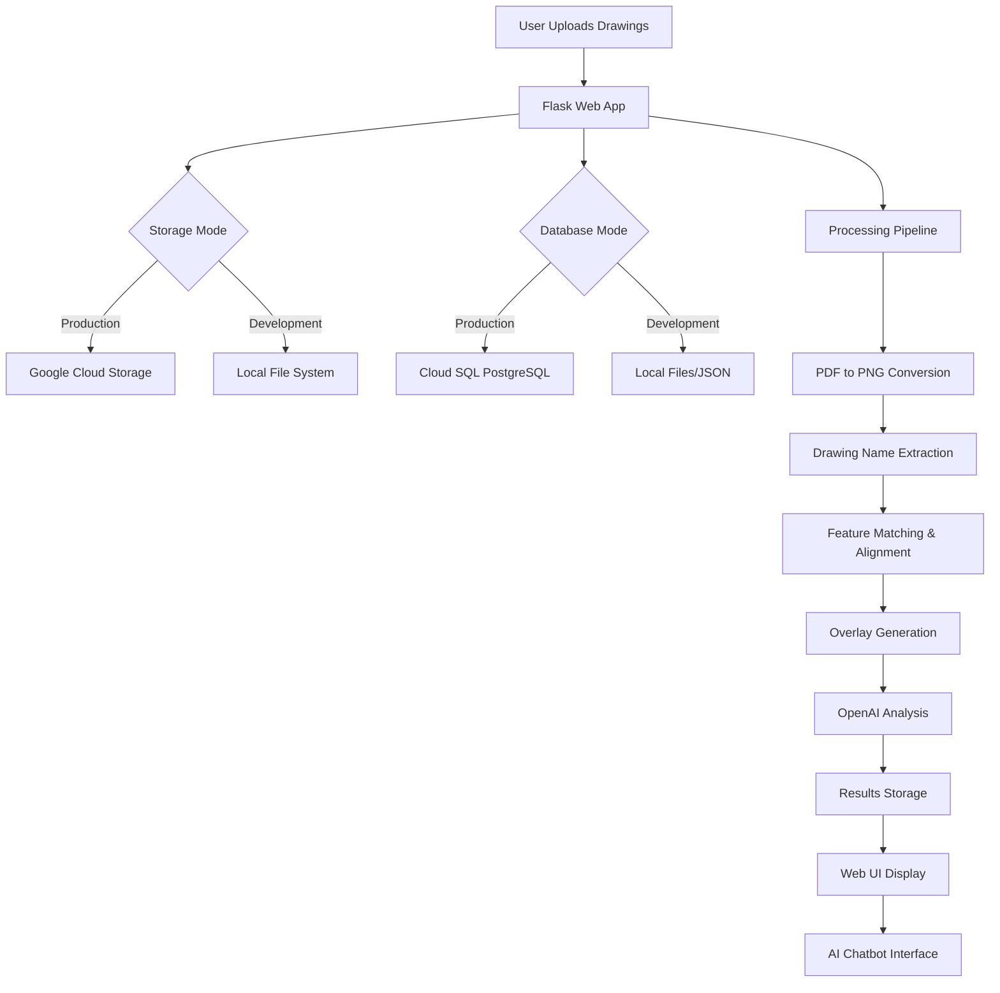

# BuildTrace Documentation

Welcome to the BuildTrace engineering documentation. This comprehensive guide is designed to onboard new founding engineers and provide deep technical understanding of the entire system.

## 📚 Documentation Index

### Core Documentation
- **[README.md](./README.md)** (this file) - Overview and navigation
- **[ARCHITECTURE.md](./ARCHITECTURE.md)** - System architecture, design patterns, and component interactions
- **[SETUP.md](./SETUP.md)** - Installation, environment setup, and first-time configuration
- **[CONFIGURATION.md](./CONFIGURATION.md)** - Configuration management, environment variables, and feature flags

### Technical Deep Dives
- **[API.md](./API.md)** - Complete API reference, endpoints, request/response formats
- **[DATABASE.md](./DATABASE.md)** - Database schema, models, relationships, and migrations
- **[PIPELINE.md](./PIPELINE.md)** - Processing pipeline flow, algorithms, and data transformations
- **[STORAGE.md](./STORAGE.md)** - Storage architecture (local vs GCS), file management, and access patterns

### Operations & Deployment
- **[DEPLOYMENT.md](./DEPLOYMENT.md)** - Deployment strategies, Cloud Run setup, CI/CD pipeline
- **[TROUBLESHOOTING.md](./TROUBLESHOOTING.md)** - Common issues, debugging guides, and solutions
- **[MONITORING.md](./MONITORING.md)** - Logging, metrics, alerting, and observability

### Development
- **[DEVELOPMENT.md](./DEVELOPMENT.md)** - Development workflow, coding standards, testing practices
- **[ROADMAP.md](./ROADMAP.md)** - Future plans, technical debt, and improvement opportunities

## 🎯 What is BuildTrace?

BuildTrace is an AI-powered architectural drawing comparison and analysis platform. It enables construction professionals to:

1. **Compare Drawing Versions**: Upload old and new architectural drawings (PDF, DWG, DXF, PNG)
2. **Detect Changes**: Automatically identify differences using computer vision (SIFT feature matching)
3. **Generate Overlays**: Create aligned overlay visualizations showing changes
4. **AI Analysis**: Use GPT-4 to analyze changes and generate comprehensive change lists
5. **Expert Consultation**: Chat with an AI assistant specialized in construction project management

## 🏗️ System Overview



## 🚀 Quick Start

For a complete setup guide, see [SETUP.md](./SETUP.md). Quick commands:

```bash
# Install dependencies
pip install -r requirements.txt

# Configure environment
cp .env.example .env
# Edit .env with your settings

# Run locally
python app.py

# Or use Docker
docker-compose up
```

## 🧩 Core Components

### 1. **Web Application** (`app.py`)
- Flask-based REST API and web interface
- Handles file uploads, session management, and user interactions
- Supports both local and cloud deployments

### 2. **Processing Pipeline** (`complete_drawing_pipeline.py`)
- Orchestrates the entire comparison workflow
- PDF parsing, image conversion, alignment, and AI analysis
- Modular design allows step-by-step execution

### 3. **Computer Vision** (`align_drawings.py`, `drawing_comparison.py`)
- SIFT feature detection and matching
- Affine transformation for drawing alignment
- Overlay generation with visual change highlighting

### 4. **AI Analysis** (`openai_change_analyzer.py`)
- GPT-4 powered change analysis
- Structured change detection and recommendations
- Context-aware construction expertise

### 5. **Storage Layer** (`gcp/storage/storage_service.py`)
- Unified interface for local and cloud storage
- Automatic fallback mechanisms
- Signed URL generation for secure access

### 6. **Database Layer** (`gcp/database/`)
- SQLAlchemy ORM models
- Session, drawing, comparison, and analysis tracking
- Supports both PostgreSQL and file-based storage

### 7. **Chatbot Service** (`chatbot_service.py`)
- Construction-specialized AI assistant
- Context-aware responses using session data
- Web search integration for current information

## 📊 Technology Stack

### Backend
- **Python 3.11+**: Core language
- **Flask**: Web framework
- **SQLAlchemy 2.0**: ORM and database management
- **OpenCV**: Computer vision and image processing
- **OpenAI API**: GPT-4 for change analysis

### Infrastructure
- **Google Cloud Platform**:
  - Cloud Run: Containerized application hosting
  - Cloud SQL: PostgreSQL database
  - Cloud Storage: File storage
  - Cloud Build: CI/CD pipeline
- **Docker**: Containerization

### Frontend
- **HTML/CSS/JavaScript**: Modern web interface
- **Vanilla JS**: No framework dependencies
- **Responsive Design**: Mobile-friendly UI

## 🔑 Key Concepts

### Sessions
Every comparison operation is organized into a **session**. A session contains:
- Uploaded drawing files (old and new)
- Processing results (overlays, analyses)
- Chat conversation history
- Metadata and timestamps

### Drawing Matching
Drawings are matched by:
1. **Drawing Name Extraction**: OCR/text extraction from PDFs
2. **Name-based Matching**: Drawings with identical names are paired
3. **Visual Alignment**: SIFT features ensure accurate overlay

### Processing Modes
- **Synchronous**: Processing happens in the web request (small files)
- **Asynchronous**: Background job processing (large files, production)
- **Chunked**: Large PDFs split into manageable chunks

## 📁 Project Structure

```
buildtrace-overlay/
├── app.py                          # Main Flask application
├── config.py                       # Configuration management
├── complete_drawing_pipeline.py    # Main processing pipeline
├── align_drawings.py              # Computer vision alignment
├── drawing_comparison.py          # Drawing matching logic
├── openai_change_analyzer.py     # AI analysis service
├── chatbot_service.py            # AI chatbot
├── chunked_processor.py          # Large file processing
├── gcp/                           # Cloud infrastructure
│   ├── database/                  # Database layer
│   │   ├── database.py           # Connection management
│   │   ├── models.py             # SQLAlchemy models
│   │   └── migrations/           # Schema migrations
│   ├── storage/                   # Storage layer
│   │   └── storage_service.py    # GCS/local storage abstraction
│   ├── infrastructure/           # Background processing
│   │   └── job_processor.py     # Async job handler
│   └── deployment/               # Deployment configs
│       ├── Dockerfile            # Container image
│       └── cloudbuild.yaml       # CI/CD pipeline
├── templates/                     # HTML templates
├── static/                        # Frontend assets
│   ├── css/
│   └── js/
└── documentation/                 # This documentation
```

## 🔐 Security Considerations

- **API Keys**: Stored in environment variables, never committed
- **File Uploads**: Size limits and type validation
- **Database**: Credentials encrypted, connection pooling
- **Storage**: Signed URLs for temporary access
- **HTTPS**: Enforced in production

## 🧪 Testing

```bash
# Run tests (when implemented)
pytest tests/

# Test API endpoints
curl http://localhost:5001/health

# Test database connection
python -c "from gcp.database import get_db_session; print('OK')"
```

## 📈 Performance

- **Typical Processing Time**: 30-120 seconds per drawing pair
- **Concurrent Sessions**: Limited by Cloud Run instance count
- **Memory Usage**: 4GB (web app), 32GB (job processor)
- **File Size Limits**: 70MB per upload (configurable)

## 🤝 Contributing

See [DEVELOPMENT.md](./DEVELOPMENT.md) for:
- Code style guidelines
- Git workflow
- Testing requirements
- Pull request process

## 📞 Support

- **Documentation Issues**: Update this documentation
- **Bugs**: Check [TROUBLESHOOTING.md](./TROUBLESHOOTING.md) first
- **Questions**: Review relevant documentation section

## 📝 License

[Add license information here]

---

**Last Updated**: 2024
**Maintained By**: BuildTrace Engineering Team

