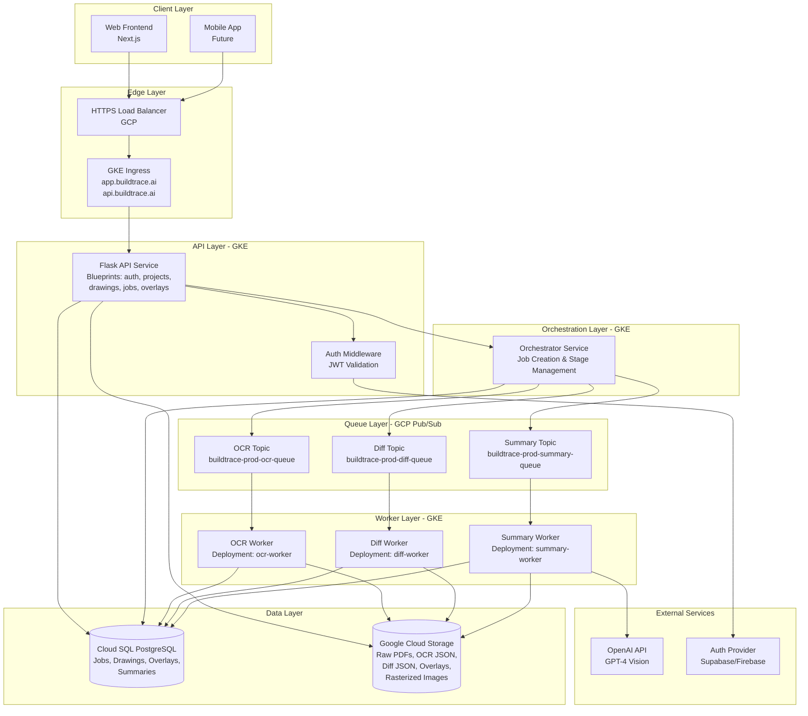
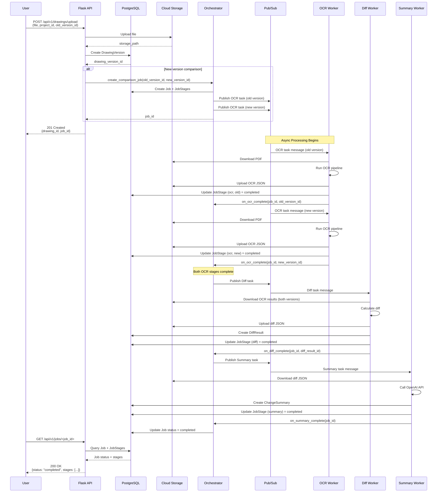
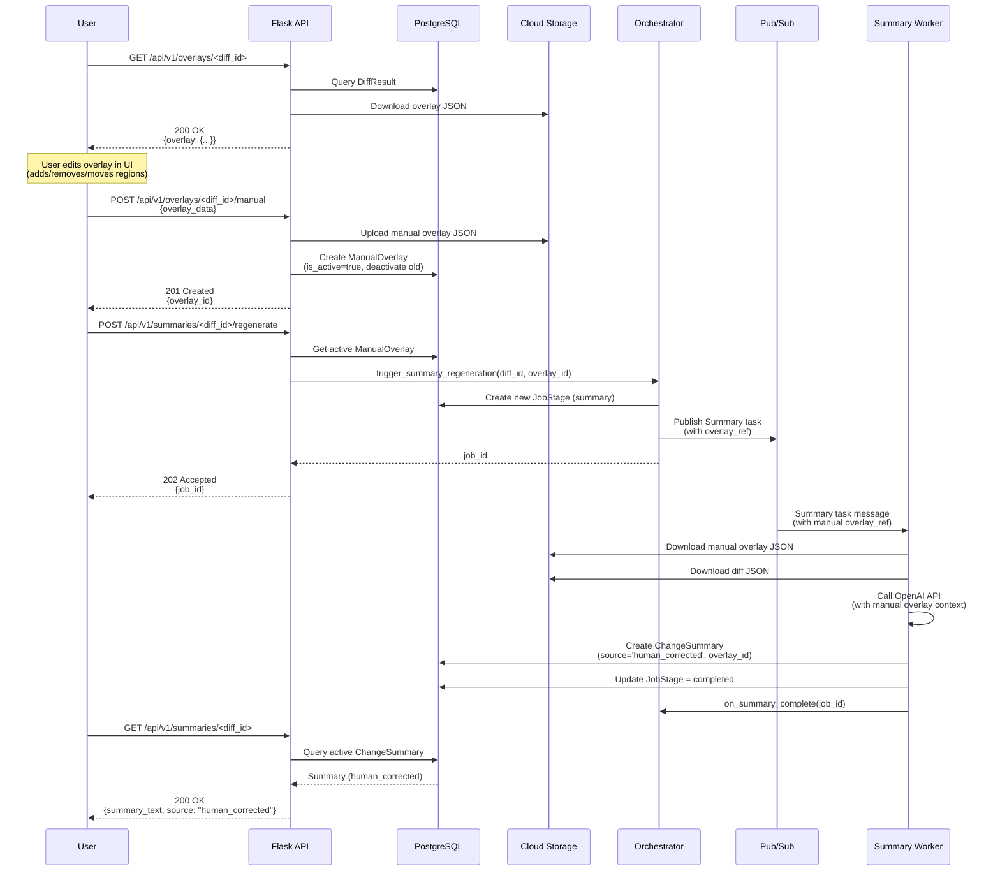
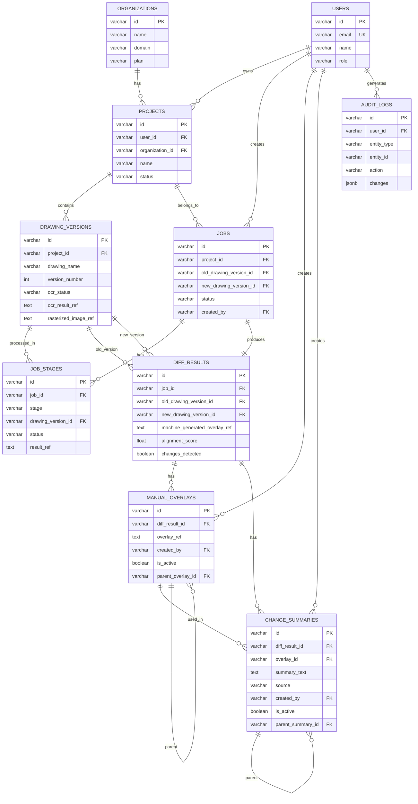
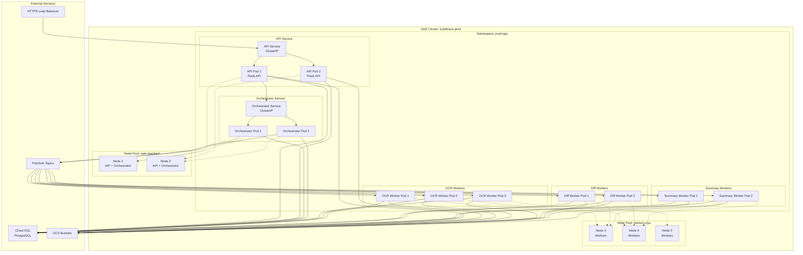

# BuildTrace REST Architecture - Implementation Details

_Last updated: 2025-01-XX_

This document completes the "Next Steps" section from `architecture.md` with concrete implementation details for the Flask-based backend, Pub/Sub job queue integration, detailed data schema evolution, and comprehensive diagrams.

---

## Table of Contents

1. [Flask Backend Architecture](#1-flask-backend-architecture)
2. [Pub/Sub Job Queue Integration](#2-pubsub-job-queue-integration)
3. [Detailed Data Schema](#3-detailed-data-schema)
4. [Architecture Diagrams](#4-architecture-diagrams)
5. [Implementation Roadmap](#5-implementation-roadmap)

---

## 1. Flask Backend Architecture

### 1.1 Current State Analysis

**Existing Flask Application Structure:**
```
buildtrace-overlay-/
├── app.py                    # Main Flask app (monolithic)
├── app_with_auth.py          # Auth-enabled version
├── config.py                 # Configuration management
├── complete_drawing_pipeline.py  # Synchronous processing
├── chunked_processor.py      # Memory-efficient processing
├── gcp/
│   ├── database/
│   │   ├── models.py         # SQLAlchemy models
│   │   └── __init__.py       # DB session management
│   ├── storage/
│   │   └── __init__.py       # GCS storage wrapper
│   └── infrastructure/
│       └── job_processor.py  # Basic job processor
└── services/
    ├── project_service.py
    └── local_storage.py
```

**Current Processing Flow:**
- **Synchronous**: User uploads → API processes immediately → Returns results
- **Chunked**: Processes PDFs page-by-page to manage memory
- **In-Container**: All processing happens in the main Flask container
- **No Queue**: Direct function calls, no async job system

### 1.2 Target Architecture (Flask + Pub/Sub)

**Proposed Flask Service Structure:**
```
buildtrace-overlay-/
├── app.py                    # Main Flask API (lightweight)
├── config.py                 # Configuration
├── blueprints/
│   ├── __init__.py
│   ├── auth.py              # Authentication endpoints
│   ├── projects.py          # Project management
│   ├── drawings.py          # Drawing upload/management
│   ├── jobs.py              # Job status queries
│   ├── overlays.py          # Manual overlay management
│   └── summaries.py        # Summary generation/editing
├── services/
│   ├── orchestrator.py      # Job orchestration service
│   ├── pubsub_client.py     # Pub/Sub publisher/subscriber
│   ├── job_service.py       # Job state management
│   └── storage_service.py   # Unified storage interface
├── workers/
│   ├── __init__.py
│   ├── ocr_worker.py        # OCR processing worker
│   ├── diff_worker.py      # Diff calculation worker
│   └── summary_worker.py   # LLM summary worker
├── gcp/
│   ├── database/
│   │   ├── models.py        # Updated models
│   │   └── __init__.py
│   └── pubsub/
│       ├── __init__.py
│       ├── publisher.py     # Pub/Sub publisher
│       └── subscriber.py    # Pub/Sub subscriber
└── processing/
    ├── ocr_pipeline.py      # OCR logic (extracted)
    ├── diff_pipeline.py     # Diff logic (extracted)
    └── summary_pipeline.py  # Summary logic (extracted)
```

### 1.3 Flask API Service Responsibilities

**Core API Endpoints (Flask Blueprints):**

#### `/api/v1/auth/*` (auth.py)
- `POST /api/v1/auth/login` - User authentication
- `POST /api/v1/auth/logout` - User logout
- `GET /api/v1/auth/me` - Current user info
- `POST /api/v1/auth/refresh` - Token refresh

#### `/api/v1/projects/*` (projects.py)
- `GET /api/v1/projects` - List user's projects
- `POST /api/v1/projects` - Create project
- `GET /api/v1/projects/<project_id>` - Get project details
- `PUT /api/v1/projects/<project_id>` - Update project
- `DELETE /api/v1/projects/<project_id>` - Delete project
- `GET /api/v1/projects/<project_id>/members` - List project members

#### `/api/v1/drawings/*` (drawings.py)
- `POST /api/v1/drawings/upload` - Upload drawing file
- `GET /api/v1/drawings/<drawing_id>` - Get drawing metadata
- `GET /api/v1/drawings/<drawing_id>/versions` - List versions
- `POST /api/v1/drawings/<drawing_id>/versions` - Create new version
- `DELETE /api/v1/drawings/<drawing_id>` - Delete drawing

#### `/api/v1/jobs/*` (jobs.py)
- `POST /api/v1/jobs` - Create processing job (old vs new drawing)
- `GET /api/v1/jobs/<job_id>` - Get job status
- `GET /api/v1/jobs/<job_id>/stages` - Get stage-level status
- `POST /api/v1/jobs/<job_id>/cancel` - Cancel job

#### `/api/v1/overlays/*` (overlays.py)
- `GET /api/v1/overlays/<diff_id>` - Get overlay (machine-generated)
- `POST /api/v1/overlays/<diff_id>/manual` - Create/edit manual overlay
- `PUT /api/v1/overlays/<diff_id>/manual/<overlay_id>` - Update manual overlay
- `DELETE /api/v1/overlays/<diff_id>/manual/<overlay_id>` - Delete manual overlay

#### `/api/v1/summaries/*` (summaries.py)
- `GET /api/v1/summaries/<diff_id>` - Get summary (latest)
- `POST /api/v1/summaries/<diff_id>/regenerate` - Regenerate summary from overlay
- `PUT /api/v1/summaries/<summary_id>` - Edit summary text

### 1.4 Flask Service Implementation Pattern

**Example: Drawing Upload Endpoint**
```python
# blueprints/drawings.py
from flask import Blueprint, request, jsonify, current_app
from services.orchestrator import OrchestratorService
from services.storage_service import StorageService
from gcp.database import get_db_session
from gcp.database.models import Drawing, DrawingVersion, Project

drawings_bp = Blueprint('drawings', __name__, url_prefix='/api/v1/drawings')

@drawings_bp.route('/upload', methods=['POST'])
def upload_drawing():
    """Upload a drawing file and create initial job"""
    try:
        # 1. Validate request
        project_id = request.form.get('project_id')
        file = request.files.get('file')
        
        # 2. Save file to storage
        storage = StorageService()
        storage_path = storage.upload_file(file, project_id)
        
        # 3. Create drawing record
        with get_db_session() as db:
            drawing = Drawing(
                project_id=project_id,
                filename=file.filename,
                storage_path=storage_path,
                status='uploaded'
            )
            db.add(drawing)
            db.commit()
            
            # 4. If this is a version comparison, create job
            old_version_id = request.form.get('old_version_id')
            if old_version_id:
                orchestrator = OrchestratorService()
                job = orchestrator.create_comparison_job(
                    old_version_id=old_version_id,
                    new_drawing_id=drawing.id
                )
                return jsonify({
                    'drawing_id': drawing.id,
                    'job_id': job.id,
                    'status': 'job_created'
                }), 201
        
        return jsonify({'drawing_id': drawing.id}), 201
        
    except Exception as e:
        current_app.logger.error(f"Upload error: {e}")
        return jsonify({'error': str(e)}), 500
```

**Key Principles:**
- **Lightweight API**: API only handles HTTP, validation, and DB writes
- **Async by Default**: Heavy processing always goes through Pub/Sub
- **Idempotent**: All endpoints support idempotency keys
- **Stateless**: No session state in Flask, use JWT tokens

---

## 2. Pub/Sub Job Queue Integration

### 2.1 Google Cloud Pub/Sub Setup

**Topic Structure:**
```
buildtrace-prod-ocr-queue          # OCR tasks
buildtrace-prod-diff-queue          # Diff calculation tasks
buildtrace-prod-summary-queue       # Summary generation tasks
buildtrace-prod-orchestrator-queue  # Orchestrator tasks (internal)
```

**Subscription Structure:**
```
buildtrace-prod-ocr-worker-sub      # OCR worker subscription
buildtrace-prod-diff-worker-sub     # Diff worker subscription
buildtrace-prod-summary-worker-sub  # Summary worker subscription
```

### 2.2 Pub/Sub Message Schema

**Base Message Format:**
```json
{
  "job_id": "uuid-string",
  "stage": "ocr|diff|summary",
  "drawing_version_id": "uuid-string",
  "old_drawing_version_id": "uuid-string",  // For diff/summary
  "new_drawing_version_id": "uuid-string", // For diff/summary
  "diff_result_id": "uuid-string",          // For summary
  "overlay_ref": "gs://bucket/path.json",   // For summary (manual overlay)
  "metadata": {
    "project_id": "uuid-string",
    "user_id": "uuid-string",
    "retry_count": 0,
    "created_at": "2025-01-XXT...",
    "priority": "normal|high"
  }
}
```

**Stage-Specific Message Examples:**

**OCR Task:**
```json
{
  "job_id": "job-123",
  "stage": "ocr",
  "drawing_version_id": "drawing-456",
  "metadata": {
    "project_id": "proj-789",
    "storage_path": "gs://bucket/drawings/proj-789/drawing-456.pdf",
    "retry_count": 0
  }
}
```

**Diff Task:**
```json
{
  "job_id": "job-123",
  "stage": "diff",
  "old_drawing_version_id": "drawing-456",
  "new_drawing_version_id": "drawing-789",
  "metadata": {
    "project_id": "proj-123",
    "ocr_result_old_ref": "gs://bucket/ocr/drawing-456.json",
    "ocr_result_new_ref": "gs://bucket/ocr/drawing-789.json",
    "retry_count": 0
  }
}
```

**Summary Task:**
```json
{
  "job_id": "job-123",
  "stage": "summary",
  "diff_result_id": "diff-456",
  "overlay_ref": "gs://bucket/overlays/diff-456-manual.json",  // Optional: manual overlay
  "metadata": {
    "project_id": "proj-123",
    "diff_result_ref": "gs://bucket/diffs/diff-456.json",
    "use_manual_overlay": true,
    "retry_count": 0
  }
}
```

### 2.3 Pub/Sub Client Implementation

**Publisher Service:**
```python
# gcp/pubsub/publisher.py
from google.cloud import pubsub_v1
from typing import Dict, Any
import json
import logging

logger = logging.getLogger(__name__)

class PubSubPublisher:
    def __init__(self, project_id: str):
        self.project_id = project_id
        self.publisher = pubsub_v1.PublisherClient()
    
    def publish_ocr_task(self, job_id: str, drawing_version_id: str, metadata: Dict[str, Any]):
        """Publish OCR task to queue"""
        topic_path = self.publisher.topic_path(
            self.project_id, 
            'buildtrace-prod-ocr-queue'
        )
        
        message_data = {
            'job_id': job_id,
            'stage': 'ocr',
            'drawing_version_id': drawing_version_id,
            'metadata': metadata
        }
        
        future = self.publisher.publish(
            topic_path,
            json.dumps(message_data).encode('utf-8'),
            job_id=job_id,
            stage='ocr'
        )
        
        message_id = future.result()
        logger.info(f"Published OCR task {job_id} as message {message_id}")
        return message_id
    
    def publish_diff_task(self, job_id: str, old_version_id: str, new_version_id: str, metadata: Dict[str, Any]):
        """Publish diff task to queue"""
        topic_path = self.publisher.topic_path(
            self.project_id,
            'buildtrace-prod-diff-queue'
        )
        
        message_data = {
            'job_id': job_id,
            'stage': 'diff',
            'old_drawing_version_id': old_version_id,
            'new_drawing_version_id': new_version_id,
            'metadata': metadata
        }
        
        future = self.publisher.publish(
            topic_path,
            json.dumps(message_data).encode('utf-8'),
            job_id=job_id,
            stage='diff'
        )
        
        return future.result()
    
    def publish_summary_task(self, job_id: str, diff_result_id: str, overlay_ref: str = None, metadata: Dict[str, Any] = None):
        """Publish summary task to queue"""
        topic_path = self.publisher.topic_path(
            self.project_id,
            'buildtrace-prod-summary-queue'
        )
        
        message_data = {
            'job_id': job_id,
            'stage': 'summary',
            'diff_result_id': diff_result_id,
            'overlay_ref': overlay_ref,
            'metadata': metadata or {}
        }
        
        future = self.publisher.publish(
            topic_path,
            json.dumps(message_data).encode('utf-8'),
            job_id=job_id,
            stage='summary'
        )
        
        return future.result()
```

**Subscriber Service (Worker):**
```python
# gcp/pubsub/subscriber.py
from google.cloud import pubsub_v1
from typing import Callable
import json
import logging
import threading

logger = logging.getLogger(__name__)

class PubSubSubscriber:
    def __init__(self, project_id: str, subscription_name: str):
        self.project_id = project_id
        self.subscription_name = subscription_name
        self.subscriber = pubsub_v1.SubscriberClient()
        self.subscription_path = self.subscriber.subscription_path(
            project_id, 
            subscription_name
        )
        self.running = False
    
    def start(self, callback: Callable):
        """Start listening for messages"""
        self.running = True
        
        def callback_wrapper(message):
            try:
                data = json.loads(message.data.decode('utf-8'))
                callback(data)
                message.ack()
            except Exception as e:
                logger.error(f"Error processing message: {e}")
                message.nack()  # Retry later
        
        streaming_pull_future = self.subscriber.subscribe(
            self.subscription_path,
            callback=callback_wrapper
        )
        
        logger.info(f"Started listening on {self.subscription_name}")
        
        try:
            streaming_pull_future.result()
        except KeyboardInterrupt:
            streaming_pull_future.cancel()
            self.running = False
    
    def stop(self):
        """Stop listening"""
        self.running = False
```

### 2.4 Orchestrator Service

**Orchestrator Responsibilities:**
- Watches for new drawings/versions
- Creates jobs and breaks them into stages
- Publishes tasks to appropriate Pub/Sub topics
- Updates job state in database

```python
# services/orchestrator.py
from gcp.database import get_db_session
from gcp.database.models import Job, JobStage, DrawingVersion
from gcp.pubsub.publisher import PubSubPublisher
from typing import Optional
import uuid
from datetime import datetime

class OrchestratorService:
    def __init__(self):
        self.pubsub = PubSubPublisher(project_id='buildtrace-prod')
    
    def create_comparison_job(
        self, 
        old_version_id: str, 
        new_drawing_id: str,
        project_id: str,
        user_id: str
    ) -> Job:
        """Create a new comparison job and enqueue OCR tasks"""
        with get_db_session() as db:
            # Create job record
            job = Job(
                id=str(uuid.uuid4()),
                project_id=project_id,
                old_drawing_version_id=old_version_id,
                new_drawing_version_id=new_drawing_id,
                status='created',
                created_by=user_id
            )
            db.add(job)
            
            # Create job stages
            ocr_stage_old = JobStage(
                job_id=job.id,
                stage='ocr',
                drawing_version_id=old_version_id,
                status='pending'
            )
            ocr_stage_new = JobStage(
                job_id=job.id,
                stage='ocr',
                drawing_version_id=new_drawing_id,
                status='pending'
            )
            diff_stage = JobStage(
                job_id=job.id,
                stage='diff',
                status='pending'
            )
            summary_stage = JobStage(
                job_id=job.id,
                stage='summary',
                status='pending'
            )
            
            db.add_all([ocr_stage_old, ocr_stage_new, diff_stage, summary_stage])
            db.commit()
            
            # Publish OCR tasks
            old_version = db.query(DrawingVersion).filter_by(id=old_version_id).first()
            new_version = db.query(DrawingVersion).filter_by(id=new_drawing_id).first()
            
            self.pubsub.publish_ocr_task(
                job_id=job.id,
                drawing_version_id=old_version_id,
                metadata={
                    'project_id': project_id,
                    'storage_path': old_version.drawing.storage_path
                }
            )
            
            self.pubsub.publish_ocr_task(
                job_id=job.id,
                drawing_version_id=new_drawing_id,
                metadata={
                    'project_id': project_id,
                    'storage_path': new_version.drawing.storage_path
                }
            )
            
            return job
    
    def on_ocr_complete(self, job_id: str, drawing_version_id: str):
        """Called when OCR stage completes - check if ready for diff"""
        with get_db_session() as db:
            job = db.query(Job).filter_by(id=job_id).first()
            ocr_stages = db.query(JobStage).filter_by(
                job_id=job_id,
                stage='ocr'
            ).all()
            
            # Check if both OCR stages are complete
            if all(stage.status == 'completed' for stage in ocr_stages):
                # Update diff stage and publish diff task
                diff_stage = db.query(JobStage).filter_by(
                    job_id=job_id,
                    stage='diff'
                ).first()
                diff_stage.status = 'in_progress'
                
                self.pubsub.publish_diff_task(
                    job_id=job_id,
                    old_version_id=job.old_drawing_version_id,
                    new_version_id=job.new_drawing_version_id,
                    metadata={'project_id': job.project_id}
                )
                
                db.commit()
    
    def on_diff_complete(self, job_id: str, diff_result_id: str):
        """Called when diff stage completes - enqueue summary"""
        with get_db_session() as db:
            diff_stage = db.query(JobStage).filter_by(
                job_id=job_id,
                stage='diff'
            ).first()
            diff_stage.status = 'completed'
            
            summary_stage = db.query(JobStage).filter_by(
                job_id=job_id,
                stage='summary'
            ).first()
            summary_stage.status = 'in_progress'
            
            self.pubsub.publish_summary_task(
                job_id=job_id,
                diff_result_id=diff_result_id,
                metadata={'project_id': diff_stage.job.project_id}
            )
            
            db.commit()
    
    def on_summary_complete(self, job_id: str):
        """Called when summary stage completes - mark job complete"""
        with get_db_session() as db:
            job = db.query(Job).filter_by(id=job_id).first()
            job.status = 'completed'
            job.completed_at = datetime.utcnow()
            db.commit()
```

### 2.5 Worker Implementation Pattern

**Example: OCR Worker**
```python
# workers/ocr_worker.py
from gcp.pubsub.subscriber import PubSubSubscriber
from services.orchestrator import OrchestratorService
from services.storage_service import StorageService
from gcp.database import get_db_session
from gcp.database.models import JobStage, DrawingVersion
from processing.ocr_pipeline import run_ocr_pipeline
import logging

logger = logging.getLogger(__name__)

def process_ocr_task(message_data: dict):
    """Process a single OCR task"""
    job_id = message_data['job_id']
    drawing_version_id = message_data['drawing_version_id']
    metadata = message_data['metadata']
    
    try:
        with get_db_session() as db:
            # Update stage status
            stage = db.query(JobStage).filter_by(
                job_id=job_id,
                drawing_version_id=drawing_version_id,
                stage='ocr'
            ).first()
            stage.status = 'in_progress'
            db.commit()
        
        # Download drawing from storage
        storage = StorageService()
        drawing_version = db.query(DrawingVersion).filter_by(id=drawing_version_id).first()
        local_path = storage.download_to_temp(drawing_version.drawing.storage_path)
        
        # Run OCR pipeline
        ocr_result = run_ocr_pipeline(local_path)
        
        # Upload OCR result to storage
        ocr_ref = storage.upload_ocr_result(
            drawing_version_id=drawing_version_id,
            ocr_data=ocr_result
        )
        
        # Update database
        with get_db_session() as db:
            stage = db.query(JobStage).filter_by(
                job_id=job_id,
                drawing_version_id=drawing_version_id,
                stage='ocr'
            ).first()
            stage.status = 'completed'
            stage.result_ref = ocr_ref
            db.commit()
        
        # Notify orchestrator
        orchestrator = OrchestratorService()
        orchestrator.on_ocr_complete(job_id, drawing_version_id)
        
        logger.info(f"OCR completed for job {job_id}, drawing {drawing_version_id}")
        
    except Exception as e:
        logger.error(f"OCR failed for job {job_id}: {e}")
        with get_db_session() as db:
            stage = db.query(JobStage).filter_by(
                job_id=job_id,
                drawing_version_id=drawing_version_id,
                stage='ocr'
            ).first()
            stage.status = 'failed'
            stage.error_message = str(e)
            db.commit()

if __name__ == '__main__':
    subscriber = PubSubSubscriber(
        project_id='buildtrace-prod',
        subscription_name='buildtrace-prod-ocr-worker-sub'
    )
    subscriber.start(process_ocr_task)
```

---

## 3. Detailed Data Schema

### 3.1 Current Schema (Before)

**Current Tables (from `create_tables.sql` and `models.py`):**

| Table | Purpose | Key Limitations |
|-------|---------|------------------|
| `users` | User accounts | Basic auth only |
| `projects` | Project organization | Single owner model |
| `sessions` | Processing sessions | Tied to synchronous processing |
| `drawings` | Drawing files | No versioning concept |
| `drawing_versions` | Version tracking | Exists but underutilized |
| `comparisons` | Drawing comparisons | Session-based, not job-based |
| `analysis_results` | AI analysis results | Single result per comparison |
| `processing_jobs` | Background jobs | Generic, no stage tracking |
| `chat_conversations` | Chat sessions | Session-based |
| `chat_messages` | Chat messages | Basic structure |

**Key Issues:**
1. **No Job Stage Tracking**: Can't track OCR/diff/summary separately
2. **No Manual Overlay Support**: No table for human-corrected overlays
3. **No Summary Versioning**: Can't track multiple summary generations
4. **Session-Centric**: Everything tied to sessions, not jobs
5. **No Diff Results Table**: Diff data stored in `comparisons` table
6. **Limited Audit Trail**: No tracking of who edited what

### 3.2 Target Schema (After)

**New/Enhanced Tables:**

#### 3.2.1 Organizations Table (NEW)
```sql
CREATE TABLE organizations (
    id VARCHAR(36) PRIMARY KEY DEFAULT gen_random_uuid()::text,
    name VARCHAR(255) NOT NULL,
    domain VARCHAR(255),  -- For domain-based auth
    plan VARCHAR(50) DEFAULT 'free',  -- free, pro, enterprise
    created_at TIMESTAMP DEFAULT CURRENT_TIMESTAMP,
    updated_at TIMESTAMP DEFAULT CURRENT_TIMESTAMP
);

CREATE INDEX idx_organizations_domain ON organizations(domain);
```

**Purpose**: Multi-tenant support, organization-level billing/limits

**Migration**: 
- Existing `projects.user_id` remains for backward compatibility
- Add optional `projects.organization_id` for future org-level features

---

#### 3.2.2 Jobs Table (ENHANCED)
```sql
-- Current: processing_jobs (generic)
-- New: jobs (specific to comparison workflow)

CREATE TABLE jobs (
    id VARCHAR(36) PRIMARY KEY DEFAULT gen_random_uuid()::text,
    project_id VARCHAR(36) REFERENCES projects(id) ON DELETE CASCADE NOT NULL,
    old_drawing_version_id VARCHAR(36) REFERENCES drawing_versions(id) NOT NULL,
    new_drawing_version_id VARCHAR(36) REFERENCES drawing_versions(id) NOT NULL,
    status VARCHAR(50) DEFAULT 'created',  -- created, in_progress, completed, failed, cancelled
    created_by VARCHAR(36) REFERENCES users(id) NOT NULL,
    created_at TIMESTAMP DEFAULT CURRENT_TIMESTAMP,
    started_at TIMESTAMP,
    completed_at TIMESTAMP,
    cancelled_at TIMESTAMP,
    cancelled_by VARCHAR(36) REFERENCES users(id),
    error_message TEXT,
    job_metadata JSONB  -- Store additional context
);

CREATE INDEX idx_jobs_project ON jobs(project_id);
CREATE INDEX idx_jobs_status ON jobs(status);
CREATE INDEX idx_jobs_created_by ON jobs(created_by);
```

**Changes from `processing_jobs`:**
- **Specific to comparisons**: `old_drawing_version_id`, `new_drawing_version_id`
- **Better status tracking**: More granular statuses
- **Cancellation support**: `cancelled_at`, `cancelled_by`
- **Project linkage**: Direct project reference

**Migration Path:**
```sql
-- Migrate existing processing_jobs to jobs
INSERT INTO jobs (id, project_id, status, created_by, created_at, started_at, completed_at, error_message, job_metadata)
SELECT 
    id,
    (SELECT project_id FROM sessions WHERE id = session_id),
    status,
    (SELECT user_id FROM sessions WHERE id = session_id),
    created_at,
    started_at,
    completed_at,
    error_message,
    job_metadata
FROM processing_jobs
WHERE job_type = 'comparison';
```

---

#### 3.2.3 Job Stages Table (NEW)
```sql
CREATE TABLE job_stages (
    id VARCHAR(36) PRIMARY KEY DEFAULT gen_random_uuid()::text,
    job_id VARCHAR(36) REFERENCES jobs(id) ON DELETE CASCADE NOT NULL,
    stage VARCHAR(50) NOT NULL,  -- ocr, diff, summary
    drawing_version_id VARCHAR(36) REFERENCES drawing_versions(id),  -- For OCR stage
    status VARCHAR(50) DEFAULT 'pending',  -- pending, in_progress, completed, failed, skipped
    started_at TIMESTAMP,
    completed_at TIMESTAMP,
    error_message TEXT,
    result_ref TEXT,  -- GCS path to stage output
    retry_count INTEGER DEFAULT 0,
    metadata JSONB,
    created_at TIMESTAMP DEFAULT CURRENT_TIMESTAMP,
    UNIQUE(job_id, stage, drawing_version_id)  -- One stage per drawing per job
);

CREATE INDEX idx_job_stages_job ON job_stages(job_id);
CREATE INDEX idx_job_stages_status ON job_stages(status);
CREATE INDEX idx_job_stages_stage ON job_stages(stage);
```

**Purpose**: Track individual stages (OCR, diff, summary) within a job

**Example Data:**
```
job_id: job-123
├── stage: ocr, drawing_version_id: drawing-456, status: completed
├── stage: ocr, drawing_version_id: drawing-789, status: completed
├── stage: diff, status: in_progress
└── stage: summary, status: pending
```

---

#### 3.2.4 Drawing Versions Table (ENHANCED)
```sql
-- Current: drawing_versions (exists)
-- Enhancements: Add OCR status, storage refs

ALTER TABLE drawing_versions ADD COLUMN IF NOT EXISTS ocr_status VARCHAR(50) DEFAULT 'pending';
ALTER TABLE drawing_versions ADD COLUMN IF NOT EXISTS ocr_result_ref TEXT;  -- GCS path to OCR JSON
ALTER TABLE drawing_versions ADD COLUMN IF NOT EXISTS ocr_completed_at TIMESTAMP;
ALTER TABLE drawing_versions ADD COLUMN IF NOT EXISTS rasterized_image_ref TEXT;  -- GCS path to PNG
ALTER TABLE drawing_versions ADD COLUMN IF NOT EXISTS file_hash VARCHAR(64);  -- SHA-256 for deduplication
ALTER TABLE drawing_versions ADD COLUMN IF NOT EXISTS file_size BIGINT;  -- Bytes

CREATE INDEX idx_drawing_versions_ocr_status ON drawing_versions(ocr_status);
```

**Purpose**: Track OCR state per version, enable deduplication

---

#### 3.2.5 Diff Results Table (NEW)
```sql
CREATE TABLE diff_results (
    id VARCHAR(36) PRIMARY KEY DEFAULT gen_random_uuid()::text,
    job_id VARCHAR(36) REFERENCES jobs(id) ON DELETE CASCADE NOT NULL,
    old_drawing_version_id VARCHAR(36) REFERENCES drawing_versions(id) NOT NULL,
    new_drawing_version_id VARCHAR(36) REFERENCES drawing_versions(id) NOT NULL,
    machine_generated_overlay_ref TEXT NOT NULL,  -- GCS path to diff JSON
    alignment_score FLOAT,  -- 0-1, quality of alignment
    changes_detected BOOLEAN DEFAULT false,
    change_count INTEGER DEFAULT 0,  -- Total number of changes
    created_at TIMESTAMP DEFAULT CURRENT_TIMESTAMP,
    created_by VARCHAR(36) REFERENCES users(id) DEFAULT NULL,  -- System for machine-generated
    metadata JSONB  -- Store diff statistics, processing time, etc.
);

CREATE INDEX idx_diff_results_job ON diff_results(job_id);
CREATE INDEX idx_diff_results_versions ON diff_results(old_drawing_version_id, new_drawing_version_id);
```

**Purpose**: Store diff calculation results separately from comparisons

**Migration from `comparisons`:**
```sql
-- Migrate comparison data to diff_results
INSERT INTO diff_results (
    id, job_id, old_drawing_version_id, new_drawing_version_id,
    machine_generated_overlay_ref, alignment_score, changes_detected, created_at
)
SELECT 
    id,
    (SELECT id FROM jobs WHERE old_drawing_version_id = old_drawing_id AND new_drawing_version_id = new_drawing_id LIMIT 1),
    old_drawing_id,
    new_drawing_id,
    overlay_path,
    alignment_score,
    changes_detected,
    created_at
FROM comparisons;
```

---

#### 3.2.6 Manual Overlays Table (NEW)
```sql
CREATE TABLE manual_overlays (
    id VARCHAR(36) PRIMARY KEY DEFAULT gen_random_uuid()::text,
    diff_result_id VARCHAR(36) REFERENCES diff_results(id) ON DELETE CASCADE NOT NULL,
    overlay_ref TEXT NOT NULL,  -- GCS path to manual overlay JSON
    created_by VARCHAR(36) REFERENCES users(id) NOT NULL,
    is_active BOOLEAN DEFAULT true,  -- Only one active overlay per diff
    parent_overlay_id VARCHAR(36) REFERENCES manual_overlays(id),  -- For overlay versioning
    created_at TIMESTAMP DEFAULT CURRENT_TIMESTAMP,
    updated_at TIMESTAMP DEFAULT CURRENT_TIMESTAMP,
    metadata JSONB  -- Store edit history, change log
);

CREATE INDEX idx_manual_overlays_diff ON manual_overlays(diff_result_id);
CREATE INDEX idx_manual_overlays_active ON manual_overlays(diff_result_id, is_active) WHERE is_active = true;
CREATE INDEX idx_manual_overlays_created_by ON manual_overlays(created_by);
```

**Purpose**: Store human-corrected overlays, support overlay versioning

**Key Features:**
- **One active overlay per diff**: `is_active` flag ensures only latest is used
- **Overlay versioning**: `parent_overlay_id` tracks edit history
- **User attribution**: `created_by` tracks who made edits

---

#### 3.2.7 Change Summaries Table (NEW)
```sql
CREATE TABLE change_summaries (
    id VARCHAR(36) PRIMARY KEY DEFAULT gen_random_uuid()::text,
    diff_result_id VARCHAR(36) REFERENCES diff_results(id) ON DELETE CASCADE NOT NULL,
    overlay_id VARCHAR(36) REFERENCES manual_overlays(id),  -- NULL for machine-generated, set for manual
    summary_text TEXT NOT NULL,
    summary_json JSONB,  -- Structured summary (bullet points, risk levels, etc.)
    source VARCHAR(50) NOT NULL,  -- 'machine', 'human_corrected', 'human_written'
    ai_model_used VARCHAR(50),  -- 'gpt-4', 'gpt-4-vision', etc.
    created_by VARCHAR(36) REFERENCES users(id),  -- NULL for machine, set for human
    is_active BOOLEAN DEFAULT true,  -- Only one active summary per diff
    parent_summary_id VARCHAR(36) REFERENCES change_summaries(id),  -- For summary versioning
    created_at TIMESTAMP DEFAULT CURRENT_TIMESTAMP,
    updated_at TIMESTAMP DEFAULT CURRENT_TIMESTAMP,
    metadata JSONB  -- Store prompt used, token usage, generation time, etc.
);

CREATE INDEX idx_change_summaries_diff ON change_summaries(diff_result_id);
CREATE INDEX idx_change_summaries_active ON change_summaries(diff_result_id, is_active) WHERE is_active = true;
CREATE INDEX idx_change_summaries_source ON change_summaries(source);
```

**Purpose**: Store summaries with versioning, track machine vs human-generated

**Key Features:**
- **Source tracking**: Distinguish machine vs human summaries
- **Overlay linkage**: Link to manual overlay if used
- **Versioning**: `parent_summary_id` tracks regeneration history
- **Active flag**: Only latest summary is active

---

#### 3.2.8 Audit Logs Table (NEW)
```sql
CREATE TABLE audit_logs (
    id VARCHAR(36) PRIMARY KEY DEFAULT gen_random_uuid()::text,
    user_id VARCHAR(36) REFERENCES users(id),
    entity_type VARCHAR(50) NOT NULL,  -- 'overlay', 'summary', 'project', etc.
    entity_id VARCHAR(36) NOT NULL,
    action VARCHAR(50) NOT NULL,  -- 'create', 'update', 'delete', 'view'
    changes JSONB,  -- Store before/after for updates
    ip_address VARCHAR(45),  -- IPv4 or IPv6
    user_agent TEXT,
    created_at TIMESTAMP DEFAULT CURRENT_TIMESTAMP
);

CREATE INDEX idx_audit_logs_user ON audit_logs(user_id);
CREATE INDEX idx_audit_logs_entity ON audit_logs(entity_type, entity_id);
CREATE INDEX idx_audit_logs_created ON audit_logs(created_at);
```

**Purpose**: Track all user actions for compliance and debugging

---

### 3.3 Schema Comparison Summary

| Aspect | Before | After | Impact |
|--------|--------|-------|--------|
| **Job Tracking** | Generic `processing_jobs` | Specific `jobs` + `job_stages` | ✅ Granular stage tracking |
| **Overlay Management** | Stored in `comparisons.overlay_path` | Separate `diff_results` + `manual_overlays` | ✅ Support manual corrections |
| **Summary Management** | Single `analysis_results` row | `change_summaries` with versioning | ✅ Track regeneration history |
| **OCR State** | Not tracked | `drawing_versions.ocr_status` | ✅ Know OCR completion status |
| **Audit Trail** | Limited | Full `audit_logs` table | ✅ Compliance & debugging |
| **Multi-tenancy** | User-based only | `organizations` table | ✅ Future org features |

### 3.4 Migration Strategy

**Phase 1: Add New Tables (Non-Breaking)**
```sql
-- 1. Create new tables
CREATE TABLE organizations (...);
CREATE TABLE jobs (...);
CREATE TABLE job_stages (...);
CREATE TABLE diff_results (...);
CREATE TABLE manual_overlays (...);
CREATE TABLE change_summaries (...);
CREATE TABLE audit_logs (...);

-- 2. Add columns to existing tables
ALTER TABLE drawing_versions ADD COLUMN ocr_status ...;
ALTER TABLE projects ADD COLUMN organization_id ...;
```

**Phase 2: Migrate Existing Data**
```sql
-- Migrate processing_jobs → jobs
-- Migrate comparisons → diff_results
-- Migrate analysis_results → change_summaries
```

**Phase 3: Update Application Code**
- Update Flask models
- Update API endpoints
- Update workers

**Phase 4: Deprecate Old Tables (After Validation)**
```sql
-- Rename old tables (keep for rollback)
ALTER TABLE processing_jobs RENAME TO processing_jobs_old;
ALTER TABLE comparisons RENAME TO comparisons_old;
ALTER TABLE analysis_results RENAME TO analysis_results_old;
```

---

## 4. Architecture Diagrams

### 4.1 Component Diagram



### 4.2 Sequence Diagram: Drawing Upload & Processing



### 4.3 Sequence Diagram: Manual Overlay & Regenerate Summary



### 4.4 Data Flow Diagram

```mermaid
flowchart TD
    START[User Uploads Drawing] --> UPLOAD[API: Save to GCS]
    UPLOAD --> CREATE_DB[API: Create DrawingVersion in DB]
    CREATE_DB --> CREATE_JOB{Comparison<br/>Requested?}
    
    CREATE_JOB -->|Yes| ORCH_CREATE[Orchestrator: Create Job]
    CREATE_JOB -->|No| END1[Return drawing_id]
    
    ORCH_CREATE --> CREATE_STAGES[Create JobStages:<br/>ocr, diff, summary]
    CREATE_STAGES --> PUB_OCR[Publish OCR tasks<br/>to Pub/Sub]
    
    PUB_OCR --> OCR_WORKER[OCR Worker: Process]
    OCR_WORKER --> OCR_DOWNLOAD[Download PDF from GCS]
    OCR_DOWNLOAD --> OCR_PROCESS[Run OCR Pipeline]
    OCR_PROCESS --> OCR_UPLOAD[Upload OCR JSON to GCS]
    OCR_UPLOAD --> OCR_UPDATE[Update JobStage = completed]
    OCR_UPDATE --> CHECK_OCR{Both OCR<br/>Complete?}
    
    CHECK_OCR -->|No| WAIT_OCR[Wait for other OCR]
    WAIT_OCR --> CHECK_OCR
    CHECK_OCR -->|Yes| PUB_DIFF[Publish Diff task]
    
    PUB_DIFF --> DIFF_WORKER[Diff Worker: Process]
    DIFF_WORKER --> DIFF_DOWNLOAD[Download OCR JSONs<br/>from GCS]
    DIFF_DOWNLOAD --> DIFF_PROCESS[Calculate Diff]
    DIFF_PROCESS --> DIFF_UPLOAD[Upload Diff JSON to GCS]
    DIFF_UPLOAD --> DIFF_CREATE[Create DiffResult in DB]
    DIFF_CREATE --> DIFF_UPDATE[Update JobStage = completed]
    DIFF_UPDATE --> PUB_SUMMARY[Publish Summary task]
    
    PUB_SUMMARY --> SUM_WORKER[Summary Worker: Process]
    SUM_WORKER --> SUM_DOWNLOAD[Download Diff JSON from GCS]
    SUM_DOWNLOAD --> SUM_LLM[Call OpenAI API]
    SUM_LLM --> SUM_CREATE[Create ChangeSummary in DB]
    SUM_CREATE --> SUM_UPDATE[Update JobStage = completed]
    SUM_UPDATE --> JOB_COMPLETE[Update Job = completed]
    JOB_COMPLETE --> END2[User Polls for Results]
    
    style START fill:#e1f5ff
    style END1 fill:#c8e6c9
    style END2 fill:#c8e6c9
    style OCR_WORKER fill:#fff3e0
    style DIFF_WORKER fill:#fff3e0
    style SUM_WORKER fill:#fff3e0
```



### 4.5 Entity Relationship Diagram (ERD)



### 4.6 Deployment Architecture (GKE)



---

## 5. Implementation Roadmap

### 5.1 Phase 1: Foundation (Week 1-2)

**Goals:**
- Set up Pub/Sub topics and subscriptions
- Create new database tables
- Implement basic Pub/Sub publisher/subscriber

**Tasks:**
1. **Infrastructure Setup**
   - [ ] Create Pub/Sub topics (OCR, Diff, Summary)
   - [ ] Create Pub/Sub subscriptions for workers
   - [ ] Set up IAM permissions for Pub/Sub

2. **Database Migration**
   - [ ] Create migration script for new tables
   - [ ] Add `jobs`, `job_stages`, `diff_results`, `manual_overlays`, `change_summaries`, `audit_logs`
   - [ ] Add columns to `drawing_versions`
   - [ ] Run migration on staging database

3. **Pub/Sub Client Library**
   - [ ] Implement `PubSubPublisher` class
   - [ ] Implement `PubSubSubscriber` class
   - [ ] Add unit tests

4. **Update Models**
   - [ ] Update SQLAlchemy models for new tables
   - [ ] Add relationships
   - [ ] Update existing models

**Deliverables:**
- Pub/Sub topics/subscriptions created
- Database schema migrated
- Pub/Sub client library ready

---

### 5.2 Phase 2: Orchestrator & Job Management (Week 3-4)

**Goals:**
- Implement orchestrator service
- Create job management API endpoints
- Migrate existing processing logic

**Tasks:**
1. **Orchestrator Service**
   - [ ] Implement `OrchestratorService` class
   - [ ] Job creation logic
   - [ ] Stage completion callbacks
   - [ ] Error handling and retries

2. **Job API Endpoints**
   - [ ] `POST /api/v1/jobs` - Create job
   - [ ] `GET /api/v1/jobs/<job_id>` - Get job status
   - [ ] `GET /api/v1/jobs/<job_id>/stages` - Get stage details
   - [ ] `POST /api/v1/jobs/<job_id>/cancel` - Cancel job

3. **Update Drawing Upload**
   - [ ] Modify upload endpoint to create jobs
   - [ ] Integrate with orchestrator
   - [ ] Update response format

**Deliverables:**
- Orchestrator service functional
- Job management API endpoints
- Jobs created on drawing upload

---

### 5.3 Phase 3: Worker Implementation (Week 5-7)

**Goals:**
- Implement OCR, Diff, and Summary workers
- Extract processing logic from Flask app
- Deploy workers as separate services

**Tasks:**
1. **OCR Worker**
   - [ ] Extract OCR logic from `chunked_processor.py`
   - [ ] Create `workers/ocr_worker.py`
   - [ ] Implement Pub/Sub subscriber
   - [ ] Add error handling and retries
   - [ ] Deploy as GKE Deployment

2. **Diff Worker**
   - [ ] Extract diff logic from `complete_drawing_pipeline.py`
   - [ ] Create `workers/diff_worker.py`
   - [ ] Implement Pub/Sub subscriber
   - [ ] Add error handling
   - [ ] Deploy as GKE Deployment

3. **Summary Worker**
   - [ ] Extract summary logic from `openai_change_analyzer.py`
   - [ ] Create `workers/summary_worker.py`
   - [ ] Implement Pub/Sub subscriber
   - [ ] Add OpenAI API integration
   - [ ] Deploy as GKE Deployment

4. **Processing Pipeline Extraction**
   - [ ] Create `processing/ocr_pipeline.py`
   - [ ] Create `processing/diff_pipeline.py`
   - [ ] Create `processing/summary_pipeline.py`
   - [ ] Remove processing logic from Flask app

**Deliverables:**
- Three worker services deployed
- Processing logic extracted and modularized
- End-to-end processing working

---

### 5.4 Phase 4: Manual Overlay & Summary Management (Week 8-9)

**Goals:**
- Implement manual overlay endpoints
- Implement summary regeneration
- Add overlay versioning

**Tasks:**
1. **Overlay API Endpoints**
   - [ ] `GET /api/v1/overlays/<diff_id>` - Get overlay
   - [ ] `POST /api/v1/overlays/<diff_id>/manual` - Create manual overlay
   - [ ] `PUT /api/v1/overlays/<diff_id>/manual/<overlay_id>` - Update overlay
   - [ ] `DELETE /api/v1/overlays/<diff_id>/manual/<overlay_id>` - Delete overlay

2. **Summary API Endpoints**
   - [ ] `GET /api/v1/summaries/<diff_id>` - Get summary
   - [ ] `POST /api/v1/summaries/<diff_id>/regenerate` - Regenerate summary
   - [ ] `PUT /api/v1/summaries/<summary_id>` - Edit summary

3. **Orchestrator Updates**
   - [ ] Add `trigger_summary_regeneration` method
   - [ ] Support manual overlay in summary tasks
   - [ ] Update summary worker to use manual overlays

**Deliverables:**
- Manual overlay management working
- Summary regeneration with manual overlays
- Full human-in-the-loop workflow

---

### 5.5 Phase 5: Flask Refactoring (Week 10-11)

**Goals:**
- Refactor Flask app into blueprints
- Remove synchronous processing
- Clean up legacy code

**Tasks:**
1. **Blueprint Structure**
   - [ ] Create `blueprints/auth.py`
   - [ ] Create `blueprints/projects.py`
   - [ ] Create `blueprints/drawings.py`
   - [ ] Create `blueprints/jobs.py`
   - [ ] Create `blueprints/overlays.py`
   - [ ] Create `blueprints/summaries.py`
   - [ ] Register blueprints in `app.py`

2. **Remove Synchronous Processing**
   - [ ] Remove `complete_drawing_pipeline` from Flask app
   - [ ] Remove `chunked_processor` from Flask app
   - [ ] Update all endpoints to use async jobs

3. **Service Layer**
   - [ ] Create `services/storage_service.py`
   - [ ] Create `services/job_service.py`
   - [ ] Refactor API endpoints to use services

**Deliverables:**
- Flask app refactored into blueprints
- No synchronous processing in API
- Clean separation of concerns

---

### 5.6 Phase 6: Testing & Optimization (Week 12)

**Goals:**
- Comprehensive testing
- Performance optimization
- Monitoring and alerting

**Tasks:**
1. **Testing**
   - [ ] Unit tests for workers
   - [ ] Integration tests for API endpoints
   - [ ] End-to-end tests for full workflow
   - [ ] Load testing

2. **Optimization**
   - [ ] Worker autoscaling configuration
   - [ ] Database query optimization
   - [ ] GCS access optimization
   - [ ] Pub/Sub message batching

3. **Monitoring**
   - [ ] Add Prometheus metrics
   - [ ] Create Grafana dashboards
   - [ ] Set up alerts for failures
   - [ ] Add distributed tracing

**Deliverables:**
- Test suite complete
- Performance optimized
- Monitoring in place

---

### 5.7 Phase 7: Migration & Rollout (Week 13-14)

**Goals:**
- Migrate existing data
- Gradual rollout
- Deprecate old system

**Tasks:**
1. **Data Migration**
   - [ ] Migrate `processing_jobs` → `jobs`
   - [ ] Migrate `comparisons` → `diff_results`
   - [ ] Migrate `analysis_results` → `change_summaries`
   - [ ] Validate migrated data

2. **Gradual Rollout**
   - [ ] Deploy to staging
   - [ ] Test with real data
   - [ ] Deploy to production (canary)
   - [ ] Monitor and fix issues
   - [ ] Full rollout

3. **Deprecation**
   - [ ] Mark old tables as deprecated
   - [ ] Update documentation
   - [ ] Plan removal timeline

**Deliverables:**
- Data migrated successfully
- System running in production
- Old system deprecated

---

## 6. Key Implementation Details

### 6.1 Flask Blueprint Example

```python
# blueprints/drawings.py
from flask import Blueprint, request, jsonify, current_app
from services.orchestrator import OrchestratorService
from services.storage_service import StorageService
from gcp.database import get_db_session
from gcp.database.models import DrawingVersion, Project
from werkzeug.utils import secure_filename
import uuid

drawings_bp = Blueprint('drawings', __name__, url_prefix='/api/v1/drawings')

@drawings_bp.route('/upload', methods=['POST'])
def upload_drawing():
    """Upload a drawing file"""
    try:
        project_id = request.form.get('project_id')
        file = request.files.get('file')
        old_version_id = request.form.get('old_version_id')  # Optional
        
        if not project_id or not file:
            return jsonify({'error': 'project_id and file required'}), 400
        
        # Validate file
        if not _allowed_file(file.filename):
            return jsonify({'error': 'Invalid file type'}), 400
        
        # Upload to storage
        storage = StorageService()
        storage_path = storage.upload_file(file, project_id)
        
        # Create drawing version
        with get_db_session() as db:
            project = db.query(Project).filter_by(id=project_id).first()
            if not project:
                return jsonify({'error': 'Project not found'}), 404
            
            drawing_version = DrawingVersion(
                id=str(uuid.uuid4()),
                project_id=project_id,
                drawing_name=_extract_drawing_name(file.filename),
                version_number=_get_next_version_number(db, project_id, _extract_drawing_name(file.filename)),
                drawing_id=str(uuid.uuid4()),  # Create drawing record too
                storage_path=storage_path,
                ocr_status='pending'
            )
            db.add(drawing_version)
            db.commit()
            
            # If comparison requested, create job
            job_id = None
            if old_version_id:
                orchestrator = OrchestratorService()
                job = orchestrator.create_comparison_job(
                    old_version_id=old_version_id,
                    new_drawing_version_id=drawing_version.id,
                    project_id=project_id,
                    user_id=request.user.id  # From auth middleware
                )
                job_id = job.id
            
            return jsonify({
                'drawing_version_id': drawing_version.id,
                'job_id': job_id,
                'status': 'uploaded'
            }), 201
            
    except Exception as e:
        current_app.logger.error(f"Upload error: {e}", exc_info=True)
        return jsonify({'error': str(e)}), 500

def _allowed_file(filename):
    """Check if file extension is allowed"""
    return '.' in filename and \
           filename.rsplit('.', 1)[1].lower() in {'pdf', 'dwg', 'dxf', 'png', 'jpg', 'jpeg'}

def _extract_drawing_name(filename):
    """Extract drawing name from filename (simplified)"""
    # Implementation would use OCR or pattern matching
    return filename.rsplit('.', 1)[0]

def _get_next_version_number(db, project_id, drawing_name):
    """Get next version number for drawing"""
    max_version = db.query(
        func.max(DrawingVersion.version_number)
    ).filter_by(
        project_id=project_id,
        drawing_name=drawing_name
    ).scalar()
    return (max_version or 0) + 1
```

### 6.2 Worker Deployment Configuration

**Kubernetes Deployment Example:**
```yaml
# k8s/ocr-worker-deployment.yaml
apiVersion: apps/v1
kind: Deployment
metadata:
  name: ocr-worker
  namespace: prod-app
spec:
  replicas: 3
  selector:
    matchLabels:
      app: ocr-worker
  template:
    metadata:
      labels:
        app: ocr-worker
    spec:
      containers:
      - name: ocr-worker
        image: gcr.io/buildtrace-prod/ocr-worker:latest
        env:
        - name: GOOGLE_CLOUD_PROJECT
          value: "buildtrace-prod"
        - name: PUBSUB_SUBSCRIPTION
          value: "buildtrace-prod-ocr-worker-sub"
        - name: DATABASE_URL
          valueFrom:
            secretKeyRef:
              name: db-credentials
              key: url
        resources:
          requests:
            memory: "2Gi"
            cpu: "1000m"
          limits:
            memory: "4Gi"
            cpu: "2000m"
        livenessProbe:
          exec:
            command:
            - python
            - -c
            - "import requests; requests.get('http://localhost:8080/health')"
          initialDelaySeconds: 30
          periodSeconds: 10
```

### 6.3 Error Handling & Retries

**Pub/Sub Message Retry Strategy:**
- **Max Retries**: 3 attempts per message
- **Backoff**: Exponential backoff (1s, 2s, 4s)
- **Dead Letter Queue**: Failed messages after 3 retries go to DLQ
- **Manual Retry**: Admin can retry from DLQ via API

**Worker Error Handling:**
```python
def process_ocr_task(message_data: dict):
    """Process OCR task with retry logic"""
    job_id = message_data['job_id']
    retry_count = message_data['metadata'].get('retry_count', 0)
    
    try:
        # Process task...
        pass
    except RetryableError as e:
        if retry_count < 3:
            # Republish with incremented retry_count
            message_data['metadata']['retry_count'] = retry_count + 1
            publisher.publish_ocr_task(...)
        else:
            # Move to DLQ
            move_to_dlq(message_data, str(e))
    except FatalError as e:
        # Don't retry, mark as failed immediately
        mark_job_failed(job_id, str(e))
```

---

## 7. Summary

This document provides a complete implementation guide for transitioning BuildTrace from a synchronous Flask monolith to an async, Pub/Sub-based architecture:

1. **Flask Backend**: Refactored into blueprints, lightweight API layer
2. **Pub/Sub Integration**: Complete job queue system with OCR, Diff, and Summary topics
3. **Data Schema**: Enhanced schema with job stages, manual overlays, summary versioning
4. **Diagrams**: Component, sequence, data flow, ERD, and deployment diagrams
5. **Implementation Roadmap**: 14-week phased approach

**Next Steps:**
1. Review this document
2. Set up Pub/Sub topics/subscriptions
3. Create database migration scripts
4. Begin Phase 1 implementation

---

_End of Document_

